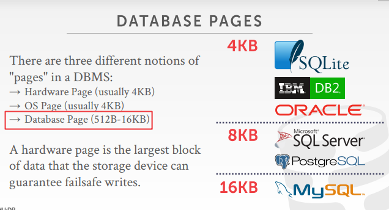

# DBMS的前提

- DBMS假定数据库的主要存储位置在非易失性磁盘上
- DBMS的组件管理数据在非易失性存储和易失性存储之间移动

# storage hierachy

- 
- cpu：
  - cpu registers
  - cpu caches
- 内存（memory）:
  - DRAM：动态随机存储器
- 硬盘（disk）：
  - SSD：固态硬盘
  - HDD：机械硬盘
- 设备的访问速度
  - 

# sequential vs random access

- 在非易失的介质上，随机读写是慢于顺序读写的
- 所以DBMS需要尽量的加大磁盘的顺序读写
- 尽量把用户对磁盘随机的存取变为顺序的存取

# system design goals

- 允许DBMS管理超过可用内存容量的数据库（不能说内存多少就只能存取多少吧..）
  - 一个好的存储引擎要允许DBMS管理一个巨大数据量的数据库
- 因为对磁盘的读/写开销很大，所以要尽量避免出现大的停顿和性能下降
  - 不要让database过多的读写磁盘
- 随机的对磁盘读写是远远慢于顺序写的，所以要尽量把随机的读写转换为连续的读写

# disk-oriented dbms

- 数据都是要存储在磁盘上的
- 磁盘中有一个directory，存储的是每一个数据页在内存中的位置
- 每个数据页前面都有一个handler，handler中存储的是这个page的元数据
- 内存的buffer pool首先要把磁盘中的directory给loading到内存中，然后再根据要找的数据和directory对应的关系，去load对应的page

# why not use the os

- OS对内存页的置换策略可能不适合DBMS的业务需求
- 当有多个读者写入由mmap映射的文件的时候，情况会很糟糕（因为os并不会对文件进行并发控制）
- mmap：就是我需要什么数据页，就从virtual memory中去拿，而具体怎么把数据加载到物理内存中的，是OS帮我们操作的
  - 但是OS不知道我们需要的高效的缓冲池的策略，造成的结果就是可能会把一些我们最近还需要的页给刷回磁盘，造成了低效
  - 如果要并发写数据的话会有很多问题

- 但其实还是有一些DBMS用到了mmap的
- 

同时，DBMS也有自己的业务需求

- 按照正确的顺序将脏页刷新到磁盘（具体什么时候将脏页刷盘，这个时机需要DBMS去控制）
- 专业的预先处理（比如说提前取出一些缓存数据）
- 缓冲区的替换策略（决定内存中哪些数据需要被刷盘）
- 线程/进程的调度（数据库多个用户的thread同时操控数据库，决定thread的执行顺序）

结论

- DBMS需要自己去管理数据库的数据页

# database storage

- 数据库的两大问题
- 问题一：数据库的数据是怎样在磁盘上存储的，落到磁盘上，文件的结构是什么
- 问题二：数据库如何控制数据在磁盘和内存之间的流动

# file storage

- 文件存储（文件在磁盘上是如何存储的）

- 页面是一个固定大小的数据块，可能存储元组，元数据，索引，日志记录等数据（每一个数据页存储的内容是固定的）
- 每个页面有一个唯一的标识符
- DBMS使用一个间接层来映射页面id到物理位置

- 不同层面的page

  - 硬件页面（4KB）

  - 操作系统页面（通常4KB）操作系统存取硬盘的最小单位

  - 数据库页面（512B-16KB）后续提到的page就是指这个

- 

## database heap

- 堆文件是page的无序集合，其中元组以随机顺序存储
  - page需要有CRUD的功能
  - page也要能够支持迭代器去遍历
- 所以需要元数据来跟踪存在哪些页面以及哪些页面有空闲空间
- 两种组织堆文件的方式
  - 链表
  - 页目录

## linked list

- 在文件的开头维护一个头页，存储两个指针
  - 空闲页面列表的头部（free page list）
  - 数据页列表的头部（data page list）
- 每个页面都跟踪自己的空闲槽的数量
- 这里的链表是单向或者双向都行
- 
- 读取的过程是首先将这个header页读入内存

## page directory

- 维护跟踪数据库文件中的数据页位置的特殊页
- 记录每个页面的空闲槽位数
- 有一个页的directory，里面存的是多少号id的page存在磁盘的哪个位置，即存储的是page的地址
- 

# page layout

- 页面布局（数据在文件上是如何存储）

- 每个页面都包含一个关于页面内容的元数据头（header）
  - 页面大小 page size
  - 校验和 checknum（校验数据是否正确，即存进去再取出来是否是正确的）
  - DBMS版本 dbms version
  - 事务的可见性 transaction visibility（意向锁等，页的锁）
  - 压缩信息 compression information（页面是如何压缩的）
  - 

- 存储数据的方式

  - tuple-oriented，page里面就直接存一行一行数据

  - log-structed

  - PS：存储的不只是元数据，平常的操作的记录也要保存的

## tuple-oriented

- 跟踪页面中元组的数目，然后只在末尾追加一个新的元组
- 删除就直接去掉这一行
- 这种想当然的方式，错误的就是，如果中间要删除一个数据的话，那么就可能会造成空间的浪费
- 而且还有其他的问题
  - 比如说tuple是变长的，即空间可能不够新的数据放到这个位置
  - 造成空间的碎片化
  - 而且把新的数据放到被删除数据的slot中，可能会破坏原有数据的某些规则顺序

- 

slotted pages

- 每个槽位都放着一个slot，slot指向真正数据存放的位置
- 即数据可以是乱的，只要知道slot的位置即可
- 
- slots数组映射到元素的起始位置偏移量
- record ids
  - 每一条记录都要有一个全局的id
  - 一般都是用pages_id+offset/slot
  - PS：这个id只能内部使用，外部的使用者不能用这个id去查询数据

## log structed

- 系统将日志记录追加到数据库修改的文件中，插入存储整个元组
  - 删除将元组标记为已删除
  - 更新只包含被修改的属性的增量
- 
- 构建索引以允许它跳转到日志中的位置
- 为了节省空间需要定期压缩日志

# tuple layout

- 元组的布局
- tuple在磁盘上的表现就是一组二进制的字节

## tuple header

- 每个元组都有一个包含有关它的元数据的头作为前缀
  - 可见性信息（并发控制信息，concurrency control，该行是否被锁上了，事务的id号）
  - NULL值的位图（bit map for null values）即用0和1来表示后面的数据是否为null，因为数据的存储是一个接一个的，紧挨着的写的，如果不标记的话，可能读到下一条数据

## tuple data

- 属性通常按照创建表时指定的顺序存储
- 可以在物理上对相关元组进行反规范化(例如：预联接)，并将它们存储在同一个页面中
  - 潜在地减少了常见工作负载模式的I/O
  - 会使更新更昂贵
  - 
  - 一个一个数据挨着往后存
  - 
  - 发现这两个表的数据总要join，那么就可以把这两行数据一起存储（有利有弊吧，如果只是要读一张表的数据，可能会把另一个表也读上来了，会让update很难受，现在很多数据库都不主动这样做了，都是让用户自己选择是否这样做）
- DBMS需要一种方法来跟踪单个元组，每个元组被分配一个唯一的记录标识符
  - 最常见的:page_id +偏移/槽
  - 也可以包含文件的位置信息

# conclusion

- 数据库的数据是按照页来存储的
- 不同的方法来找到数据页（使用链表还是用字典）
- page的存储结构（页可能是slot的存法）
- tuples的存储结构
- 操作系统的page和DBMS的page不是一样的，例如说mysql中一个page是16kb，那么到磁盘中就是4个4kb的page