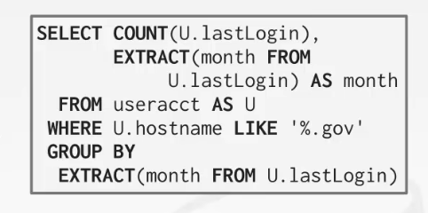

# Log-structured file organization

- 这一类DBMS存储的是一条条log，即log records
- 比如说
  - 新增一条怎样的record
  - 删除了哪一条record
  - 更新了哪一条record
- 
- 准确来说，这类DBMS存储的是操作所用的日志
- 如果要读取某个数据，就要把与这个数据有关的log全部重放
  - 一般都是从后往前找，找到这个数据刚被插入的时候（如果从前往后找，浪费时间）
  - 一个优化：给对应的数据一个索引，将同一个数据相关的log用一个索引将它们指向
- 但是如果log太多了的话会影响性能，所以会周期性的压缩日志
  - 即最后的日志，会保留数据本身（即对数据操作的日志，最后都会压缩为数据本身）
- 这种机制更多的用在kv数据库中（因为就只有一个键一个值，我们只需要最后一条更新日志即可恢复数据本身，比如说上面update了val=X，那么我们就知道id=3的数据最后的val就是X；但关系型数据库一条记录有多个数据，想要获取最新的数据不仅仅要最后一条更新日志，可能还要多条（因为关系型db有多个列，需要多条log维护这个值））
  - 例如leveldb，rocksdb，cassndra，hbase

## log-structured compaction

- 日志压缩

### level compaction

- 水平压缩
- 会有很多个log文件，但问题是数据A在log1中insert，又在log2中update，即对于单个log文件无论如何压缩，都无法很好的压缩掉数据A
- 所以就出现了水平级别的压缩，即第一层是各个log文件，然后第二层是上一层的两个log文件合并，第三层就以此类推
- 
- 参考rocksdb
- 上面是说数据如何写入，下面就说数据是如何读的
  - 首先从level 0层开始读，如果有的话，就代表此时的数据是当前该数据最新的版本，直接读即可
  - 如果没有，就代表该数据的操作可能已经被压缩到下面一层了，所以就往下一层读数据
  - 以此类推的往下走

### universal compaction

- 不是分层的，数据都是在同一层，合并后的数据都还是在同一层
- 

- 优点：写数据的时候将随机写变为顺序写，极大的提高性能，适用于写多读少的情况

# data representation

- 数据在磁盘上是如何表达的

- 

- 使用原生cpp的数据类型，通常比任意精度数字块，但是会存在舍入误差的情况
- 
  - 如上图，直接打印数字结果是没问题的，但是如果要打印结果的后20位，就会出现精度缺失的问题（因为浮点数的存储，计组..）
- DB的解决办法是字面上存储的是字符串
- 小数之类的通常存储在一个精确的、可变长度的二进制表示中，并带有额外的元数据
- 类似于VARCHAR，但是不存储string
- Demo：Postgres, SQL Server, Oracle

## PostgreSql对小数的存储

- ndigits：这个小数有多少位
- weight：权重
- scale：指数
- sign：是正数还是负数还是0
- digits：字符串（用字符串来存数字是多少）
- 

## mysql对小数的存储

- intg：小数点之前有多少位
- frac：小数点之后有多少位
- len：这个数据有多少的字节长
- sign：这个数是正还是负
- bug：指向字符串
- 

## Large values

- 可能会出现某一行记录的值，用一整个数据页都无法存储下来
- 所以会单独的拿一个溢出页来存储这个数据
- 如果记录的长度超过了2KB，那么PG数据库就会将数据单独拿一个page来存储，一页是8Kb
- mysql则是大于8KB就会触发（在原位置存储地址，然后取数据的时候去地址拿即可；一页是16kb，则mysql一页最少存储两行数据），SQL server（行数据不能超过整个page的长度，即sql server一页最少要存一行数据）
- 如果溢出页也不够的话，就溢出页后面再加上溢出页
- 尽量不要存储太大的数据，浪费资源（如果某个数据占用一页，那么就相当于读取一页只读到了一行数据..）
- 对于图片的做法，就可以把这类数据用对象存储，然后本地db记录一个地址就好了

- 

- 有些系统允许在外部文件中存储非常大的值，作为BLOB类型处理
  - Oracle: BFILE数据类型
  - 微软:FILESTREAM数据类型
- 即本地存储这个文件的地址，用的时候读地址上的数据即可

# system catalogs

- meta-data（可以理解为是系统表，与DBMS配置相关的元数据）
  - tables,columns,indexs,views
  - users,permissions
  - internal statistics
- 几乎所有数据库都自己管理这些meta-data，并且是把数据存储在表中
- DBMS都将meta-data当作数据存储在系统表中

# database workloads

DBMS可以以不同的方式存储元组，这些方式更适合OLTP或OLAP工作负载

## OLTP

- On-line Transaction Processing
- 行存储
- 用户在用
- 在线事务处理，快速的操作，读写数据量很小的元组，高并发，但是每次处理的数据量又很小
  - 读取/更新与数据库中单个实体相关的少量数据的简单查询
- 更倾向于写数据
- 

## OLAP

- On-line Analytical Processing
- 列存储
- 公司内部在用
- 联机分析处理，一个很复杂的sql，涉及多个表的join
  - 跨多个实体读取大量数据库的复杂查询
- 更倾向于读数据
- 

## HTAP

- hybrid transaction + analytical processing
- OLTP + OLAP

## bifurcated environment

- 工作负载时分开的
- 平时操作的时候用OLTP，然后用extract transform load将数据进行转换，转换到OLAP中进行分析
- 
- 一些公司的场景

# data storage models

- 其实我们平常使用sql语句，都是直接查询数据，但是不管数据库的底层是如何实现的
- 所以就衍生出说按列存储和按行存储

## n-ary storage model（NSM）

- 一个tuple存储了多个属性，就是按行存储

- DBMS将一个元组的所有属性连续地存储在一个页面中（适合OLTP）
- 在这种情况下，查询往往只对单个实体进行操作
- DBMS将一个元组的所有属性连续地存储在一个页面中
- 
- 优点
  - 快速插入，更新和删除（只处理这一行即可）
  - 适合需要整个元组的查询（需要一整行数据的时候就是优势了）
- 缺点
  - 不适合扫描表的大部分属性的子集
  - 比如说要查询某一列所有的数据，那么这种存储方式就要遍历全表，但是我们可能只需要其中一列的数据，那么其他列的数据的读入其实就是浪费的了..
  - 即做了很多的无用功

## decomposition storage model（DSM）

- DBMS存储一个页面中连续的所有元组的单个属性的值（适合OLAP）
- 
- 列式存储的两种方式：（遇到的问题，如何甄别这个数据属于哪一个对象的）
  - 一种是固定长度的偏移，每个值对于一个属性来说都是相同的长度（即规定所有列的第一行存的是对象A，第二行存的是对象B，第三行存的是对象C）
  - 另一种是对于还有每个属性的列，都加上该元组的id（每一列中的每个数据都记录自己属于哪一个对象，即用额外的空间存储id）
- 
- 优点
  - 减少浪费的I/O量，因为DBMS只读取它需要的数据
  - 更好的查询处理和数据压缩
- 缺点
  - 由于元组拆分/拼接（因为可能某一个元组无法完全存取数据的某一列，就会面临元组的切分的情况，所以数据的删除和擦混入就会有合并拼接的操作，从而会影响性能），点查询、插入、更新和删除速度较慢
  - 点查询不行（比如需要一行数据，就会变为随机IO，非常慢）

# Conclusion

- 存储引擎和数据库之间密切