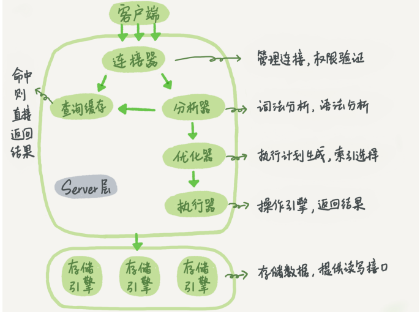

# 基础架构：一条SQL查询语句是如何执行的？

### 基础架构

- 

- MySQL 可以分为 Server 层和存储引擎层两部分
  -  Server 层包括连接器、查询缓存、分析器、优化器、执行器等，涵盖 MySQL 的大多数核心服务功能
  - 存储引擎层负责数据的存储和提取。其架构模式是插件式的，支持 InnoDB、MyISAM、 Memory 等多个存储引擎

### 连接器

- 负责跟客户端建立连接、获取权限、维持和管理连接
- 补充知识
  - 长连接是指连接成功后，如果客户端持续有请求，则一直使用同一个连接（尽量使用长连接）
  - 短连接则是指每次执行完很少的几次查询就断开连接，下次查询再重新建立一个
  - 太多长连接导致mysql异常重启，两个解决办法
    - 定期断开长连接
    - 通过执行 mysql_reset_connection 来重新初始化连接资源

### 查询缓存

- 弊大于利（一旦修改，全部缓存失效）
- MySQL 8.0 版本直接将查询缓存的整块功能删掉了，也就是说 8.0 开始彻底没有这个功能

### 分析器

- 词法分析，语法分析

### 优化器

- 优化器是在表里面有多个索引的时候，决定使用哪个索引；或者在一个语句有多表关联（join）的时候，决定各个表的连接顺序

### 执行器

- 先会判断是否有查询的权限
- 然后调用引擎接口，返回数据