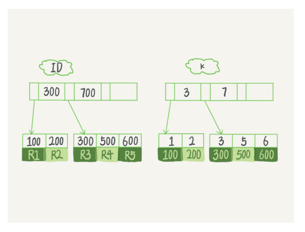

# 深入浅出索引(上)

索引的出现其实就是为了提高数据查询的效率，就像书的目录一样

常见的三种索引：哈希表、有序数组和搜索树

### 哈希表

- 
- 哈希表这种结构适用于只有等值查询的场景
- 比如memcached及其他一些NoSQL引擎

### 有序数组

- 
- 在等值查询和范围查询场景中的性能就都非常优秀
- 支持范围查询（二分法）
- 如果仅仅看查询效率，有序数组就是最好的数据结构了。但是，在需要更新数据的时候就麻烦了，你往中间插入一个记录就必须得挪动后面所有的记录，成本太高
- 所以只适用于静态存储引擎

### 二叉搜索树

- 
- 每个节点的左儿子小于父节点，父节点又小于右儿子。这样如果你要查 ID_card_n2 的话，按照图中的搜索顺序就是按照 UserA -> UserC -> UserF -> User2 这个路径得到，这个时间复杂度是 O(log(N))
- 为了维持 O(log(N)) 的查询复杂度，你就需要保持这棵树是平衡二叉树。为了做这个 保证，更新的时间复杂度也是 O(log(N))

- 在 MySQL 中，索引是在存储引擎层实现的，所以并没有统一的索引标准，即不同存储引擎的索引的工作方式并不一样。而即使多个存储引擎支持同一种类型的索引，其底层的实现 也可能不同

### InnoDB的索引模型

- 使用的是B+树
- 
- 其中，索引分为主键索引和非主键索引
  - 主键索引的叶子节点存的是整行数据，在 InnoDB 里，主键索引也被称为聚簇索引（clustered index）
  - 非主键索引的叶子节点内容是主键的值。在 InnoDB 里，非主键索引也被称为二级索引（secondary index）
- 基于非主键索引的查询需要多扫描一颗索引树

### 索引维护

- B+树为了维护索引的有序性需要做出必要的维护
- 以上面这个图为例，如果插入新的行 ID 值为 700，则只需要在 R5 的记录后面插入一个新记录
- 如果新插入的 ID 值为 400，就相对麻烦了，需要逻辑上挪动后面的数据，空出位置
- 更糟的情况是，如果 R5 所在的数据页已经满了，根据 B+ 树的算法，这时候需要申请一个新的数据页，然后挪动部分数据过去。这个过程称为**页分裂**。在这种情况下，性能自然会受影响
- 除了性能外，页分裂操作还影响数据页的利用率。原本放在一个页的数据，现在分到两个页中，整体空间利用率降低大约 50%

### 自增主键

- 是指自增列上定义的主键，在建表语句中一般是这么定义的： NOT NULL PRIMARY KEY AUTO_INCREMENT
- 自增主键的插入数据模式，正符合了我们前面提到的递增插入的场景。每次插入一条新记录，都是追加操作，都不涉及到挪动其他记录，也不会触发叶子节点的分裂
- 显然，主键长度越小，普通索引的叶子节点就越小，普通索引占用的空间也就越小
- 所以，从性能和存储空间方面考量，自增主键往往是更合理的选择