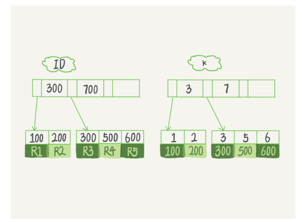
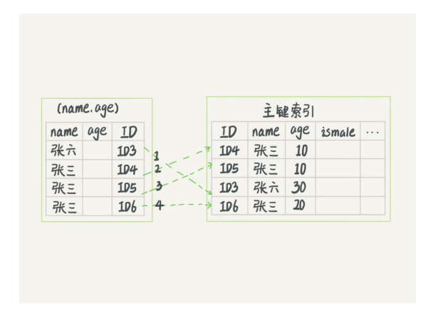
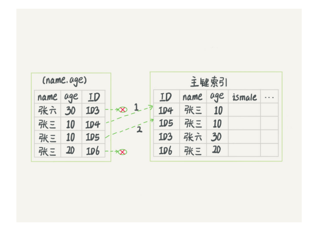

# 深入浅出索引(下)


### 一条语句的查询

```sql
select * from T where k between 3 and 5
```

- 
- 执行流程：
  - 在 k 索引树上找到 k=3 的记录，取得 ID = 300
  - 再到 ID 索引树查到 ID=300 对应的 R3
  - 在 k 索引树取下一个值 k=5，取得 ID=500
  - 再回到 ID 索引树查到 ID=500 对应的 R4
  - 在 k 索引树取下一个值 k=6，不满足条件，循环结束
- 在这个过程中，回到主键索引树搜索的过程，我们称为**回表**


### 覆盖索引

- 如果执行的语句是 select ID from T where k between 3 and 5
- 这时只需要查 ID 的值， 而 ID 的值已经在 k 索引树上了
- 因此可以直接提供查询结果，不需要回表
- 由于覆盖索引可以减少树的搜索次数，显著提升查询性能，所以使用覆盖索引是一个常用的性能优化手段


### 最左前缀原则

- 这个最左前缀可以是联合索引的最左 N 个字段，也可以是字符串索引的最左 M 个字符
- 安排索引顺序的原则
  - 如果通过调整顺序，可以少维护一个索引，那么这个顺序往往就是需要优先考虑采用的
  - 其次再考虑空间


### 索引下推

- ```sql
  select * from tuser where name like '张 %' and age=10 and ismale=1;
  ```

- 每拿到一个姓张的数据，就要再去判断他的岁数是不是10岁

- 在 MySQL 5.6 之前，只能从 ID3 开始一个个回表。到主键索引上找出数据行，再对比字段值

  - 

- MySQL 5.6 引入的索引下推优化（index condition pushdown)， 可以在索引遍历过 程中，对索引中包含的字段先做判断，直接过滤掉不满足条件的记录，减少回表次数（即在索引内部就又判断了一次）

  - 