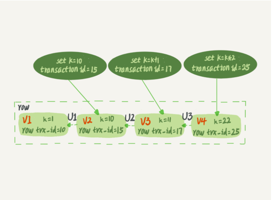
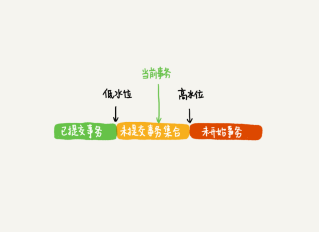
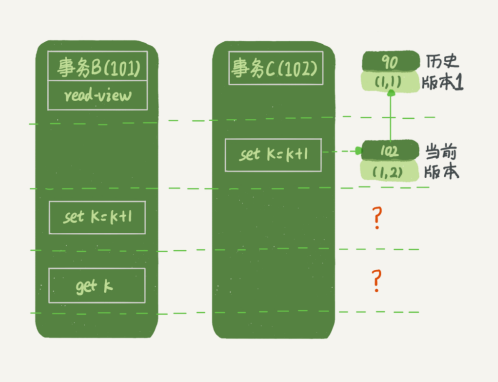
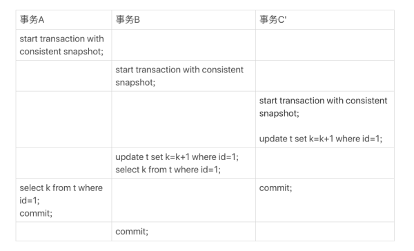
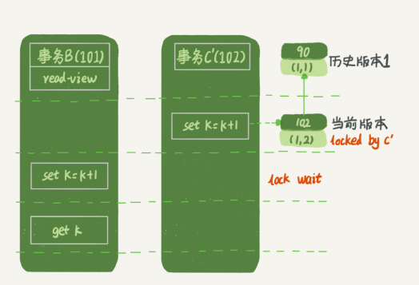

# 事务到底是隔离的还是不隔离的？

### 事务的起点

- begin/start transaction 命令并不是一个事务的起点，在执行到它们之后的第一个操作 InnoDB 表的语句，事务才真正启动
- 如果你想要马上启动一个事务，可以使用 start transaction with consistent snapshot 这个命令

### 视图

- 第一种是view，它是一个用一个查询语句定义的虚拟表，在调用的时候执行查询语句并生成结果
- 另一个时InnoDB在实现MVCC时用到的一致性读视图，即consistent read view，用于支持RC（读提交）和RR（可重复读）隔离级别的实现

### 快照

- 在可重复读隔离级别下，事务在启动的时候就“拍了个快照”。注意，这个快照是基于整库的
- 背景：
  - InnoDB 里面每个事务有一个唯一的事务 ID，叫作 transaction id
  - 它是在事务开始的时候向 InnoDB 的事务系统申请的，是按**申请顺序严格递增**的

- 而每行数据也都是有多个版本的，每次事务更新数据的时候，都会生成一个新的数据版本，并把transaction id赋值给这个数据版本的事务ID，记为row trx_id
- 同时，旧的数据版本要保留，并且在新的数据的版本中，能够有信息可以直接拿到它
- 即，数据表中的一行记录，其实可能有多个版本，每个版本有自己的row trx_id
- 
- 其中的三个虚线的横线箭头是undo log

- 因此，一个事务只需要在启动的时候声明说，”以我启动的时刻为准，如果一个数据版本是在我启动之前生成的，就认；如果是我启动之后才生成的，就不认，我必须要找到它的上一个版本“
- 如果上一个版本也不可见的话，那就得继续往前找；如果是这个事务自己更新的数据的话，它还是要认的

- 在实现上， InnoDB 为**每个事务构造了一个数组**，用来保存这个事务启动瞬间，当前正在“活跃”的所有事务 ID
- “活跃”指的是：启动了但还没提交
- 数组里面事务ID的最小值记为**低水位**，当前系统里面已经创建过的事务ID的最大值加1记为**高水位**
- 这个视图数组和高水位，组成了当前事务的一致性视图
- 

- 对于当前事务的启动瞬间来说，一个数据版本的 row trx_id，有以下几种可能
  - 如果在绿色部分，表示这个版本是已提交的事务或者是当前事务自己生成的，这个数据是可见的
  - 如果在红色部分，表示这个版本是由将来启动的事务生成的，是不可见的
  - 如果在黄色部分，包括两种情况
    - 若 row trx_id 在数组中，表示这个版本是由还没提交的事务生成的，不可见
    - 若 row trx_id 不在数组中，表示这个版本是已经提交了的事务生成的，可见

- 对上述的翻译：
  - 版本未提交，不可见
  - 版本已提交，但是是在视图创建后提交的，不可见
  - 版本已提交，而且是在视图创建前提交的，可见

### 更新逻辑

- 一个规则：更新数据都是先读后写，而这个读，只能读当前的值，称为**当前读**

- 参考一个背景：
- 
- 如果事务 B 在更新之前查询一次数据，这个查询返回的 k 的值确实是 1
- 但是，当它要去更新数据的时候，就不能再在历史版本上更新了，否则事务 C 的更新就丢失了
- 因此，事务 B 此时的 set k=k+1 是在（1,2）的基础上进行的操作
- PS:这里事务C执行完set后就直接提交了

- 再参考一个背景：
- 
- 在这里：事务 C’的不同是，更新后并没有马上提交，在它提交前，事务 B 的更新语句先发起了
- 这里两阶段锁上场了，事务 C’没提交，也就 是说 (1,2) 这个版本上的写锁还没释放
- 而事务 B 是当前读，必须要读最新版本，而且必须加锁，因此就被锁住了，必须等到事务 C’释放这个锁，才能继续它的当前读
- 

### 可重复读

- 核心是**一致性读**
- 而事务更新数据的时候，只能用当前读
- 如果当前的记录的行锁被其他事务占用的话，就需要进入锁等待
- 与读提交的区别
  - 在可重复读隔离级别下，只需要在事务开始的时候创建一致性视图，之后事务里的其他查 询都共用这个一致性视图
  - 在读提交隔离级别下，每一个语句执行前都会重新算出一个新的视图

- 对可重复读的一个全新的认识
  - 重复读是指 当前读到的数据 和 事务开始的时候的数据 是一样的
  - 但是，如果说当前要改数据的话，即更新数据的话，都是先读后写，这个读只能读当前的值（不能是快照读）
  - 而为什么还是会出现幻读，是因为，你只是保证了当前已有的数据是和开始的时候一样，但是如果后面有事务提交了新的数据（这个事务的开始是早于当前事务的），那么当前事务再读的时候就会出现幻读的情况，这时候就需要间隙锁来解决了

### 小结

- 对于可重复读，查询只承认在事务启动前就已经提交完成的数据（其实这不准确，应该说是只承认该事务之前就已经启动的事务提交的数据）
- 对于读提交，查询只承认在语句启动前就已经提交完成的数据
- 而当前读，总是读取已经提交完成的最新版本