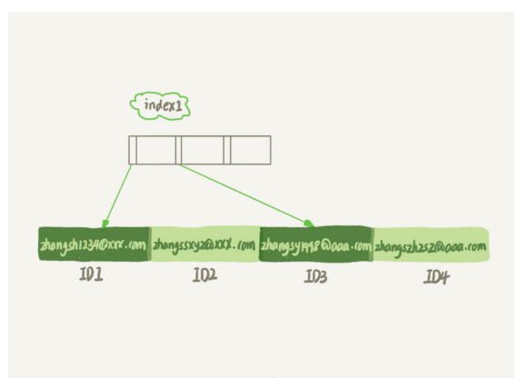
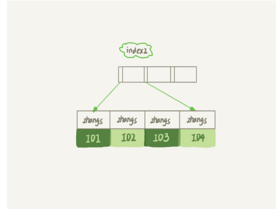

# 怎么给字符串字段加索引？

- 
- 

### 如何选择前缀索引

- 图二是前缀索引，发现使用了前缀索引，可能会导致查询语句读数据的次数变多
- 但是呢，说使用前缀索引，定义好长度，就可以做到既节省空间，又不用额外增加太多的查询成本
- 问题就变成如何设置好字符串索引的长度？
  - 算出这个列上有多少个不同的值，依次选取不同长度的前缀来看这个值
  - 而使用前缀索引很可能会损失区分度，所以你需要预先设定一个可以接受的损失比例， 比如 5%

### 前缀索引对覆盖索引的影响

- 如果使用整个字符串的索引结构，那么就可以利用覆盖索引，因为这里查到了结果就直接返回了，不需要再到其他索引里面再查一次
- 而使用前缀索引，即使当前查到了结果，即使当前索引包含了所有的信息，但是InnDB还是会回到其他索引里面再查一下，因为系统并不确定前缀索引的定义是否截断了完整信息
- 总结：使用前缀索引就用不上覆盖索引对查询性能的优化了，这也是你在选择是否使用 前缀索引时需要考虑的一个因素

### 其他方式

- 使用倒序存储
  - 比如说身份证号的最后6位没有地址码这样的重复逻辑，所以最后这6位很可能就提供了足 够的区分度
- 使用hash字段
  - 再创建一个整数字段，来保存身份证的校验码，同时在这个字段上创建索引
  - 然后每次插入新记录的时候，都同时用crc32()这个函数得到校验码填到这个新字段
  - 所以查询的时候不仅要查询哈希值是否相等，还要看具体的字符串是否相等
- 相同点：
  - 都不支持范围查询
  - 倒序存储的字段上创建的索引是按照倒序字符 串的方式排序的，已经没有办法利用索引方式查出身份证号码在 [ID_X, ID_Y] 的所有市民了
  - 同样地，hash 字段的方式也只能支持等值查询
- 不同点：
  - 从占用的额外空间来看：倒序存储方式在主键索引上，不会消耗额外的存储空间，而 hash 字段方法需要增加一个字段。当然，倒序存储方式使用 4 个字节的前缀长度应该是 不够的，如果再长一点，这个消耗跟额外这个 hash 字段也差不多抵消了
  - 在 CPU 消耗方面：倒序方式每次写和读的时候，都需要额外调用一次 reverse 函数，而 hash 字段的方式需要额外调用一次 crc32() 函数。如果只从这两个函数的计算复杂度来 看的话，reverse 函数额外消耗的 CPU 资源会更小些
  -  从查询效率上看：使用 hash 字段方式的查询性能相对更稳定一些。因为 crc32 算出来 的值虽然有冲突的概率，但是概率非常小，可以认为每次查询的平均扫描行数接近 1。 而倒序存储方式毕竟还是用的前缀索引的方式，也就是说还是会增加扫描行数
