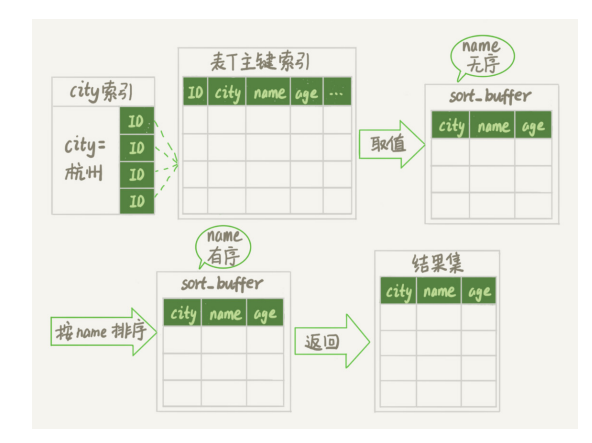
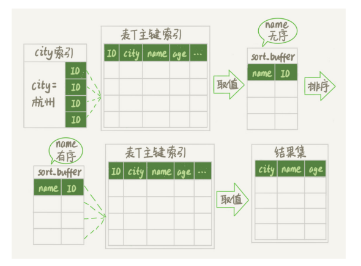
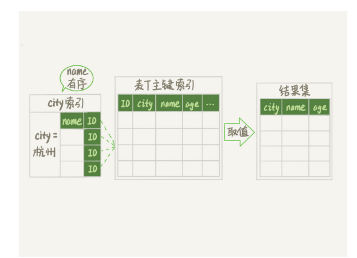
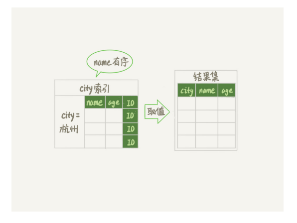

# “order by”是怎么工作的？

- 背景

  - ```sql
    select city,name,age from t where city='杭州' order by name limit 1000;
    ```

- MySQL会给每个线程分配一块内存用于排序，称为sort_buffer


### 全字段排序

- 语句的执行流程
  - 初始化 sort_buffer，确定放入 name、city、age 这三个字段
  - 从索引 city 找到第一个满足 city='杭州’条件的主键 id
  - 到主键 id 索引取出整行，取 name、city、age 三个字段的值，存入 sort_buffer 中
  - 从索引 city 取下一个记录的主键 id
  -  重复上述两个步骤直到 city 的值不满足查询条件为止
- 
- 图中按照name排序的动作，可能在内存中完成，也可能需要外部排序，这取决于排序所需的内存和参数 sort_buffer_size


- sort_buffer_size，就是 MySQL 为排序开辟的内存（sort_buffer）的大小。如果要排序的 数据量小于 sort_buffer_size，排序就在内存中完成。但如果排序数据量太大，内存放不 下，则不得不利用磁盘临时文件辅助排序
- PS：外部排序通常是归并排序，所以需要多个文件
  - MySQL 将需要排序的数据分成 12 份，每一份单独排序后存在这些临时文件中。然后把这 12 个有序文件再合并成一个有序的大文件


### rowid排序

- 全字段排序的缺点：如果查询要返回的字段很多的话，那么sort_buffer里面要放的字段数太多，这样内存里能够同时放下的行数很少，要分成很多个 临时文件，排序的性能会很差
- 即，单行数据很多的话，这个方法效率会很低


- 背景：
  - max_length_for_sort_data是 MySQL 中专门控制用于排序的行数据的长度的一个参数
  - 它的意思是，如果单行的长度超过这个值，MySQL 就认为单行太大，要换一个算法


- 语句执行流程
  - 初始化 sort_buffer，确定放入两个字段，即 name 和 id
  - 从索引 city 找到第一个满足 city='杭州’条件的主键 id
  - 到主键 id 索引取出整行，取 name、id 这两个字段，存入 sort_buffer 中
  - 从索引 city 取下一个记录的主键 id
  - 重复上述步骤直到不满足 city='杭州’条件为止
  - 对 sort_buffer 中的数据按照字段 name 进行排序
  - 遍历排序结果，取前 1000 行，并按照 id 的值回到原表中取出 city、name 和 age 三个 字段返回给客户端
- 


- 这种方法会多一遍回表的情况


### 两种排序的比较

- 如果 MySQL 实在是担心排序内存太小，会影响排序效率，才会采用 rowid 排序算法，这 样排序过程中一次可以排序更多行，但是需要再回到原表去取数据
- 如果 MySQL 认为内存足够大，会优先选择全字段排序，把需要的字段都放到 sort_buffer 中，这样排序后就会直接从内存里面返回查询结果了，不用再回到原表去取数据
- 总结：如果内存够，就要多利用内存，尽量减少磁盘访问


- 并不是所有的order by都需要排序（比如说主键就不需要排序）
  - 之所以需要生成临时表排序，是因为原来的数据是无序的


- 优化：对city和name建立联合索引
- 语句执行流程变为：
  -  从索引 (city,name) 找到第一个满足 city='杭州’条件的主键 id
  - 到主键 id 索引取出整行，取 name、city、age 三个字段的值，作为结果集的一部分直 接返回
  - 从索引 (city,name) 取下一个记录主键 id
  - 重复上述两个步骤，直到查到第 1000 条记录，或者是不满足 city='杭州’条件时循环结束
- 

- 这个查询过程不需要临时表，也不需要排序，相当于拿这1k个数据只扫描了1k次


- 覆盖索引+联合索引的优化：
  - 在city、name和age建立联合索引
- 语句执行过程：
  - 从索引 (city,name,age) 找到第一个满足 city='杭州’条件的记录，取出其中的 city、 name 和 age 这三个字段的值，作为结果集的一部分直接返回
  - 从索引 (city,name,age) 取下一个记录，同样取出这三个字段的值，作为结果集的一部分直接返回
  - 重复执行第二步，直到1k条记录
- 