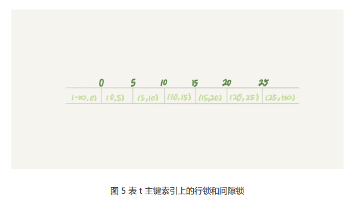

# 幻读是什么，幻读有什么问题？

### 背景

- 我的理解：
  - 就是有一个比当前事务A更早开始的事务B，此时A事务进行了一次select，得到结果j1
  - 然后B事务提交了一次insert，接着B事务commit
  - 然后A事务再select的时候，得到了结果j2
  - j1 != j2
- 
  - 因为上面的三个查询都是**当前读**，而当前读的规则，就是要能读到所有已经提交的记录的最新值。并且，session B 和 sessionC 的两条语句，执行后就会提交， 所以 Q2 和 Q3 就是应该看到这两个事务的操作效果，而且也看到了，这跟事务的可见性规则并不矛盾

### 幻读

- 定义：
  - 用一个事务里面，后一个请求看到的比之前相同请求看到的，多了记录出来
  - 一个事务在前后两次查询同一个范围的时候，后一次查询看到了前一次没有看到的行
- 说明
  - 在可重复读隔离级别下，普通的查询是快照读，是不会看到别的事务插入的数据的。因此，幻读在“当前读”下才会出现
  - 上述sessionB的修改结果，被sessionA之后的select语句用”当前读“看到，不能称为幻读，幻读只能是指新插入的行

### 幻读有什么问题？

语义上

- session A 在 T1 时刻就声明了，“我要把所有 d=5 的行锁住，不准别的事务进行读写操作”
- 而实际上，这个语义被破坏了

### 如何解决幻读？

- 产生幻读的原因，行锁只能锁住行，但是新插入记录这个动作，要更新的是记录之间的”间隙“
- 因此InnoDB引入新的锁，也就是间隙锁
- 即锁的就是两个值之间的空隙
- 