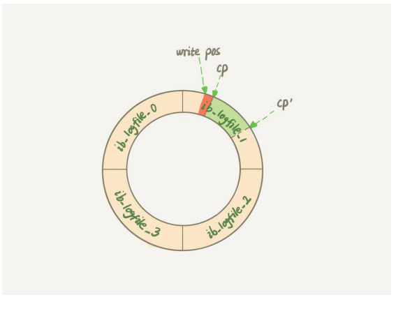
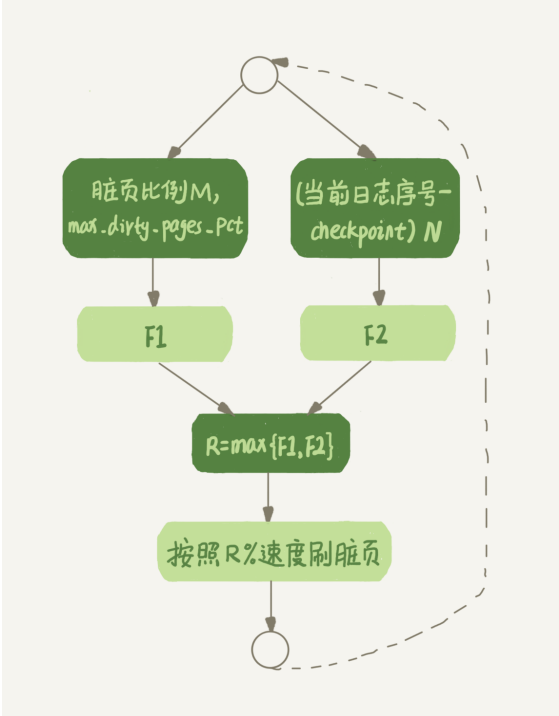

# .l为什么我的MySQL会“抖”一下

- 当内存数据页跟磁盘数据页内容不一致的时候，我们称内存页为脏页
- 内存数据写入到磁盘后，内存和磁盘上的数据页一致了，称为干净页

- 平时执行很快的更新操作，其实就是在写内存和日志，而MySQL偶尔抖一下可能是因为在刷脏页（flush）

### flush

触发的时机：

- 第一种：InnoDB 的 redo log 写满了。这时候系统会停止所有更新操作， 把 checkpoint 往前推进，redo log 留出空间可以继续写
- 
- 把checkpoint的位置从CP移动到CP‘，就要把两点之间的日志（浅绿色的部分），对应的所有的脏页都flush到磁盘上
- 之后write pos就是两个cp之间的区域
- 但这种情况下是InnoDB需要尽量避免的，因为出现这种情况，系统就不再接收更新了，所有的更新都必须堵住

- 第二种：系统内存不足。当需要新的内存页，而内存不够用的时候，就要淘汰一些数据页，空出内存给别的数据页使用
- 如果淘汰的是“脏页”，就要先把脏页写到磁盘
- PS：有人说可以把内存淘汰掉，后续需要数据的受，从磁盘读入数据，拿redo log来用也可以
  - 但问题是，如果我刷脏页的话，就能够保证数据页只有两种情况
  - 一种是内存里存在的，内存里就直接返回
  - 另一种是内存不存在的，就可以肯定数据文件上是正确的结果，读入内存后返回
- 这种情况其实才是常态。InnoDB用缓冲池（buffer pool）管理内存，缓冲池中的内存页有三种状态：
  - 第一种是，还没有使用的
  - 第二种是，使用了并且是干净页
  - 第三种是，使用了并且是脏页

- 当要读入的数据页没有在内存的时候，就必须到缓冲池中申请一个数据页
- 这时候只能把 最久不使用的数据页从内存中淘汰掉
- 如果要淘汰的是一个干净页，就直接释放出来复用
- 但如果是脏页呢，就必须将脏页先刷到磁盘，变成干净页后才能复用

- 影响性能的两种情况
- 一个查询要淘汰的脏页个数太多，会导致查询的响应时间明显变长
- 日志写满，更新全部堵住，写性能跌为 0，这种情况对敏感业务来说，是不能接受的

- 第三种：MySQL 认为系统“空闲”的时候

- 第四种：MySQL 正常关闭的情况。这时候，MySQL 会把内存的脏页都 flush 到磁盘上，这样下次 MySQL 启动的时候，就可以直接从磁盘上读数据，启动速度会很快

### InnoDB刷脏页的控制策略

- 首先，需要告诉InnoDB自己主机的IO能力（这就要用到 innodb_io_capacity 这个参数了，它会告诉 InnoDB 你的磁盘能力）
- 决定控制刷脏页的速度的因素
  - 内存脏页太多（脏页比例）
  - redo log写满（redo log写盘速度）
- 参数 innodb_max_dirty_pages_pct 是脏页比例上限，默认值是 75%。InnoDB 会根据当 前的脏页比例（假设为 **M**），算出一个范围在 0 到 100 之间的数字
- InnoDB 每次写入的日志都有一个序号，当前写入的序号跟 checkpoint 对应的序号之间的差值，我们假设为 N。InnoDB 会根据这个 N 算出一个范围在 0 到 100 之间的数字，这个计算公式可以记为 F2(**N**)。F2(N) 算法比较复杂，你只要知道 N 越大，算出来的值越大就好了
- 
- 为了避免MySQL抖一下，平时要多关注脏页比例，不要让它接近75%
- 其中，脏页比例是通过 Innodb_buffer_pool_pages_dirty/Innodb_buffer_pool_pages_total 得到的

### 一个坑爹的策略

- MySQL 中的一个机制，可能让你的查询会更慢：
- 准备刷一个脏页的时候，如果 这个数据页旁边的数据页刚好是脏页，就会把这个“邻居”也带着一起刷掉
- 而且这个把“邻居”拖下水的逻辑还可以继续蔓延，也就是对于每个邻居数据页
- 如果跟它相邻的数 据页也还是脏页的话，也会被放到一起刷

- 在 InnoDB 中，innodb_flush_neighbors 参数就是用来控制这个行为的
- 值为 1 的时候会有上述的“连坐”机制
- 值为 0 时表示不找邻居，自己刷自己的

- 所以会导致系统刷盘变得很慢...
- 不过还好，在 MySQL 8.0 中，innodb_flush_neighbors 参数的默认值已经是 0 了