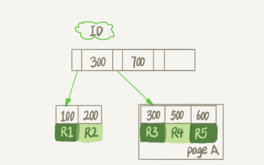
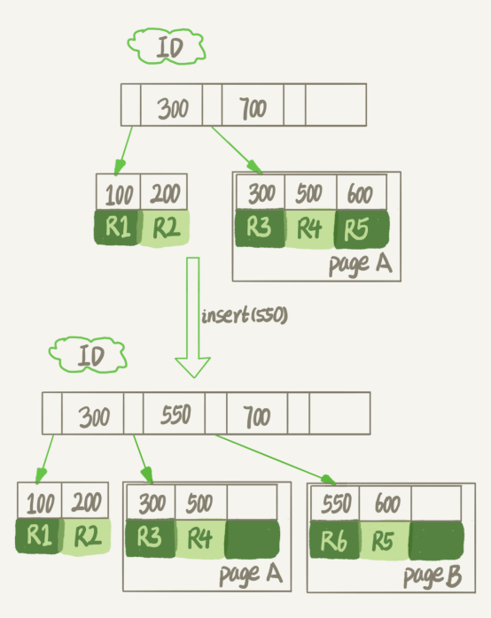
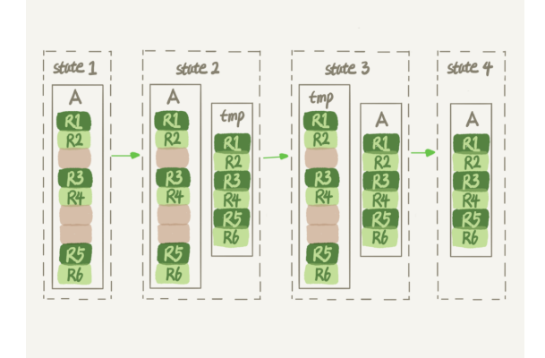
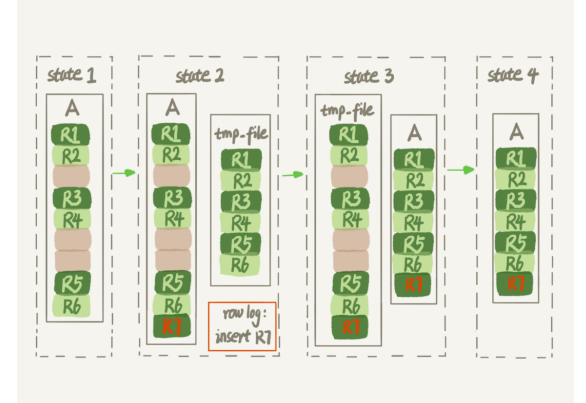

# 为什么表数据删掉一般，表文件大小不变？

### 参数 innodb_file_per_table

- 表数据既可以在共享表里面，也可以是单独的文件，这个行为就是这个参数控制的
- OFF 表示的是，表的数据放在系统共享表空间，也就是跟数据字典放在一起
- ON 表示的是，每个 InnoDB 表数据存储在一个以 .ibd 为后缀的文件中
- 从 MySQL 5.6.6 版本开始，它的默认值就是 ON 了


### 数据删除流程

- 
- 如果删除R4记录
  - InnoDB只会把R4这个记录标记为删除
  - 如果后续再插入一个ID在300和600之间的记录，可能会复用这个位置
  - 但是，磁盘文件的大小不会缩小
- 如果要删掉一整个页上所有的数据，那么整个数据页可以被复用


- 删除记录和删除页的复用是不同的
- 如果将数据页 page A 上的所有记录删除以后，page A 会被标记为可复用
- 这时候如果要插入一条ID=50的记录需要使用新页的时候，pageA是可以被复用的


- 如果相邻的两个数据页利用率都很小，系统就会把这两个页上的数据合到其中一个页上，另外一个数据页就被标记为可复用


- 如果我们用 delete 命令把整个表的数据删除呢？结果就是，所有的数据页都会被标记为可复用。但是磁盘上，文件不会变小
- 即删除数据会导致数据表变得空洞


插入数据也会导致表空洞

- 


### 重建表

- ```sql
  alter table A engine=InnoDB;//重建表
  ```


- 
- 上图是MySQL5.5的做法
- 可以看出花时间最多的地方就是往临时表插入数据的过程
- 在整个DDL过程中，表A中不能有更新


- 
- 上图是MySQL5.6以后的做法
- 当重建表的时有数据插入的时候，将所有对A的操作记录在一个日志文件（row log）中，对应的是state2的状态
- 临时文件生成后，将日志文件中的操作应用到临时文件，得到一个逻辑数据上与表A相同的数据文件，对应的就是图中state3的状态
- PS：
  - alter语句在启动后需要获取MDL写锁，但是这个写锁在真正拷贝数据之前就退化成了读锁
  - 退化的原因：MDL读锁不会阻塞增删改的操作
  - 上锁的原因：禁止其他线程对这个表做DDL
- 在这个过程最耗时的是拷贝数据到临时表的过程，而这一步是可以接收增删改操作的
- 而相对于DDL过程，锁的时间非常短，对于业务来说，是可以online的


### Online和inplace

- 在MySQL5.5的时候，我们把表A中的数据导出来的存放位置叫作tmp_table，这是一个临时表，是在server层创建的
- 而MySQL5.6以后，重建的数据是放在tmp_file中，这个临时文件是InnoDB在内部创建出来的
  - 整个DDL过程都在InnoDB内部完成的
  - 对于server层来说，没有把数据挪动到临时表，是一个原地“操作”


- DDL 过程如果是 Online 的，就一定是 inplace 的
- 反过来未必，也就是说 inplace 的 DDL，有可能不是 Online 的
- 截止到 MySQL 8.0，添加全文索引（FULLTEXT index）和空间索引 (SPATIAL index) 就属于这种情况


### 小结

- Online DDL的方式是可以考虑在业务低峰期使用的，而MySQL5.5及之前的版本，这个命令是会阻塞DML的
- 