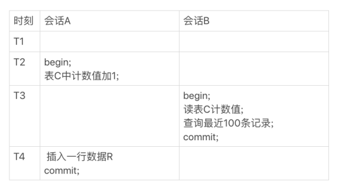

# count(*)这么慢，我该怎么办？

### count(*)的实现方式

- MyISAM 引擎把一个表的总行数存在了磁盘上，因此执行 count(*) 的时候会直接返回这个数，效率很高
- InnoDB 引擎就麻烦了，它执行 count(*) 的时候，需要把数据一行一行地从引擎里面读出来，然后累积计数


- 背景：
  - InnoDB 是索引组织表，主键索引树的叶子节点是数据，而普通索引树的叶子节点是主键值。所以，普通索引树比主键索引树小很多
- 所以MySQL 优化器会找到最小的那棵树来遍 历。在保证逻辑正确的前提下，尽量减少扫描的数据量，是数据库系统设计的通用法则之一


- ```sql
  show table status;
  ```

- 可以显示当前表有多少行

- 但是它也是通过采样估算的，因此很可能不准；官方误差有40%到50%


- 小结：
  - MyISAM 表虽然 count(*) 很快，但是不支持事务
  - show table status 命令虽然返回很快，但是不准确
  - InnoDB 表直接 count(*) 会遍历全表，虽然结果准确，但会导致性能问题


### 用缓存系统保存计数

- 用一个redis服务来记录这个表的总行数


缺点：

- 缓存系统可能会丢失更新
- 因为redis不能保持原子操作的特性导致系统出现问题（看书，书上写的很详细）
  - 情况一：查到的 100 行结果里面有最新插入记录，而 Redis 的计数里还没加1
  - 情况二：查到的 100 行结果里没有最新插入的记录，而 Redis 的计数里已经加了1


### 在数据库保存计数

- 把计数直接放到数据库里单独的一张计数表C中
- 解决了崩溃丢失的问题,InnoDB是支持崩溃恢复不丢数据的
- 利用事务的原子性保证了数据的一致
- 


### 不同的count用法

原则

- server层要什么就给什么
- InnoDB只给必要的值
- 现在的优化器只优化了count(*)的语义为”取行数“，其他“显而易见”的优化并没有做


- 对于 **count(主键 id)**来说，InnoDB 引擎会遍历整张表，把每一行的 id 值都取出来，返回给 server 层
- server 层拿到 id 后，判断是不可能为空的，就按行累加


- 对于**count(1)**来说，InnoDB 引擎遍历整张表，但不取值
- server 层对于返回的每一行， 放一个数字“1”进去，判断是不可能为空的，按行累加


- 对于**count(字段)**来说
  - 如果这个“字段”是定义为 not null 的话，一行行地从记录里面读出这个字段，判断不能为 null，按行累加
  - 如果这个“字段”定义允许为 null，那么执行的时候，判断到有可能是 null，还要把值取出来再判断一下，不是 null 才累加


- 对于**count(*)**来说，并不是把全部字段取出来，而是专门做了优化，不取值
- count(*) 肯定不是 null，按行累加


- 总结：按照效率排序的话，count(字段) < count(主键 id) < count(1) == count(*)
- 所以最好多用count(**)