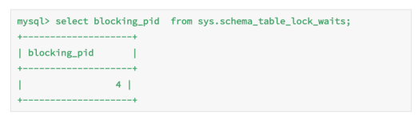
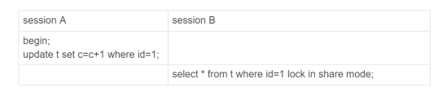
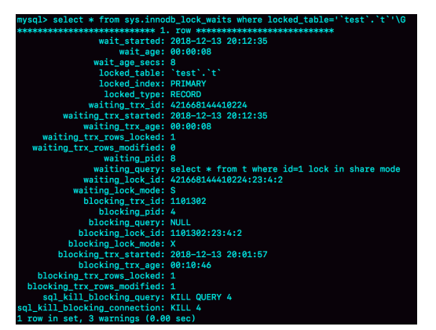
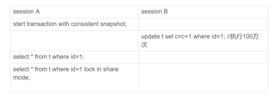
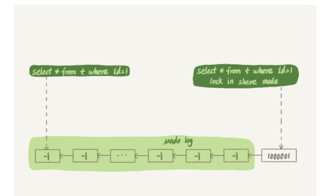

# 为什么我只查一行的语句，也执行这么慢？

### 查询长时间不返回

- 一般这种情况都是表被锁了
- 首先执行show processlist命令，看看当前语句处于什么状态

等MDL锁

- 出现这个状态表示的是，现在有一个线程正在表t上请求或者持有MDL写锁，吧select语句堵住了
- 
- 解决办法：
  - 找到谁持有MDL写锁，然后把它kill掉
  - 通过查询 sys.schema_table_lock_waits 这张表，我们就可以直接找出造成阻塞的 process id，把这个连接用 kill 命令断开即可
  - 

等flush

- 当前语句被flush语句给阻塞了
- 
- sessionA的语句被执行了10万秒，导致sessionB的flush语句去关闭表就要等sessionA的查询结束，这样sessionC要再次查询的话就会被flush阻塞
- 解决办法：
  - 也是使用show processlist，去kill线程

等行锁

- 
- 由于访问id=1的时候会加上读锁，如果这时候已经有一个事务在这行记录上持有一个写锁，那么select就会被阻塞
- 
- 这里要解决行锁，应该是用`kill 4`才行，也就是说直接断开这个链接，这里隐含的一个逻辑是，链接被断开的时候，会自动回滚这个链接里面正在执行的线程，也就释放了id=1上的行锁

### 查询慢

- 扫描行数多，是正常的可以理解的
- 坏查询不一定是慢查询，如果数据量上去了，执行时间也就线性涨上去了

- 
- 这里sessionA先开始一个事务，之后sessionB才开始执行update语句
- sessionB执行完后，出现了100万个回滚日志(undo log)
- 
- 带 lock in share mode 的 SQL 语句，是当前读，因此会直接读到 1000001 这个结果，所以速度很快
- 而 select * from t where id=1 这个语句，是一致性读，因此需要从 1000001 开始，依次执行 undo log，执行了 100 万次以后，才将 1 这个结果返回。