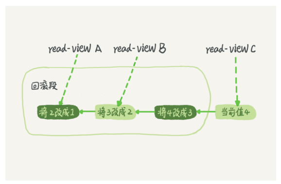

# 事务隔离：为什么你改了我还看不见？

### 事务

- 保证一组数据库操作，要么全部成功，要么全部失败
- 在MySQL中，事务支持是在引擎层实现的
- MySQL 原生的 MyISAM 引擎就不支持事务，这也是 MyISAM 被 InnoDB 取代的重要原因之一

### 隔离级别

- 读未提交（read uncommitted）：一个事务还没提交时，它做的变更就能被别的事务看到
- 读提交（read committed）：一个事务提交之后，它做的变更才会被其他事务看到
- 可重复读（repeatable read）：
  - 一个事务执行过程中看到的数据，总是跟这个事务在启动时看到的数据是一致的
  - 未提交的变更对其他事务也是不可见的
  - 在事务执行期间会锁定该事务以任何方式引用的所有行
- 串行化（serializable）：
  - “写”会加“写锁”，“读”会加“读锁”
  - 当出现读写锁冲突的时候，后访问的事务必须等前一个事务执行完成，才能继续执行

### 实现

- 数据库里面会创建一个视图，访问的时候以视图的逻辑结果为准
- 可重复读：这个视图是在事务启动时创建的，整个事务存在期间都用这个视图
- 读提交：这个视图是在每个 SQL 语句开始执行的时候创建的
- 读未提交：直接返回记录上的最新值，没有视图概念
- 串行化：直接用加锁的方式来避免并行访问

- Oracle 数据库的默认隔离级别其实就是“读提交”

### 事务隔离的实现

- MVCC
- 
- 回滚日志：在不需要的时候才会删除；也就是说，系统会判断，当没有事务再需要用到这些回滚日志时，回滚日志会被删除
- 不需要：是当系统里没有比这个回滚日志更早的 read-view 的时候
- 所以尽量不要使用长事务，这意味着系统内会有很多很老的事务视图
- 长事务还占用锁资源

