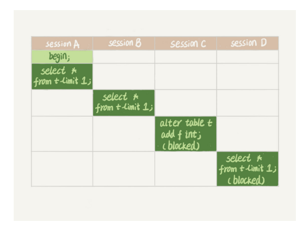

# 全局锁和表锁：给表加个字段怎么有这么多阻碍？

根据加锁的范围，MySQL 里面的锁大致可以分成全局锁、表级锁和行锁三类

### 全局锁

- 对整个数据库实例加锁
- MySQL 提供了一个加全局读锁的方法，命令是 Flush tables with read lock (FTWRL)
- 加锁后以下语句会被阻塞：
  - 数据更新语句（数据的增删改）
  - 数据定义语句（包括建表、修改表结构等）
  - 更新类事务的提交语句
- 全局锁的典型使用场景是**做全局逻辑备份**，也就是把整个库的每个表都select出来存成文件

- 既然要全库只读，为什么不使用 set global readonly=true 的方式呢
  - 在有些系统中，readonly 的值会被用来做其他逻辑，比如用来判断一个库是主库 还是备库。因此，修改 global 变量的方式影响面更大，我不建议你使用
  - 在异常处理机制上有差异。如果执行 FTWRL 命令之后由于客户端发生异常断开， 那么 MySQL 会自动释放这个全局锁，整个库回到可以正常更新的状态。而将整个库设 置为 readonly 之后，如果客户端发生异常，则数据库就会一直保持 readonly 状态，这 样会导致整个库长时间处于不可写状态，风险较高

### 表级锁

- 表级锁分为表锁，元数据锁（meta data lock MDL）

- 表锁的语法是lock tables ... read/write
- 可以用 unlock tables 主动 释放锁，也可以在客户端断开的时候自动释放
- 需要注意，lock tables 语法除了会限制别的线程的读写外，也限定了本线程接下来的操作对象
- 比如说lock tables t1 read, t2 write
  - 会限制其他线程的写 t1、读写 t2 语句
  - 也会限制自己线程的行读 t1、读写 t2 语句

- MDL不需要显式使用，在访问一个表的时候自动会被加上
- 在MySQL5.5版本中引入MDL，当对一个表做增删改查操作的时候，加 MDL 读锁；当要对表做结构变更操作的时候，加 MDL 写锁
- 读锁之间不排斥，因此可以有多个线程同时对一张表增删查改
- 读写锁之间、写锁之间是互斥的，用来保证变更表结构操作的安全性。因此，如果有两个线程要同时给一个表加字段，其中一个要等另一个执行完才能开始执行

### 给表加字段

- 一种coredump的情况
- 
- sessionA和sessionB都不放锁，导致sessionC一直阻塞，那此时sessionC是拿了所有数据的MDL锁的，这就会导致后面的线程全都被阻塞了，如果后续的线程越来越多，就会导致内存爆满
- 解决办法（优雅的添加字段）：
  - 解决长事务，因为事务不提交就会一直占用着MDL锁（如果你要做 DDL 变更的表刚好有长事务在执行，要考虑先暂停 DDL，或者 kill 掉这个长事务）
  - 或者在alter table的时候设定等待事件，如果在这个指定的等待时间里面能够拿到 MDL 写锁最好，拿不到 也不要阻塞后面的业务语句，先放弃。之后开发人员或者 DBA 再通过重试命令重复这个过程

总结

- 表锁一般是在数据库引擎不支持行锁的时候才会被用到的。如果你发现你的应用程序里有 lock tables 这样的语句，你需要追查一下，比较可能的情况是：
  - 要么是你的系统现在还在用 MyISAM 这类不支持事务的引擎，那要安排升级换引擎
  - 要么是你的引擎升级了，但是代码还没升级。我见过这样的情况，最后业务开发就是把 lock tables 和 unlock tables 改成 begin 和 commit，问题就解决了