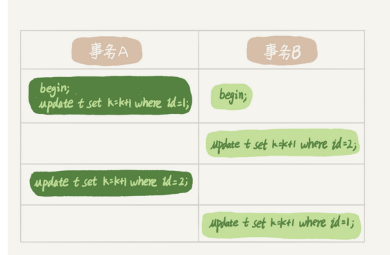

# 行锁功过：怎么减少行锁对性能的影响？

- MySQL 的行锁是在引擎层由各个引擎自己实现的。但并不是所有的引擎都支持行锁，比如 MyISAM 引擎就不支持行锁
- 不支持行锁意味着并发控制只能使用表锁，对于这种引擎的表，同一张表上任何时刻只能有一个更新在执行，这就会影响到业务并发度。
- InnoDB 是支持行锁的，这也是 MyISAM 被 InnoDB 替代的重要原因之一

### 行锁

- 行锁就是针对数据表中行记录的锁

### 两阶段锁协议

- 
- 事务B的update语句会被阻塞，直到事务A执行commit之后，事务B才能继续执行
- 所以，事务A持有的两个记录的行锁，都是在commit的时候才能释放
- 即，在 InnoDB 事务中，行锁是在需要的时候才加上的，但并不是不需要了就立刻释放，而是要等到事务结束时才释放。这个就是两阶段锁协议
- 如果你的事务中需要锁多个行，要把最可能造成锁冲突、最可能影响并发度的锁尽量放到后面

### 死锁和死锁检测

- 当并发系统中不同线程出现循环资源依赖，涉及的线程都在等待别的线程释放资源时，就会导致这几个线程都进入无限等待的状态，这就是**死锁**
- 
- 两种策略的解法
  - 直接进入等待，直到超时，这个超时时间可以通过参数 innodb_lock_wait_timeout 来设置（默认是50s）
  - 发起死锁检测，发现死锁后，主动回滚死锁链条中的某一个事务，让其他 事务得以继续执行。将参数 innodb_deadlock_detect 设置为 on，表示开启这个逻辑
- 通常选择的是第二种策略

- 每个新来的被堵住的线程，都要判断会不会由于自己的加入导致了死锁，这是一个时间复杂度是 O(n) 的操作
- 假设有 1000 个并发线程要同时更新同一行，那么死锁检测操作就是 100 万这个量级的
- 虽然最终检测的结果是没有死锁，但是这期间要消耗大量的 CPU 资源
- 因此，你就会看到 CPU 利用率很高，但是每秒却执行不了几个事务
- 所以，解决办法：
  - 一种头痛医头的方法，就是如果你能确保这个业务一定不会出现死锁，可以临时把死锁检测关掉
  - 或者，控制并发度，减少并发的线程
- 这个并发控制要做在数据库服务端。如果你有中间件，可以考虑在中间件实现；如果你的团队有能修改 MySQL 源码的人，也可以做在 MySQL 里面。基本思路就是，对于相 同行的更新，在进入引擎之前排队。这样在 InnoDB 内部就不会有大量的死锁检测工作 了