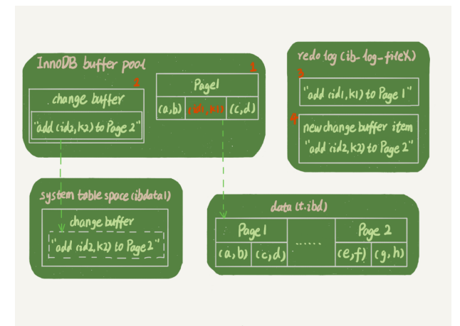
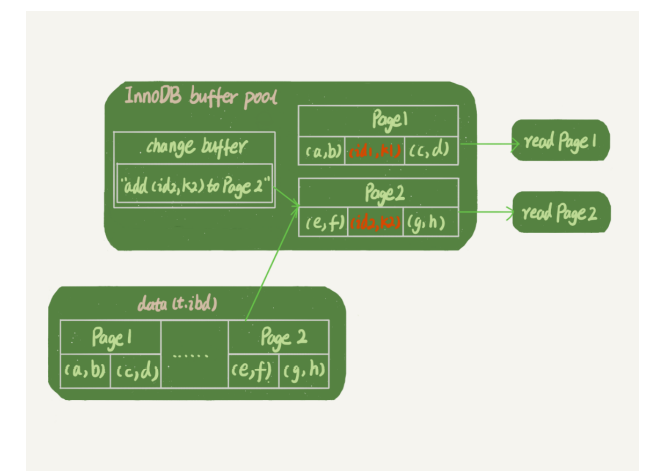

# 普通索引和唯一索引，应该怎么选择？


### 查询过程

- ```sql
  select id from T where k = 5
  ```

- 对于普通索引来说，查找到满足条件的第一个记录 (5,500) 后，需要查找下一个记录，直到碰到第一个不满足 k=5 条件的记录

- 对于唯一索引来说，由于索引定义了唯一性，查找到第一个满足条件的记录后，就会停止继续检索

- 虽然，普通索引可能会搜索下一个记录，甚至下一页，但是对于整型字段，一个数据页可以放近千个 key，因此出现这种情况的概率会很低

- 所以这两者操作在性能上是差不多的


### change buffer

- 当需要更新一个数据页时，如果数据页在内存中就直接更新，而如果这个数据页还没有在内存中的话
- 在不影响数据一致性的前提下，InooDB 会将这些更新操作缓存在 change buffer 中，这样就不需要从磁盘中读入这个数据页了
- 在下次查询需要访问这个数据页的时候，将数据页读入内存，然后执行 change buffer 中与这个页有关的操作
- 即change buffer在内存中有拷贝，会写入到磁盘中


meage

- 将 change buffer 中的操作应用到原数据页，得到最新结果的过程称为 merge
- 除了访问 这个数据页会触发 merge 外，系统有后台线程会定期 merge
- 在数据库正常关闭 （shutdown）的过程中，也会执行 merge 操作


size

- change buffer用的是buffer pool里的内存，因此不能无限增大
- change buffer的大小，可以通过 innodb_change_buffer_max_size 来动态设置


使用场景

- 因为merge的时候才是真正进行数据更新的时候，而change buffer的主要目的就是将记录的变更动作缓存下来
- 所以在一个数据页做merge之前，change buffer记录的变更越多，收益越大
- 场景一
  - 对于写多读少的业务来说，页面在写完以后马上被访问到的概率比较小，此时 change buffer 的使用效果最好
- 场景二
  - 假设一个业务的更新模式是写入之后马上会做查询
  - 那么即使满足了条件，将更新先记录在 change buffer，但之后由于马上要访问这个数据页，会立即触发 merge 过程
  - 对于这种业务模式，change buffer反而起到副作用


### 更新过程

- 对于唯一索引来说，所有的更新操作都要先判断这个操作是否违反唯一性约束，所以是用不上change buffer


更新数据的两种情况

- 这个记录要更新的目标页在内存中
  - 对于唯一索引，找到 3 和 5 之间的位置，判断到没有冲突，插入这个值，语句执行结束
  - 对于普通索引，找到 3 和 5 之间的位置，插入这个值，语句执行结束
- 这个记录要更新的目标页不在内存中
  - 对于唯一索引，需要将数据页读入内存，判断到没有冲突，插入这个值，语句结束
  - 对于普通索引，则是将更新记录在change buffer，语句结束
  - 将数据从磁盘写入内存涉及随机IO的访问，而change buffer因为减少了随机磁盘访问，所以对更新性能的提升是会很明显的


### 索引选择和实践

- 如果所有的更新后面，都马上伴随着对这个记录的查询，那么你应该关闭 change buffer。 而在其他情况下，change buffer 都能提升更新性能
- 在实际使用中，你会发现，普通索引和 change buffer 的配合使用，对于数据量大的表的 更新优化还是很明显的


### change buffer 和 redo log


插入数据

- ```sql
  insert into t(id, k) values(id1, k1), (id2, k2);
  ```

- 这里假设k1所在的数据页在内存中，k2所在的数据页不在内存中

- 

- 1、Page1在内存的，所以直接更新内存

- 2、page2不在内存，就在内内粗的change buffer区域，记录下

- 3、将上述的两个动作计入redo log中

- PS：这里的虚线的事情都是系统后台做的，不影响更新的响应时间（后续是要把change buffer打到磁盘上的吗）


读数据

- ```sql
  select * from t where k in (k1, k2)
  ```

- 

- 读page1的时候，是直接从内存返回

  - WAL之后如果读数据，不一定要读磁盘的，比如这里就可以直接从内存中返回数据

- 读page2的时候，需要把page2从磁盘读到内存中，然后应用change buffer里面的操作日志，生成一个正确的版本并返回结果


总结

- redo log主要节省的是随机写磁盘的IO消耗（转成顺序写），而change buffer主要节省的则是随机读磁盘的IO消耗
- change buffer：在更新的时候没有写入磁盘，只有在查询的时候才写入磁盘（所以减少了一次写入磁盘的消耗）
