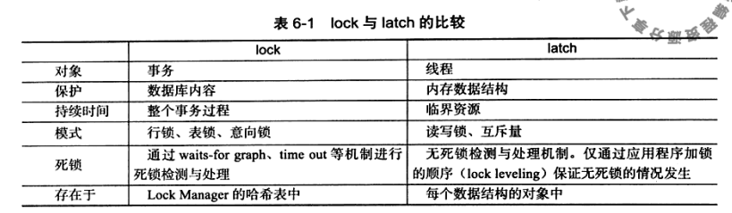

# 6.2 lock与latch

## latch

- latch一般称为门锁（轻量级的锁），因为其要求锁定的事件必须非常短，若连续的时间长，则应用的性能会非常差
- 在InnoDB中latch分为mutex（互斥量）和rwlock（读写锁）
- 目的是用来保证并发线程操作临界资源的正确，并且通常没有死锁检测的机制
- 一般这类锁的对象都是数据库的底层数据结构，例如说B+树，hash表
- 可以这么理解，下面的lock的底层实现，大多是依赖于latch的，所以只要数据结构支持了并发，对于使用数据结构的一方来说，就相当于黑盒，可以借此实现更高层面的锁

## lock

- 对象是事务，用来锁定的是数据库中的对象，如表、页、行
- 并且一般lock的对象仅在事务commit或rollback后进行释放（不同的隔离级别释放的时间会有所不同）

## 二者的比较

- 

# 6.3 InnoDB存储引擎中的锁

- 两种标准的行级锁
  - 共享锁（S Lock），允许事务读一行数据
  - 排他锁（X Lock），允许事务删除或更新一行数据
- 如果一个事务T1已经获得了行r的共享锁，那么另外的事务T2可以立即获得行r的共享锁，这种情况就是**锁兼容**
- 若有其他的事务T3想获得行r的排他锁，则必须等待事务T1，T2释放行r上的共享锁，这就是**锁不兼容**
- 

- 为了支持在不同粒度上进行加锁操作，InnoDB存储引擎支持一种额外的锁方式，叫作**意向锁**，是将锁定的对象分为多个层次，意向锁意味着事务希望在更细粒度上进行加锁
- 意向锁分为两种：
  - 意向共享锁（IS Lock），事务想要获得一张表中某几行的共享锁
  - 意向排他锁（IX Lock），事务想要获得一张表中某几行的排他锁

一致性非锁定读

- 是指InnoDB存储引擎通过行多版本控制的方法来读取当前执行事件数据库中的数据
- 如果读取的行正在执行DELETE或UPDATE操作，这时读取操作不会因此去等待行上的锁释放，而是会去读取行的一个快照数据
- 之所以叫作非锁定都，是因为不需要等待访问的行上X锁的释放