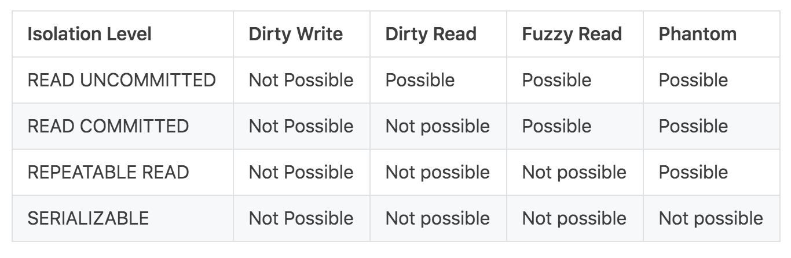

# 脏写

- 一开始value为null，事务A修改了value为1（原来是null），事务B在修改value为2（原来是null），而此时事务B没有提交，反而发生了回滚，造成了value变为了null，而对于事务A来说，它的修改就无效了
- 所有的事务的隔离级别都不会发生脏写的情况

# 脏读

- 正在执行的事务读到了其他还未提交事务的值
- 读未提交的隔离级别下，可能会出现这种情况

# 不可重复读

- 读倾斜
  - 事务a在执行过程中，对某一个值在不同的时间点读到了不同的值，也叫不可重复读
  - 可重复读的隔离级别下可以解决
- 在一个事务中多次读取同一个数据时，结果出现不一致

# 幻读

- 写倾斜
  - 事务先查询数据库，根据返回的结果而作出某些决定，然后修改数据库。在事务提交的时候，支持决定的条件不再成立
- 事务先查询了某些符合条件的数据，同时另一个事务执行写入，改变了先前的查询结果
- 如果是可重复读的快照读，是不会出现幻读的情况的；换言之，当前都就会出现幻读的情况
- 定义：
  - 用一个事务里面，后一个请求看到的比之前相同请求看到的，**多了记录出来**
  - 即一个事务在前后两次查询同一个范围的时候，后一次查询看到了前一次查询没有看到的行
  - 一个事务在前后两次查询同一个范围的时候，后一次查询看到了前一次没有看到的行

https://www.zhihu.com/question/437140633

# 更新丢失

- 两个事务同时执行读－修改－写入操作序列，出现了其中一个覆盖了另一个的写入，但是没有包含对方最新值的情况，导致了被覆盖的数据发生了更新丢失

