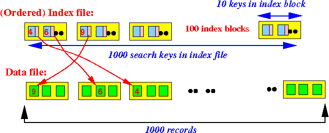
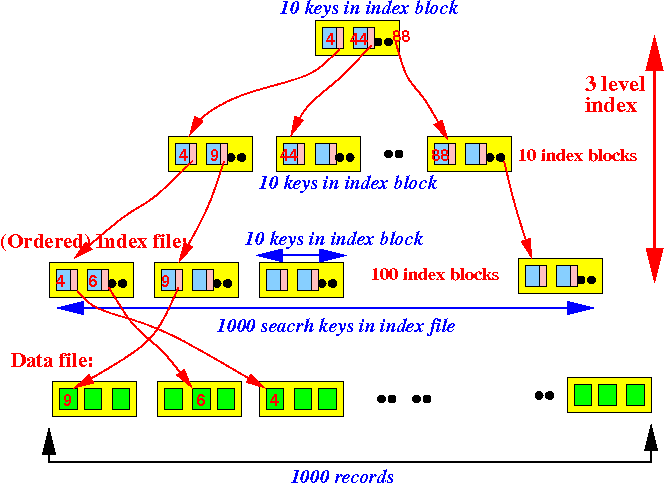
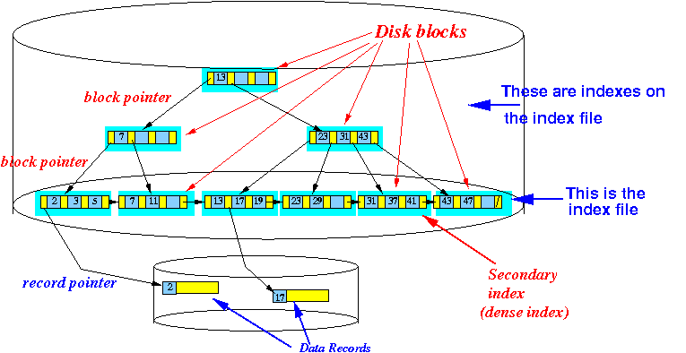
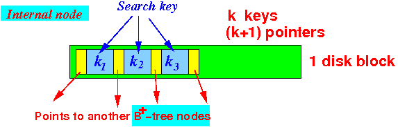
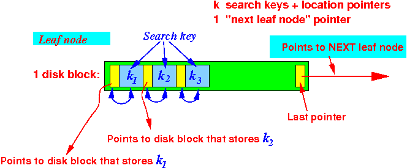
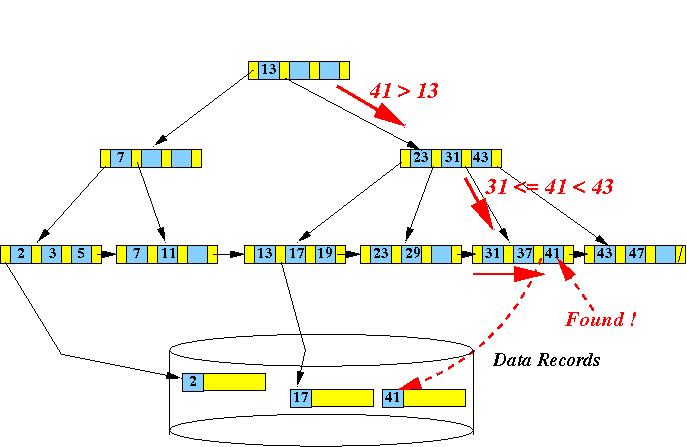

# 背景

- 在磁盘上读取一个扇区的耗时大概是毫秒级别
- 在磁盘上顺序读取一个块(一个块包含多个扇区，大概是0.01秒
- 计算机处理一个磁盘块中的数据耗时通常<0.01秒
- 所以我们评估性能的时候，主要考虑**访问磁盘的次数**

## 有序索引

- 
- 每个数据文件上有0.1k条记录，每个索引文件有0.1k个索引块，每个索引块有10个索引
- 想要在索引文件中找到数据，大概需要查找7个block（log100=7）

## 多级索引

- 而如果使用的是多级索引，磁盘的访问次数就变为了3次
- 
- 所以引入B+树

# B+树

- 

## 特点

- B+树是一个高度平衡的树：每个叶子节点都距离 Root 节点距离相同
- 在磁盘上的存储
  - 
- 中间节点的结构（包括根节点）
  - 
  - 有k个key，就有k+1个pointer
- 叶子节点的结构
  - 
- B+树的查找
  - 

- 增加B+树的路数可以降低树的高度，那么无限增加树的路数是不是可以有最优的查找效率
  - 不可以。因为这样会形成一个有序数组，文件系统和数据库的索引都是存在硬盘上的，并且如果数据量大的话，不一定能一次性加载到内存中。有序数组没法一次性加载进内存，这时候B+树的多路存储威力就出来了，可以每次加载B+树的一个结点，然后一步步往下找

# 横向对比

## 为什么不选择红黑树,AVL树作为索引

- 红黑树的树高度太深，会变相的增加磁盘IO的次数
- 像AVL和红黑树，一般都是用在做内存数据结构的，因为只有在内存中才没有磁盘IO的损耗
- 而B+树不一样，它将索引都放在同放在一个页里面，有效的减少了磁盘的IO

## 为什么不选择跳表作为索引

- 首先，我们对mysql的一个要求就是读多写少的场景，所以对读的要求很高，那就先看读操作
- 接着来看跳表的读操作，如果一条数据一个结点，最底层要存放2kw数据，且每次查询都要能达到二分查找的效果，2kw大概在2的24次方左右，所以，跳表大概高度在24层左右。最坏情况下，这24层数据会分散在不同的数据页里，也即是查一次数据会经历24次磁盘IO
- 而B+树是多叉树结构，每个结点都是一个16k的数据页，能存放较多索引信息，所以扇出很高。三层左右就可以存储2kw左右的数据。也就是说读一次数据，如果这些数据页都在磁盘里，那么最多需要查询三次磁盘IO
- 而对于写操作，B+树需要拆分合并索引数据页，跳表则独立插入，并根据随机函数确定层数，没有旋转和维持平衡的开销，因此跳表的写入性能会比B+树要好

引申一个话题，为什么redis要用跳表，不用b+树

- 因为redis是内存数据库，数据都放在内存中，不存在磁盘IO的说法，所以层数高并不是阻塞
- 并且B+树的合并拆分的花销，大于跳表随机加索引的开销

## 为什么不选择Hash表作为索引

- MySQL中存储索引用到的数据结构是B+树，B+树的查询时间跟树的高度有关，是log(n)，如果用hash存储，那么查询时间是O(1)
- 采用Hash来存储确实要更快，但是采用B+树来存储索引的原因主要有以下两点：
  - 从内存角度上说，数据库中的索引一般是在磁盘上，数据量大的情况可能无法一次性装入内存，B+树的设计可以允许数据分批加载
  - 从业务场景上说，如果只选择一个数据那确实是hash更快，但是数据库中经常会选中多条，这时候由于B+树索引有序，并且又有链表相连，它的查询效率比hash就快很多了

## 为什么不选择B-树作为索引

- B+tree的磁盘读写代价更低，B+tree的查询效率更加稳定数据库索引采用B+树而不是B树的主要原因：B+树只要遍历叶子节点就可以实现整棵树的遍历，而且在数据库中基于范围的查询是非常频繁的，而B树只能中序遍历所有节点，效率太低

- B+树的特点

  - 所有关键字都出现在叶子结点的链表中(稠密索引)，且链表中的关键字恰好是有序的
  - 不可能在非叶子结点命中
  - 非叶子结点相当于是叶子结点的索引(稀疏索引)，叶子结点相当于是存储(关键字)数据的数据层

- b+树的非叶子节点不保存数据，只保存子树的临界值（最大或者最小），所以同样大小的节点，b+树相对于b树能够有更多的分支，使得这棵树更加矮胖，查询时做的IO操作次数也更少

- B树只适合随机检索，B+树支持随机检索和顺序检索

  2.B+树空间利用率高，可以减少IO次数，磁盘读写代价更低。
  一般来说索引本身也很大，往往以索引文件的形式存储在磁盘上，这样索引查找过程就要产生磁盘IO消耗。B+树的内部节点只作为索引使用，其内部节点（非[叶子节点](https://so.csdn.net/so/search?q=叶子节点&spm=1001.2101.3001.7020)）比B树更小，判断能容纳的节点中关键字更多，一次读取到的键更多。

  3.B+树查询效率更稳定，因为数据存放在叶子节点。

  4.B树在一定程度上也提高了磁盘IO性能，但没有解决[遍历](https://so.csdn.net/so/search?q=遍历&spm=1001.2101.3001.7020)效率低下的问题。B+树的叶子节点都使用指针顺序连接在一起，只要遍历叶子节点就可以实现所有值。

  5.增删文件时，B树需要重新调整树结构。B+树不需要调整树结构，因此B+树效率更高。

## 为什么选择B类树作为索引

- 我们在MySQL中的数据一般是放在磁盘中的，读取数据的时候肯定会有访问磁盘的操作，磁盘中有两个机械运动的部分，分别是盘片旋转和磁臂移动。盘片旋转就是我们市面上所提到的多少转每分钟，而磁盘移动则是在盘片旋转到指定位置以后，移动磁臂后开始进行数据的读写。那么这就存在一个定位到磁盘中的块的过程，而定位是磁盘的存取中花费时间比较大的一块，毕竟机械运动花费的时候要远远大于电子运动的时间。当大规模数据存储到磁盘中的时候，显然定位是一个非常花费时间的过程，但是我们可以通过B树进行优化，提高磁盘读取时定位的效率。
- 为什么B类树可以进行优化呢？我们可以根据B类树的特点，构造一个多阶的B类树，然后在尽量多的在结点上存储相关的信息，保证层数（树的高度）尽量的少，以便后面我们可以更快的找到信息，磁盘的I/O操作也少一些，而且B类树是平衡树，每个结点到叶子结点的高度都是相同，这也保证了每个查询是稳定的。
- B类树高度较小，能够有效的减少磁盘IO

## 为什么选择B+树作为索引

- 文件索引和数据库索引为什么使用B+树
  - 文件与数据库都是需要较大的存储，也就是说，它们都不可能全部存储在内存中，故需要存储到磁盘上。而所谓索引，则为了数据的快速定位与查找，那么索引的结构组织要尽量减少查找过程中磁盘I/O的存取次数，因此B+树相比B树更为合适。数据库系统巧妙利用了局部性原理与磁盘预读原理，将一个节点的大小设为等于一个页，这样每个节点只需要一次I/O就可以完全载入，而红黑树这种结构，高度明显要深的多，并且由于逻辑上很近的节点(父子)物理上可能很远，无法利用局部性
  - 最重要的是，B+树还有一个最大的好处：方便扫库。
  - B树必须用中序遍历的方法按序扫库，而B+树直接从叶子结点挨个扫一遍就完了，B+树支持range-query非常方便，而B树不支持，这是数据库选用B+树的最主要原因
  - B+树查找效率更加稳定，B树有可能在中间节点找到数据，稳定性不够

# 参考

- https://www.isolves.com/it/sjk/MYSQL/2022-04-18/53124.html
- https://www.bilibili.com/video/BV15V411p7pi
- https://hardcore.feishu.cn/docs/doccnk7wi4nmvR8WpBruVOvAgLg#