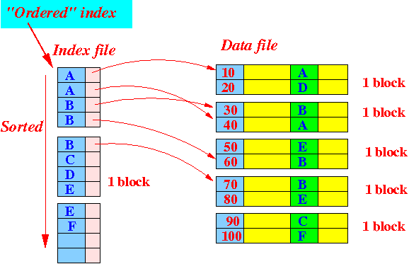
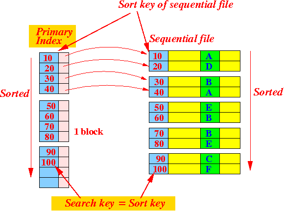
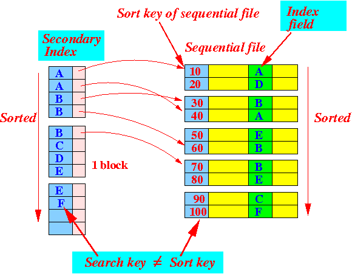
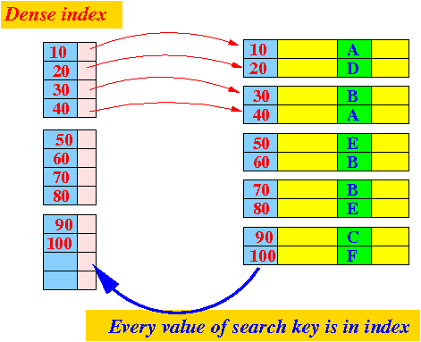
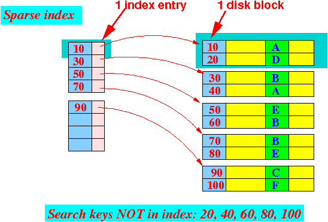
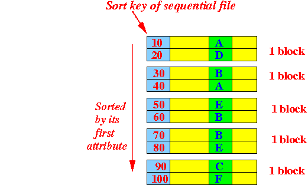
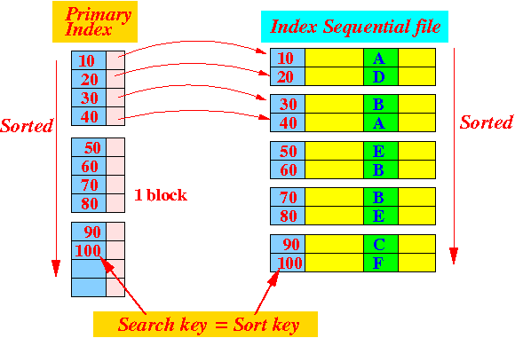

# 索引

## 有序索引

- 所有的数据、索引按照被查找键进行排序
- 

## 主键索引

- 查找键和排序键是同一个的有序索引
- 加速查询+列值唯一（不可以有null）+表中只有一个
- 

## 二级索引

- 假设数据是按照A列进行排序的，那么二级索引中索引的排序就是按照B列进行排序的（这就意味着如果要通过二级索引寻找数据，就要回表）
- 

## 普通索引

- 就是在创建索引时,不附加任何限制条件。该类型的索引可以创建在任何数据类型的字段上
- 区别于唯一索引

## 全文索引（todo）

- 对文本的内容进行分词，进行搜索

## 联合索引

- 又叫做组合索引
- 多列值组成一个索引，专门用于组合搜索，其效率大于索引合并
- 参考最左前缀匹配原则

## 唯一索引

- 不允许具有索引值相同的行，从而禁止重复的索引或键值
- 通过关键字UNIQUE实现

## 稠密索引

- 每一条记录的value都在索引文件里面
- B+树的叶子结点就是密集索引
- 

## 稀疏索引

- 对于每个 Block 建立一条索引结构
- 相当于B+树中的非叶子结点
- 只有主键索引才能成为稀疏索引，因为稀疏索引要求必须按照顺序排序，因为要比较。
- 使用场景更多的是二级索引，因为文件不需要排序，类比词典
- 

## 聚簇索引

- 又叫做簇类索引，聚类索引，聚集索引
- 感觉就是主键索引，其B+树的叶子结点存储的是原生数据

- 聚簇索引的索引页面指针指向数据页面（即叶子节点的block存储的是原生数据）
  - 非叶子节点存储索引关键字（但不存储对应记录的具体内容），叶子结点存储主键和具体的数据记录
- 一张表只有一个聚簇索引，可以有很多个非聚簇索引
  - 聚簇索引需要额外的空间存储索引中间页
- 优点：
  - 数据访问更快，因为聚簇索引将索引和数据保存在同一个B+树中，因此从聚簇索引中获取数据比非聚簇索引更快
- 缺点：
  - 插入速度严重依赖于插入顺序，按照主键的顺序插入是最快的方式，否则将会出现页分裂，严重影响性能。因此，对于InnoDB表，我们一般都会定义一个自增的ID列为主键
  - 更新主键的代价很高，因为将会导致被更新的行移动。因此，对于InnoDB表，我们一般定义主键为不可更新

## 非聚簇索引

- 在innodb中又叫做二级索引、辅助索引
- 以主键以外的列值作为键值构建的B+树索引
  - 叶子结点的数据域存储的是指向原生数据的主键

- 非聚集索引的叶子节点不存储表中的数据，而是存储该列对应的主键，想要查找数据我们还需要根据主键再去聚集索引中进行查找，这个再根据聚集索引查找数据的过程，我们称为回表
- 缺点
  - 每次改变了表中的数据后，同时要更新聚簇索引和非聚簇索引（特别是频繁更新数据的时候）

## 聚簇索引与非聚簇索引的区别

- 通过聚集索引可以查到需要查找的数据；而通过非聚集索引可以查到记录对应的主键值，再使用主键的值通过聚集索引查找到需要的数据（多了回表的过程）
- 聚集索引和非聚集索引的根本区别是表记录的排列顺序和与索引的排列顺序是否一致
  - 聚集索引（Innodb）的叶节点就是数据节点，而非聚集索引（MyisAM）的叶节点仍然是索引节点，只不过其包含一个指向对应数据块的指针
- 聚簇索引的意思是逻辑顺序相当于物理顺序，也就是查询键之后能够直接找到对应的值；而非聚簇索引因为在逻辑顺序和物理顺序间增加了一个间接层（例如根据非聚簇索引查询到的主键回表查找），因此效率更慢，但是提供了更多灵活性

# 操作

## 覆盖索引

- 是一种查询方式，不是索引类型
- 背景：
  - 我们知道在InnoDB存储引擎中，如果不是主键索引，叶子节点存储的是主键+列值。最终还是要“回表”，也就是要通过主键再查找一次，这样就会比较慢
- 定义：MySQL 执行计划 explain 结果里的 `key` 有使用索引，如果 select 后面查询的字段都可以从这个索引的树中获取，这种情况一般可以说是用到了覆盖索引
  - 一般都是针对辅助索引（联合索引等）
  - 即通过索引值可以直接找到要查询字段的值，而不需要通过主键值回表查询

- 例子：假如有一个联合索引（name，age），查询name和age的时候，where上的条件是age，那么就可以使用覆盖索引查询

## 索引合并（todo）

- 使用多个单列索引组合搜索

# 文件

## 顺序文件

- 所有记录被按照某一个字段的顺序排序后，所组成的文件
- 

## 索引顺序文件

- 存储主键索引的顺序文件
- 