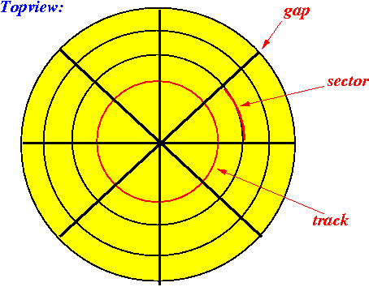

# 索引的需求背景

- 读多写少的场景
  - 在早期互联网绝大部分的场景都属于是读多写少的场景
- 数据按行组织
  - 关系型数据库通常会涉及使用一行记录的内容，数据按照行来组织（多列扁平存储）
- 存储千万级数据
  - 随着互联网快速发展，需要存储的数据量级增加到千万级量级
- 高性价比存储
  - 存储时选择存储介质需要满足成本相对较低，容量较大的特点

如果单单是只用磁盘存储数据，而不用索引的话

- 首先是浪费空间（如果只想要读取其中的一部分，却又不得不把全部的数据都读出来）
- 读写查不够高效（没有索引，必须遍历所有的条目才能找到）
- 不能面对意外的情况（如果硬盘出现意外的情况，如何解决）

# 存储介质的选择

- 因为内存是易失性存储，而且还很贵，所以只能选择硬盘了
- 但缺点就是硬盘的IO是远远慢于内存的，所以必须要减少磁盘IO
- 同时随机IO慢于顺序IO，所以尽可能的使用顺序IO

# 磁盘驱动器的组成

## 磁盘组合

磁盘组合由一个或多个圆盘组成，它们围绕着一根中心主轴旋转

- 圆盘的上表面和下表面涂覆了一薄层磁性材料，二进制位被存储在这些磁性材料（上下两个面都存储了数据）
- 磁盘被组织成磁道，**磁道**是单个盘片上的同心圆（磁片上的环形轨道），所有盘面上半径相同的磁道构成了**柱面**
  - 
  - 在每个不同的磁片中，相同半径的圆弧会组成一个圆柱体，圆柱体的侧面就是**柱面**
  - **柱面**某圈轨道自上而下形成的
  - 为什么要重视这个概念：因为磁头在访问同一个柱面上的数据时，不需要移动
  - 

- 磁道被组织成**扇区**，扇区是被间隙（gap）分割的圆的片段，间隙未被磁化为0或1
  - **扇区**是磁盘读写的基本的单位，注意扇区太小会导致读写效率低下
  - 所以OS对其进行了优化，OS以块为单位读取数据，一个块包含了多个扇区
  - **扇区间隔**（gap），没有磁性，被用来识别扇区的开始

## 磁头组合

磁头组合承载着磁头，每个盘面都有一个磁头，它极其贴近地悬浮在盘面上，但是绝对不与盘面接触（否则盘片就会被破坏）

- 磁头读出经过它下面的盘面的磁方向，也能改变其磁方向，以便在磁盘上写信息
- 每个磁头被固定在一个磁头臂上，所有盘面的磁头随着磁头臂一同移进移出
- 磁头臂是固定的磁头组合的一部分

磁盘+磁头

- 

# 磁盘数据的存取

## 存取磁盘数据的过程

- 控制移动磁头组合的机械马达，将磁头定位到一个特定的半径位置，使得某一柱面任何磁道都可以被读写
- 从磁头所在柱面的扇区中选择一个扇区，控制器也负责识别何时旋转主轴已经到达了所要求的扇区正移动到磁头下面的那个点
- 将所要求的扇区读取的二进制位传送到计算机的主存储器
- 可能的话，将一整条或更多磁道缓存于磁盘控制器的内存中，期待该磁道的许多扇区能够被很快读取，从而避免对磁盘的额外访问

- 磁盘的工作分为两部分，第一部分是磁片不断的旋转，第二部分是磁头的前后移动（控制当前要读取的是哪一个磁道）
- 所以在同一个磁道上读取数据，是依靠磁道盘片的旋转，而不是磁头的旋转，切换磁道才是磁头运动的目的

## 存取磁盘数据的消耗分析

### 寻道时间（seek）

- 控制磁头运动到正确的轨道上，从内到外 or 从外到内运动

- 磁盘控制器将磁头组合定位在磁盘块所在的磁道的柱面上所需要的时间即**寻道时间**（每一个盘面都有一个磁头，但是要把磁头的位置调整到对应的磁道上）
- 一般需要0-10ms

### 旋转延迟（rotate）

- 选择一个扇区

- 磁盘控制器等待访问块的第一个扇区旋转到磁头下所需要的时间为**旋转延迟**（将磁头旋转到对应的扇区的位置）
- 一般需要0-10ms

### 传输时间（transfer）

- 把数据传输到内存中

- 当磁盘控制器读取或写数据时，数据所在的扇区和扇区间的空隙经过磁头所需要的时间为**传输时间**
- 一般需要1ms

- 寻道时间、旋转延迟和传输时间的总和称为**磁盘的延迟**
- 综上：读取一个扇区需要20ms
  - 但如果把要读取的数据都放到相邻的扇区中，实际上就只需要1ms左右

# 磁盘怎么存储数据

## 背景

- 数据是以文件的形式存储在磁盘上的
- 一个文件包含多个块

## block,file,directory

- 块block：是扇区的逻辑集合
  - 一个扇区512bytes，对于一个磁盘操作来说太小了
  - 一个block大概是8k bytes
- 文件File：存储数据的逻辑单元
  - 一个文件由一系列的块组成
  - 这些信息存放在direction entry
- 目录directory
  - 目录被存放在特殊的几个blocks上

# 磁盘错误

- 概率错误（bit位翻转，比如网线的外层包含一层金属的屏蔽网，防止电磁信号对数据的传输发生干扰，导致读到的0101变为了1111）：读到的数据不正确，内存数据不完整
  - crc校验方式，增加校验值，hash值，验证正确性，失败后重新读取
- 媒介损耗（部分扇区的磁性消失）
  - 数据丢失，磁盘块不能够再读写
  - 解决：记录每个扇区的状态，异常扇区跳过
- 磁盘损坏
  - 数据全部丢失
  - 创建副本/RAID ec算法 将1g大小的数据算成不同块大小的数据进行存储
- 稳定存储（数据不完整，内存数据丢失）
  - 进程A写数据到一半出现了异常，原数据被覆盖
  - 校验值无法解决
  - 解决：双写（在两个地方写数据）

# 加速数据库访问硬盘的技术

## 背景

- 执行磁盘读写所花费的时间或许要比操纵主存中的数据所花费的时间要长得多，所以对于IO开销的预估，块访问（磁盘IO）次数就是算法所需要的时间的近似值，所以被最小化的应该是**磁盘的IO次数**

## 按柱面组织数据

- 背景：发现寻道时间占平均块访问时间的一半，所以将一些可能被一起访问的数据存储在单个柱面或几个临近的柱面
- 操作：将要一起访问的块放在同一柱面上，这样就可以经常避免寻道时间，也可能避免旋转延迟
- 例如：LSM树，leveldb

## 使用多个磁盘（条带读取）

- 背景：使用多个磁盘（每个磁盘都具有独立的磁头组），来代替一个磁盘（其多个磁头锁定在一起）
- 操作：将数据分割存储在几个相对较小的磁盘上而不是放在一个大磁盘上，让更多的磁头组设备分别去访问磁盘块，可以增加在单位时间内的磁盘块访问数量，即把一个文件分隔到不同的磁盘上进行读取
- 例子：磁盘控制器有足够传输速度的前提下，4个磁盘的条带化可以提速三倍
  - 假如说有32个要读取，平均放到4个磁盘上，每个磁盘上8个块
  - 那么读取一个文件（按照读取一个块需要20ms），则总共需要8*20ms
  - 而如果只放在一个磁盘上，就是32*20ms
- 

## 调度

### 磁盘调度

- 让磁盘控制器在若干个请求中选择一个来首先执行
  - 当系统需要按一定的顺序访问磁盘块的时候无法使用，但是若请求来自独立的进程，就可以使用
- 先来先服务（先到的需求先服务，公平低效）

### 电梯算法

- 把磁头看作是在做横跨磁盘的扫描，从柱面最内圈到最外圈，然后再返回来，正如电梯做垂直运动，从建筑物的底层到顶层，然后再返回来
- 如果有一个或多个对该柱面上的块的请求，磁头就停下来
- 根据请求，所有这些块被读或写，然后磁头沿着其正在行进的同一方向继续移动，直至遇到下一个包含要访问块的柱面
- 当磁头到达其行进方向上的某一个位置时，在该位置的前方不再有访问请求，磁头就朝相反方向移动

- 电梯算法（需求都到了以后，对于磁盘上的磁道，从外到内或从内到外，优先读取位于当前位置的数据，在接着满足，高效不公平）

## 预取和大规模缓冲

- 背景：预先将预期被访问的磁盘块读取到主存储器中，提高读写效率
- 操作：在一些应用中能够预测从磁盘请求块的顺序，所以能够在需要这些块之前将它们装入主存，减少访问块所需要的平均时间
- 例子：假设进程在操作数据1，那么os可能会从磁盘中预先读取其后面的几个数据例如234到os的缓存中
- 

## 镜像磁盘

- 把两个或者更多的数据符本放在不同的磁盘上，该策略除了可以保存数据以备某个磁盘可能坏掉，如同将数据分割存储在几个磁盘上，可以让我们一次访问多个磁盘块

# 数据的存储

- 数据是存储在文件中的，文件包含有多个块，数据中的记录就是存储在块中
  - 

- 
  - 数据记录存储在块里面，每一个块的头部是header信息，后续存放的是每条记录
  - block header会记录每个记录的偏移量

- 偏移量的信息是从前往后的，而数据记录的信息是从后往前的（把偏移量的信息放到头部，提高读写效率）
  - 

# 记录的存储方式

### 定长数据

- （每个位置上的数据的长度是固定的）
- 记录存在字节对齐的说法
  - 

- 每个记录的头部（record header）都存储着每个字段的位置（从哪儿开始读，到哪儿结束）
- 因为是定长的，所以上述的头部信息只需要存储一次即可

### 变长数据

- （每个位置上的数据的长度是不定的）
- 给每个记录都放一个record header
- 先是记录前面定长数据的大小，然后记录该记录的总长度
- 接着记录每个变长数据的起始位置
- 

### 不定格式

- （一条记录里面包含几个字段，包含哪些字段都是不知道的）

- 存储字段结构体：包含了字段的意义，类型，长度，如要存储Tom的姓名：Name（意义），String（类型），3（长度）

# 如何读取记录

### 数据库地址

- 定义：磁盘的块地址+记录地址

- 应用：索引或记录相互引用的时候会用上

- 数据库地址访问的两种方式

  - 方法一：数据库地址+offset（block address + offset）（相当于直接找到数据本身）

  - 方法二：数据库地址+偏移表（前面record header）中的offset（相当于去table中找一下数据的偏移值）

### 逻辑地址

- 原因：解决多条记录引用同一条记录时，引起大量修改操作
- 所以引入map table，key：逻辑地址，value：物理地址
- 逻辑地址可以是任意方式生成，但必须唯一，比如每条记录+1

### 过程

- 真正去读取一个数据，应该是先读取块，根据块中的 offset 就可以读取记录，所以问题转化为：如何取读取一个块
- 这个块是在磁盘中还是在内存中
- 用到的是磁盘地址还是内存地址
- 所以我们需要一个机制，告诉我们要读取的 Block 在磁盘上还是在内存中，如果在内存里，我们需要知道内存地址
  - 即将磁盘的物理地址映射为虚拟内存地址
  - 有点类似OS里面的页表了

### 加速访问

- 不用数据库地址，直接用虚拟内存地址访问即可
- 缺点
  - 将数据回盘的时候，需要将虚拟内存地址转为数据库地址
  - 释放内存的时候，可能会有非法引用，因为我们不能释放还在被使用的block

# 参考

- https://tech.meituan.com/2017/05/19/about-desk-io.html
- https://hardcore.feishu.cn/docs/doccnnKcxKECnBNjZgjxSwTopDe
- 《数据库系统实现》的第二章