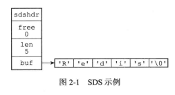
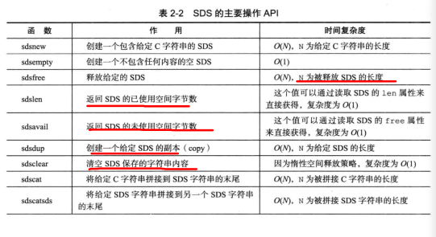
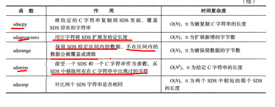
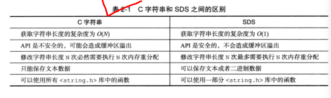

SDS（simple dynamic string）

- Redis需要的不仅仅是一个字符串字面量，还得是一个可以被修改的字符串值
- 应用：AOF的缓冲区，客户端状态中的输入缓冲区


# SDS的定义

- ```c
  struct sdshdr {
      //	记录buf数组中已使用字节的数量
      //	等于SDS所保存字符串的长度
      int len;
      
      //	记录buf数组中未使用字节的数量
      int free;
      
      //	字节数组，用于保存字符串
      char buf[];
  };
  ```

- 

- free为0，表示没有分配任何未使用空间

- len为5，表示保存了一个5字节长的字符串

- buf是一个char类型的数组，而其最后则保存了空字符'\0'（但是统计长度的时候是不计算这个的..）


- SDS遵循C字符串以空字符结尾的惯例，保存空字符的1字节空间不计算在SDS的len属性中，并且为空字符分配的额外的1字节空间，以及添加空字符到字符串末尾等操作，都是由SDS函数自动完成的
- 使用空字符结尾的好处：SDS可以直接重用一部分C字符串函数库里面的函数


# SDS与C字符串的区别

- 安全性，效率以及功能方面的要求


## 常数复杂度获取字符串长度

- 因为C字符串不记录自身的长度信息，所以为了获得字符串的长度，就要O（N）的时间复杂度
- 而SDS有len属性记录SDS本身的长度，所以时间复杂度为O（1）
- 设置和更新SDS长度的工作都是SDS的API自动完成的


## 杜绝缓冲区溢出

- C字符串不记录自身长度的另一个缺点就是缓冲区溢出
- 如果想要在在字符串dest后面加上一些字符，但C字符串并不记录自身的长度，所以有可能dest后面是其他正在使用的字符，你添加新的字符就会把原来的字符给cover了


- 而SDS的空间分配策略完全杜绝了这种情况
- 当SDS的API需要对SDS进行修改时，API会先检查SDS的空间是否满足修改所需的要求，如果不满足的话，API会自动将SDS的空间拓展到执行修改所需的大小，然后才执行实际的修改操作


## 减少修改字符串时带来的内存重分配次数

- 对于一个包含了N个字符的C字符串，这个字符串的底层实现总是一个N+1个字符长的数组（最后一位是/0）
- 导致每次要增长或缩短的时候，都要重分配一次内存
- 而内存重分配会涉及复杂的算法，并且可能需要执行系统调用，通常是一个比较耗时的操作
- 但Redis作为database，对性能的要求极高，不能动不动就重分配内存
- 为了避免这种缺陷，SDS通过未使用空间解除了字符串长度和底层数组长度之间的关联
  - 即，通过未使用空间，SDS实现了空间预分配和惰性空间释放两种优化策略


### 空间预分配

- 用于优化SDS字符串增长操作


- 如果对SDS进行修改之后，SDS的长度将小于1MB，那么程序分配和len属性同样大小的未使用空间
- 即，如果修改了数据以后，SDS的长度仍然小于1MB，那么会给free增加此时len长度的空间，使得buf的长度变为此时的len * 2 + free + 1的值（/0）


- 如果对SDS进行修改之后，SDS的长度大于等于1MB，那么程序分配1MB的未使用空间


- 通过空间预分配策略，Redis可以减少连续执行字符串增长操作所需的内存重分配次数


## 惰性空间释放

- 惰性空间释放用于优化SDS的字符串缩短操作：当SDS的API需要缩短SDS保存的字符串时，程序并不立即使用内存重分配来回收缩短后多出来的字节，而是使用free属性将这些字节的数量记录下来，并等待将来使用


- SDS也提供了相应的API，让我们可以在有需要的时候，真正地释放SDS的未使用空间


## 二进制安全

- C字符串中的字符必须符合某种编码，并且除了字符串的末尾之外，字符串里面不能有空字符，否则最先被程序读入的空字符将被误认为时字符串的结尾
- 这种限定，使得C字符串只能保存文本数据，不能保存像图片音频、视频、压缩文件这样的二进制数据


- SDS的API都是二进制安全的，所有SDS的API都会以处理二进制的方式来处理SDS存放在buf数组里的数据
- 数据在写入时是什么样子的，读取时就是什么样子的


- 原因：SDS使用len属性的值而不是空字符来判断字符串是否结束


- 因此，使用Redis可以保存文本数据，还可以保存任意格式的二进制数据


## 兼容部分C字符串函数

- 因为SDS还是以空字符结尾


# SDS API

- 
- 


# Conclusion

- 
- Redis只会使用C字符串作为字面量，在大多数情况下，Redis使用SDS作为字符串表示
- SDS的优点
  - 常数复杂度获取字符串长度
  - 杜绝缓冲区溢出
  - 减少修改字符串长度时所需的内存重分配次数
  - 二进制安全
  - 兼容部分C字符串函数