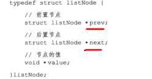
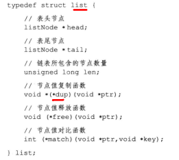
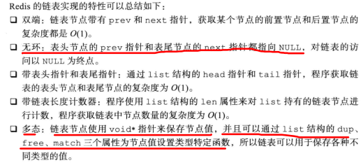

- 链表的应用
  - 列表键的底层实现之一就是链表，当一个链表键包含了数量较多的元素时，又或者列表中包含的元素都是比较长的字符串时。Redis就会用链表作为列表键的底层实现
  - 发布与订阅，慢查询，监视器等功能都用到了链表
  - redis服务器还用链表保存多个客户端的状态信息，以及使用链表来构建客户端输出缓冲区

# 链表和链表节点的实现

- 链表节点的实现（adlist.h/listNode）
- 

- 链表的实现（adlist.h/list）
- 

- 表头指针head，表尾指针tail，链表长度计数器len

- dup函数用于复制链表节点所保存的值
- free函数用于释放链表节点所保存的值
- match函数用于对比链表节点所保存的值和另一个输入值是否相等

特性总结

- 

# 链表和链表节点的API

# Conclusion

- 链表被广泛用于实现Redis的各种功能，比如列表键，发布与订阅、慢查询、监视器等
- 每个链表节点由一个ListNode结构来表示，每个节点都有一个指向前置节点和后置节点的指针，所以是双向链表
- 每个链表使用一个list结构来表示，这个结构带有表头指针，表尾节点指针以及链表长度等信息
- 因为链表表头的前置节点和表尾节点的后置节点都是NULL，所以是无环链表
- 通过为链表设置不同的类型特定函数，Redis的链表可以用于保存各种不同的值