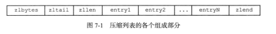
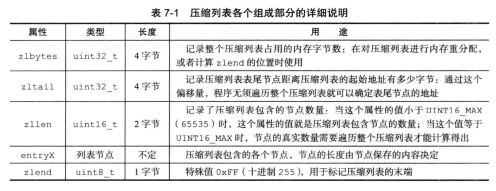
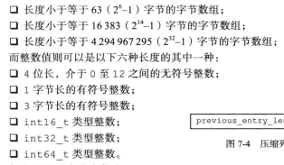
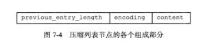
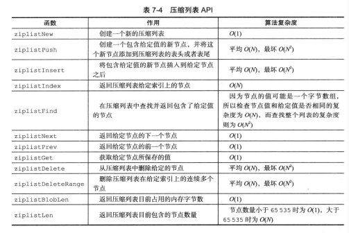

- 压缩列表ziplist是列表键和哈希键的底层实现之一
- 当一个列表键只包含少量列表项，并且每个列表项要么是小整数值，要么是长度比较短的字符串时，就用压缩列表实现列表键

# 压缩列表的构成

- 压缩列表是为了节约内存而开发的，由一系列特殊编码的连续内存块组成的顺序型数据结构
- 
- 
- zlbytes表示列表的长度
- zltail指向的是最后一个元素的偏移量
- zllen是节点的数量

# 压缩列表节点的构成

- 可以保存一个字节数组或者一个整数值
- 
- 

## previous_entry_length

- 以字节为单位，记录了压缩列表中**前一个结点**的长度
- 所以可以通过指针运算，根据当前结点的起始地址计算出前一个结点的起始地址
- 压缩列表**从表尾向表头遍历**操作就是利用这一原理实现的

## encoding

- 记录了节点的content属性所保存数据的类型以及长度

## content

- 负责保存节点的值，节点值可以是一个字节数组或者整数，值得类型和长度由encoding决定

# 连锁更新

- 我们已知previous_entry_length是用来存储前一个结点的长度，但是如果新插入的结点的长度太长，导致当前结点需要用5字节来存储，而后面的结点也会因此产生级联更新的情况...
- 同理，删除结点也会发生连锁更新的情况

- 连锁更新在最坏情况下需要对压缩列表执行N次空间重分配操作，每次空间重分配最坏复杂度是O(N)，所以连锁更新的最坏复杂度为O(N2)

- 但因此造成的性能问题却是很低的
  - 要恰好有多个连续的，长度介于250字节至253字节之间的结点，连锁更新才有可能被引发，在实际情况中并不多见
  - 即使出现了，只要被更新的结点数量不多，就不会有太大影响

# 压缩列表API

- 

# Conclusion

- 压缩列表是一种为了节约内存而开发的顺序型数据结构
- 压缩列表被用作列表键和哈希键的底层实现之一
- 压缩列表可以包含多个节点，每个节点可以保存一个字节数组或者整数值
- 添加新节点到压缩列表，或者从压缩列表中删除节点，可能会引发来连锁更新操作