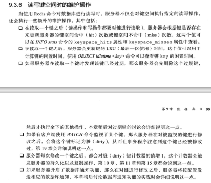
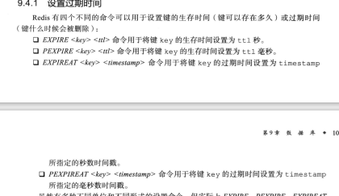
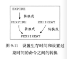
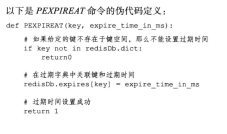
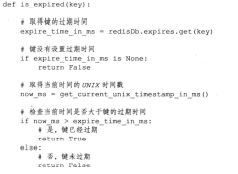
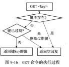
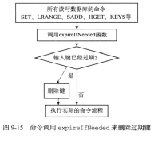
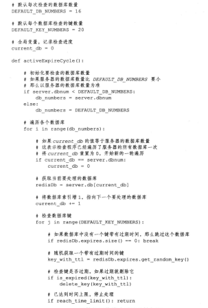
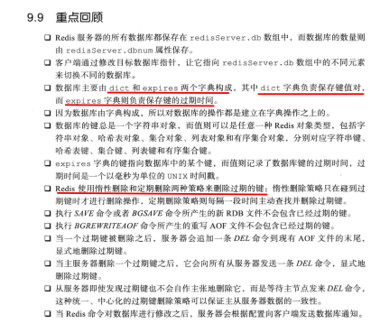

# 服务器中的数据库

- redis服务器将所有的数据库保存在服务器状态redis.h/redisServer中的db数组中，其中的每个redisDb代表一个数据库

- 在初始化服务器时，程序会根据服务器状态的dbnum属性决定创建多少个数据库

- ```c
  struct redisServer {
      redisDb *db; // 一个数组，保存着服务器中所有的数据库
      int dbnum; // 服务器的数据库数量
  };
  ```

- dbnum默认是16


# 切换数据库

- 每个redis客户端都有自己的目标数据库

- ```c
  typedef struct redisClient {
      redisDb *db; // 记录客户端正在使用的database
  };
  ```

- 该指针指向redisServer.db数组中的一个元素，即目标数据库

- 通过SELECT切换数据库


# 数据库键空间

- 每个数据库都由一个redis.h/redisDb结构表示

- ```cpp
  typedef struct redisDb {
      dict *dict; // 数据库键空间，保存着数据库中所有键值对
  };
  ```

- 键空间的键就是数据库中的键，每个键都是一个字符串对象

- 键空间的值也是数据库中的值

- 即数据库的键空间是一个**dict**

- 一些操作：添加新键，删除键，更新键，对键取值


- 读写键空间时的维护操作
- 


# 设置键的生存事件或过期时间

- 通过EXPIRE或PEXPIRE，客户端可以以秒或者毫秒为数据库中的某个键设置生存时间（time to live，TTL），在经过一定时间后，就会删除生存时间为0的键
- 或者通过EXPIREAT或者PEXPIREAT，设置过期时间（expire time），是一个UNIX时间戳
- 
- 虽然命令各有不同，但是它们的底层都是PEXPIREAT实现的
- 


- redisDb结构中的**expires**保存了数据库中所有键的过期时间，即过期字典

  - 过期字典的键是一个**指针**，这个指针指向键空间中的某个键对象（即某个数据库键）

  - 过期字典的值是一个long long的整数，保存的是一个UNIX时间戳的过期时间

  - ```c
    typedef struct redisDb {
        //	过期字典，保存着键的过期时间
        dict *expires;
    };
    ```

  - 

- 可以使用persist命令移除一个键的过期时间


- 使用TTL可以以秒为单位返回键的剩余生存时间，PTTL则以毫秒为单位返回键的剩余生存时间


## 过期键的判定

- 步骤：
  - 检查给定键是否存在于过期字典；如果存在就取得键的过期时间
  - 检查当前UNIX时间戳是否大于键的过期时间，如果是的话那么键已经过期，否则的话键就未过期
  - 


# 过期键删除策略

## 定时删除

- 在设置键的过期时间时，创建一个定时器，让定时器在键的过期时间来临时，立即执行对键的删除操作
- 对内存最友好（准时释放过期内存，提高内存利用率）
- 缺点：对CPU时间不友好，即会浪费CPU在删除过期键上，降低服务器的响应时间和吞吐量
  - 比如说，内存够用，但还是把时间浪费在删除过期键上...
- 并且，redis的定时器还是链表...，导致查找一个时间事件的复杂度为O（N）


## 惰性删除

- 对CPU时间最友好，只会在取出键时才对键值做过期检查，可以保证删除过期键的操作只会在非做不可的情况下进行，并且删除的目标仅限于当前处理的键
- 缺点就是对内存不友好（如果一个键过期很久了，但没有人对其操作，那么它就会一直留在那里，浪费内存，有点类似内存泄漏..）


## 定期删除

- 每隔一段时间执行一次删除过期操作，并通过限制删除操作执行的时长和频率来减少删除操作对CPU的影响
- 通过定期删除过期键，可以有效地减少因为过期键而带来的内存浪费
- 缺点：难以确定删除操作执行的时长和频率


# redis的过期删除策略

- redis使用的是惰性删除和定期删除


## 惰性删除的策略的实现

- 由db.c/expireIfNeeded函数实现，所有的读写都会调用该函数进行检查
  - 如果输入键已经过期，那么就会将输入键从数据库中删除
  - 如果没有过期，就不做动作
- 
- 


## 定期删除策略的实现

- 由redis.c/activeExireCycle实现，每次定时函数redis.c/serverCron执行时，activeExireCycle就会被调用（在规定时间内，分多次遍历服务器中的各个数据库，从数据库的expires字典中随机删除一部分键的过期时间，并删除其中的过期键）
- 


# AOF、RDB和复制功能对过期键的处理


## 生成RDB文件

- 会对数据库中的键进行检查，已过期的键不会被保存到新创建的RDB文件中
- 因此，数据库中包含过期键不会对新的RDB文件造成影响


## 载入RDB文件

- 如果服务器以主服务器模式运行，那么载入RDB文件时，程序会对文件中保存的键进行检查，未过期的键会被载入到数据库中，而过期键则会被忽略
- 如果是以从服务器模式运行，那么在载入RDB文件时，文件中保存的所有键，不论是否过期，都会被载入到数据库中（在主从服务器进行数据同步的时候，从服务器的数据库就会被清空，所以有没有过期数据都不会有影响）


## AOF文件写入

- 当AOF持久化运行时，如果某个键已经过期，但它还没有被惰性删除或定期删除，那么AOF文件不会因为这个过期键而产生任何影响（就如果数据过期了，但是没有被删除，AOF不会有任何操作）
- 当过期键被惰性删除或者定期删除之后，程序会向AOF文件追加一条DEL命令，来显式地记录该键已被删除（会在数据删除后给AOF追加DEL命令）


## AOF重写

- AOF重写过程中，程序会对数据库中的数据进行检查，已过期的键不会被保存到重写后的AOF文件中


## 复制

- 当服务器运行在**复制模式**下，从服务器的过期键删除动作由主服务器控制：
  - 主服务器在删除一个过期键之后，会显式地向所有从服务器发送要给DEL，告知从服务器删除这个过期键
  - 从服务器在执行客户端发送的读命令时，即使碰到过期键也不会将过期键删除，而是继续像处理未过期键一样来处理过期键
  - 从服务器只有在接到主服务器发来的DEL命令后，才会删除过期键
- 通过由**主服务器来控制从服务器统一地删除过期键**，可以保证主从服务器的数据一致性


# 数据库通知

- 可以让客户端通过订阅给定的频道或者模式，来获知数据库中键的变化，以及数据库中命令的执行情况
- 键空间通知：某个键执行了什么命令
- 键事件通知：某个命令被什么键执行了


## 发送通知

- notify.c/notifyKeyspaceEvent实现的


## 发送通知的实现

- 1


# Conclusion

- 