# background

- Redis是一个kv数据库，服务器通常会保存任意个非空数据库，而每个非空数据库都有任意个kv对
- 我们将服务器中的非空数据库以及它们的kv对称为**数据库状态**
- 因为redis是内存database，将数据存储在内存中，所以如果不想办法将存储在内存中的数据库状态保存到磁盘里面，那么一旦服务器进程退出，服务器中的数据库状态就会丢失了

- RDB持久化既可以手动执行，也可以根据服务器配置选项定期执行，该功能可以将某个时间点上的数据库状态保存到一个RDB文件中
- 生成的是一个经过压缩的二进制文件

# RDB文件的创建与载入

- 有两个Redis命令，一个是SAVE（阻塞），另一个是BGSAVE（子进程并发处理）
  - SAVA会阻塞Redis主进程，直到RDB文件生成完毕（阻塞的时候不能接收任何命令请求）
  - BGSAVE会派生一个子进程，然后由子进程负责创建RDB文件

- RDB文件的载入工作是在服务器启动时自动执行的，所以Redis并没有专门用于载入RDB文件的命令，只要Redis服务器在启动时检测到RDB文件，就会自动载入RDB文件

- AOF文件的更新频率通常比RDB文件的更新效率高，所以：
  - 如果服务器开启了AOF持久化功能，那么服务器会优先使用AOF
  - 只有在AOF处于关闭状态时，服务器才会使用RDB文件来还原数据库状态
- 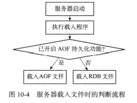

- 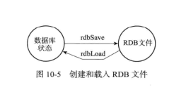

## SAVE命令执行时的服务器状态

- 只有在服务器执行完SAVE命令后，重新开始接收命令请求之后，客户端发送的命令才会被处理

## BGSAVE命令执行时的服务器状态

- 因为BGSAVE的保存工作是由子进程执行的，所以在子进程创建RDB文件的过程中，Redis仍然可以继续处理客户端的命令请求
- 而在这期间，服务器处理SAVE，BGSAVE，BGREWRITEAOF时会和平时有所不同
  - 客户端发送的SAVE会被拒绝（为了避免父进程和子进程同时执行两个rdgSAVE调用，防止产生竞争条件）
  - 发送的BGSAVE也会因为产生竞争条件而被拒绝
  - 对于BGREWRITEAOF，如果BGSAVE正在执行，那么客户端发送的BGREWRITEAOF会被延迟到BGSAVE执行完毕后再执行
  - 如果BGREWRITEAOF正在执行，那么客户端发送的BGSAVE会被服务器拒绝

- 而实际上BGREWRITEAOF和BGSAVE都是子进程完成的，操作上并没有冲突，但同时发出两个子进程都对磁盘进行大量的读写操作，会极大的影响性能

## RDB文件载入时的服务器状态

- 服务器在载入RDB文件时，会一直处于阻塞状态，直到载入工作完成为止

# 自动间隔性保存

- 因为BGSAVE可以不阻塞主进程的情况下执行，所以Redis允许用户通过设置服务器配置的save选项，让服务器每隔一段时间自动执行一次BGSAVE
- 用户可以设置多个保存条件，其中任意一个条件满足就可以执行BGSAVE
- 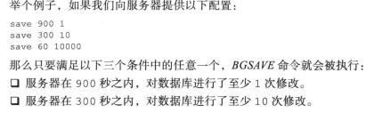

## 设置自动保存条件

- 当服务器启动时，用户可以通过配置文件或传入启动参数的方式设置save选项，如果没有设置，就是默认条件
- 接着用参数设置服务器状态redisServer的saveparams
- 

## dirty计数器和lastsave属性

- redisServer还保存了以下数据
  - dirty计数器记录距离上一次成功执行SAVE或BGSAVE后，服务器对数据库状态进行了多少次的修改
  - lastsave是一个UNIX时间戳，记录了服务器上一次成功执行SAVE或BGSAVE的时间
- 当服务器成功执行了一个数据库修改命令之后，就会对dirty进行更新：命令修改了多少次数据库，dirty就增加多少
  - 比如一次性添加了三个元素，就+3

## 检查保存条件是否满足

- redis服务器周期性操作函数serverCrom默认每隔100ms就会执行一次，该函数用于对正在运行的服务器进行维护，其中一项工作就是检查save选项所设置的保存才能条件是否满足，如果满足，就执行BGSAVE
- 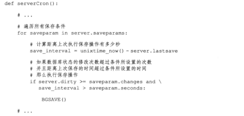

# RDB文件结构

- 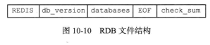

## REDIS

- 通过这**5个字节**，可以快速检查所在如的是否为RDB文件

## db_version

- **4个字节**，记录了RDB文件的版本号

## database

- 包含着零个或任意多个数据库，以及各个数据库中的键值对数据
  - 如果服务器为空，那么这个部分也为空，长度为0字节
- 根据数据库所保存的键值对的数量、类型和内容不同，这个部分的长度也会有所不同

- 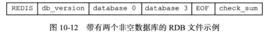

- 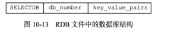
- SELECTDB长度为1字节，读到这个数据表示接下来要读入的是一个数据库号码
- db_number保存着一个数据库号码，根据号码的大小不同长度可以分为1字节、2字节或者5字节
  - 当读入db_number时，就会调用SELECT命令，根据读入的数据库号码进行数据库切换，使得之后读入的键值对可以载入到正确的数据库中
- key_value_pairs部分保存了数据库中所有的kv对，同时也保存了kv对的过期时间
- 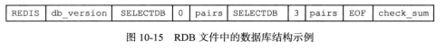

### 不带过期时间的key_value_pairs

- 不带过期时间的kv对在RDB文件中由TYPE，key，value组成
- TYPE
  - 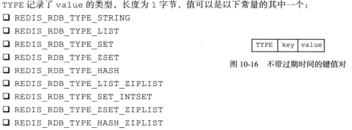
- key
  - key是一个字符串对象，编码方式和REDIS_RDB_TYPE_STRING一样

### 带过期时间的key_value_pairs

- 会在原有的基础上，加上expiretime_ms和ms这两个变量
  - EXPIRETIME_MS常量的长度为1字节，可以告知程序，接下来要读入的将是一个以毫秒为单位的过期时间
  - ms是一个8字节长的带符号整数，记录着一个以毫秒为单位的UNIX时间戳，这个时间戳就是kv对的过期时间

### value的编码

#### 字符串对象

- REDIS_RDB_TYPE_STRING，字符串对象的编码可以是REDIS_ENCODING_INT或者REDIS_ENCODING_RAW
- 对于REDIS_ENCODING_INT
  - 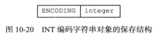
  - ENCODING的值可以是REDIS_RDB_ENC_INT8，REDIS_RDB_ENC_INT16，REDIS_RDB_ENC_INT32
- 对于REDIS_ENCODING_RAW，说明对象是一个字符串，根据长度不同，有不同的存储
  - 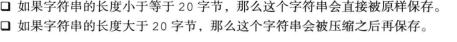
- PS：如果关闭了RDB文件压缩功能，那么RDB总以无压缩的方式保存字符串

- 对于没有被压缩的字符串，结构：len + string
  - 其中len是string的长度
- 而被压缩了的字符串
  - 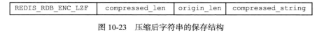
  - REDIS_RDB_ENC_LZF标记该字符串已经被LZF算法压缩过了，接着会更具后面的三个部分对字符串进行解压
  - compressed_len记录的是字符串被压缩之后的长度
  - origin_len记录的是字符串原来的长度
  - compressed_string记录的是被压缩之后的字符串

#### 列表对象

- REDIS_RDB_TYPE_LIST
- 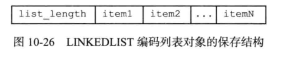
- list_length记录了列表的长度，即保存了多少个列表项
- item则表示列表项
- 而每个列表项都是一个字符串，所以每个列表项的第一个单位是一个数字，记录该项的长度，第二个单位是内容，即列表项的内容

#### 集合对象

- REDIS_RDB_TYPE_SET
- 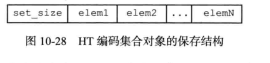
- set_size是集合的大小
- elem是集合项（elem是字符串，则处理方式和列表对象里面的item1是一致的）

#### 哈希表对象

- REDIS_RDB_TYPE_HASH
- 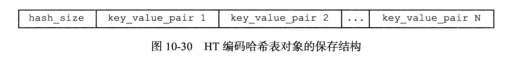
- hash_size表示hash的大小
- 以key_value_pair开头的部分代表哈希表中的键值对
  - 键值对都是字符串对象
  - 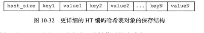

#### 有序集合对象

- REDIS_RDB_TYPE_ZEST
- 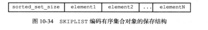
- sorted_set_size记录有序集合的大小
- 以element开头的部分代表有序集合中的元素，每个元素分为成员和分值两部分
  - 成员是一个字符串对象，分值是一个double浮点数
  - 程序在保存RDB文件时会先将分支转换成字符串对象，然后再用保存刺符传对象的方法将分值保存起来
- 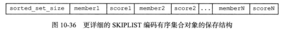

#### INTSET编码集合

- REDIS_RDB_TYPE_SET_INSERT
- 先将整数集合转换为字符串对象，然后将字符串对象保存到RDB文件中

#### ZIPLIST编码的列表、哈希表或者有序集合

- 

## EOF

- **1字节**，标志着RDB文件正文内容的结束，当读到这个数据时，就知道所有的数据库的所有键值对都载入完毕

## check_sum

- 一个**8字节**长的无符号整数，保存着一个检验和
- 这个检验和是更具上述四个部分的数据计算得到的
- 用来检查RDB文件是否有出错或损坏的情况出现

# 分析RDB文件

- 使用od命令来分析Redis服务器产生的RDB文件，该命令可以用给定的给格式转存并打印输入文件

- 377表示EOF终止常量

## 不包含任何键值对的RDB文件

- 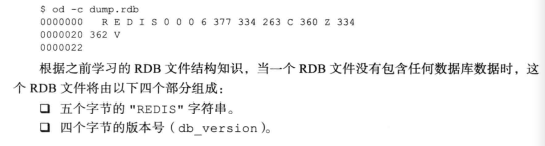
- 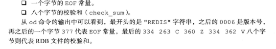

- 本章主要是利用RDB文件的结构分析，感觉面试问的不多就略过了...

# Conclusion

- RDB文件用于保存和还原Redis服务器所有数据库中的所有键值对

- SAVE命令由服务器进程直接执行保存操作，所以会阻塞服务器
- BGSAVE由子进程执行保存操作，不会阻塞服务器
- 服务器状态中会保存所有用save选项设置的保存条件，当任意一个保存条件满足时，服务器会自动执行BGSAVE
- RDB是一个经过压缩的二进制文件，由多个部分组成
- 对于不同类型的键值对，RDB文件会使用不同的方式来保存

- 所以相比AOF，RDB的启动时机非常的灵活多变，可以直接用命令强制server执行；也可以写好配置，在条件满足的时候让主进程执行，或者说也可以fork一个新的进程来执行，都是可以的