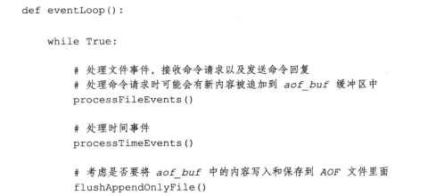
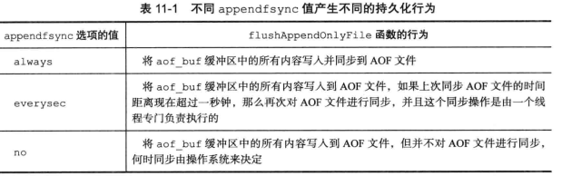
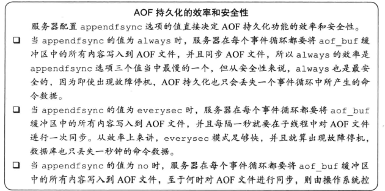
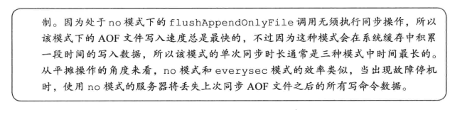
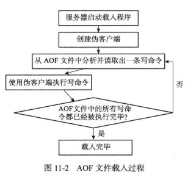
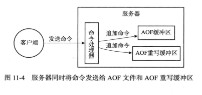
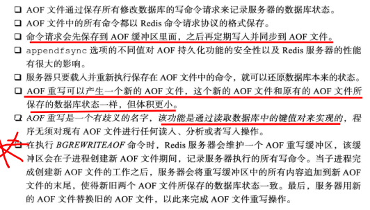

- AOF持久化是通过保存Redis服务器所执行的**写命令**来记录数据库状态

- 被写入AOF文件的所有命令都是以Redis的命令请求协议格式保存的

- 服务器在启动时，可以通过载入和执行AOF文件中保存的命令来还原服务器关闭之前的数据库状态

# AOF持久化的实现

- AOF的实现可以分为命令追加（append），文件写入和文件同步（sync）三个步骤

## 命令追加

- 当AOF持久化功能处于打开状态时，服务器在执行完一个写命令之后，会以协议格式将被执行的写命令追加到服务器状态的aof buf缓冲区的末尾
  - 缓冲区就是之前的sds...

## 写入和文件同步

- Redis的服务器进程就是一个事件循环，这个循环中的文件事件负责接收客户端的命令请求，以及客户端发送命令回复
- 而时间事件则负责执行像serverCron函数这样需要定时运行的函数

- eventloop的执行流程
- 

- flushAppendOnlyFile的配置
- 

文件的写入和同步

- 当用户调用write函数时，将一些数据写入到文件时，操作系统通常会将写入数据暂时保存在一个内存缓冲区里面，等到缓冲区的空间被填满，或者超过了指定的事件后，才真正地将缓冲区中的数据写入到磁盘里面（但如果数据还在内存的时候，宕机了，就g了）
- 所以OS提供了fsync和fdatasync两个同步函数，强制让OS将缓冲区中的数据写入到硬盘中，从而确保写入数据的安全性

AOF持久化的效率和安全性

- 
- 

- 这里说的写入和同步，写入是指将数据写入到内存的缓冲区中，而同步是指将数据刷盘

# AOF文件的载入与数据还原

Redis读取AOF文件并还原数据库状态的步骤

- 创建一个不带网络连接的伪客户端（fake client）：因为Redis的命令只能在客户端上下文中执行，而载入AOF文件时所使用的指令直接来源与AOF文件而不是网络连接，所以服务器使用了一个没有网络连接的伪客户端来执行AOF文件保存的写命令
- 从AOF文件中分析并读取出一条写命令
- 使用伪客户端执行被读出的命令
- 一直执行上面两个指令，知道AOF文件中的所有写命令都被处理完毕为止
- 

# AOF重写

- AOF文件太大的话会浪费内存，所以需要对其进行压缩
- 为了解决AOF文件体积膨胀的问题，Redis提供了AOF文件提供重写功能，通过该功能，Redis服务器可以创建一个新的AOF文件来替代现有的AOF文件，新旧两个AOF文件所保存的数据库状态相同，但新的AOF文件不会包含任何浪费空间的冗余命令
- AOF重写通过读取服务器当前的数据库状态来实现的

- 如果服务器想要用尽量少的命令来记录某个键值的状态，最好的办法就是直接从数据库中读取这个键值，然后用一条RPUSH 巴拉巴拉的命令来代替所有和这个键值相关的语句

- 总结：首先从数据库中读取键现在的值，然后用一条命令去记录键值对，代替之前记录这个键值对的多条命令

## AOF后台重写

- AOF的重写会有大量的读写操作，所以会导致线程长时间的被阻塞（而Redis是单线程执行的...）
- 所以这样的话重写AOF期间，就不能接收其他的命令了
- 所以Redis就将AOF重写程序放到子进程中执行
  - 子进程进行AOF重写期间，服务器进程（父进程）可以继续处理命令请求
  - 子进程带有服务器进程的数据副本，使用子进程而不是线程，可以避免使用锁的情况下，保证数据的安全性
  - 还有一点，就是AOF重写如果coredown的话，也不会影响父进程（而如果是线程的话，就会有级联反应，导致整个父进程coredown）

- 子进程的问题：因为子进程在进行AOF重写期间，服务器进程还需要处理命令请求，而新的命令会对现有的数据库状态进行修改，从而使得当前的数据库状态和重写后的AOF文件所保存的数据库状态不一致
- 解决办法：AOF重写缓冲区

- 这个缓冲区在服务器创建子进程之后开始使用，当Redis服务器执行完一个写命令之后，它会同时将这个写命令发送给AOF缓冲区和AOF重写缓冲区
- 也就是说，子进程在执行AOF重写过程中，服务器进程要做的几件事：
  - 执行客户端的命令
  - 将执行后的写命令追加到AOF缓冲区
  - 将执行后的写命令追加到AOF重写缓冲区
- 

- 就可以保证：AOF缓冲区的内容会被定期写入和同步到AOF文件中，对现有AOF文件的处理工作会如常进行
- 从创建子进程开始，服务器执行的所有写命令都会被记录到AOF重写缓冲区中

- 当子进程完成AOF重写工作之后，它会向父进程发送一个信号，父进程在接收到该信号之后，会调用一个信号处理函数，并执行一下工作：
  - 将AOF重写缓冲区中的所有内容写入到新的AOF文件中，这时新的AOF文件所保存的数据库状态将和服务器此时的数据库状态相同
  - 对AOF文件改名，原子地覆盖现有的AOF文件，完成新旧两个AOF文件的替换

- 在整个AOF后台重写过程中，只有信号处理函数执行时会对服务器进程造成阻塞

# Conclusion

- AOF是在主线程的最后执行的，每次将指令写入到文件（或缓冲区中）
- 而AOF重写是在子进程中完成的

- 