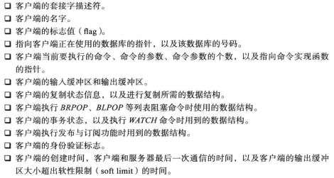
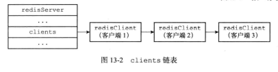

- redis服务器使用单线程单进程的方式处理命令请求，并与多个客户端进行网络通信

- client的数据结构

  - 

- redis服务器状态结构的clients是一个链表，保存了所有与服务器连接的客户端状态

  - ```c
    struct redisServer {
        list *clients; // 一个链表，保存了所有客户端状态
    };
    ```

  - 


# 客户端属性


## 套接字描述符

- ```c
  typedef struct redisClient {
      int fd;
  };
  ```

- fd为-1表示是伪客户端，源于AOF文件或者lua脚本

  - 用于AOF文件并还原数据库状态
  - 用于执行lua脚本中包含的redis命令

- fd大于-1的是正常的fd


## 名字

- ```c
  typedef struct redisClient {
      robj *name;
  };
  ```


## 标志

- 标志客户端目前处于的状态

- ```c
  typedef struct redisClient {
      int flags;
  };
  ```


## 输入缓冲区

- 客户端状态的输入缓冲区用于保存客户端发送的命令请求：

- ```c
  typedef struct redisClient {
      sds querbuf;
  };
  ```

- 最大大小不能超过1GB，否则会自动关闭client


## 命令与命令参数

- 对querbuf中的命令进行解析，得出命令参数以及命令参数的个数分别保存到客户端状态的argv和argc中

- ```c
  typedef struct redisClient {
      robj **argv;//z
      int argc;
  };
  ```

- 