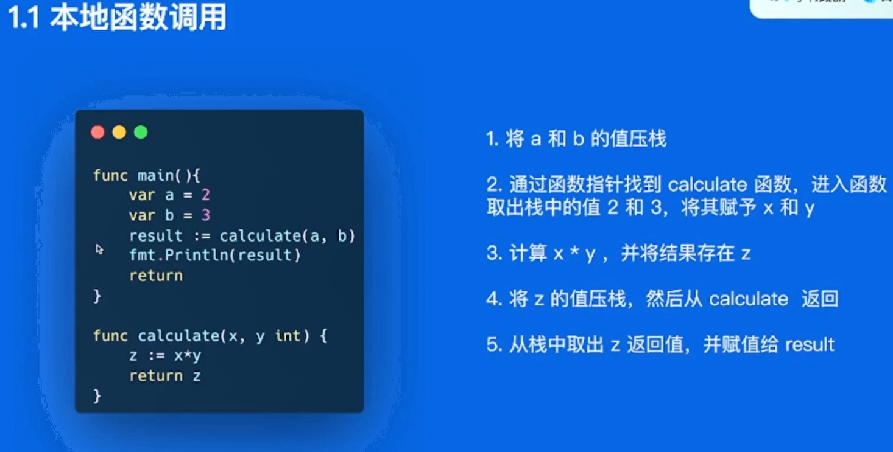
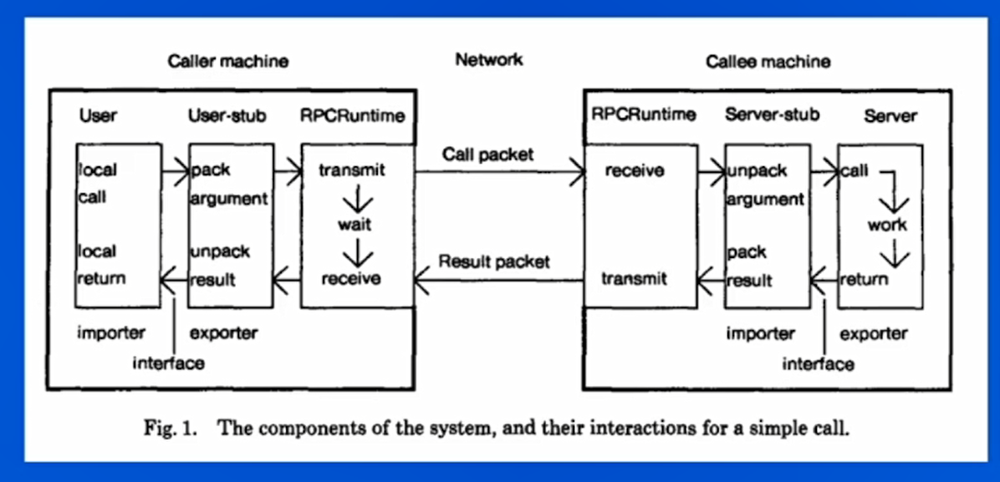

# 基本概念

## 基本函数调用

- 

## 远程函数调用

- RPC(Remote Procedure Calls)
- 一个场景：网上商城部分需要调用支付服务的支付扣款函数
  - 

- 需要解决以下的一些问题：**函数映射，数据转换成字节流，网络传输**

- 函数映射问题：怎么告诉支付服务我们需要需要调用的是付款还是充值函数
  - 本地的话是可以直接使用函数指针找到对应的函数即可（编译器会帮我们找到对应的函数指针）
  - 而远程调用，是两个完全不同的进程，地址空间都是不一样的
  - 一个解决办法就是给每个函数一个id地址，即id和这个函数的映射关系
- 如何将函数的具体参数告诉远程服务
  - 本地调用的时候仅仅是将函数的参数压栈
  - 而远程调用时不同的进程，所以要先将参数转化成一个字节流，传输给对端
  - 对端接收到后再将数据转化为可读的形式
- 远程调用是基于网络协议栈的，那么如何保证这个传输过程的高效和稳定性

## RPC概念模型

- 分为五个模型：**User,User-stub,RPCRuntime,Server-stub,Server**

- 
- caller machine是调用端，callee machine是被调用端

listen中linux默认的backlog是128