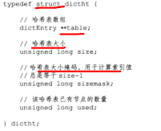
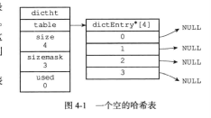
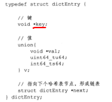
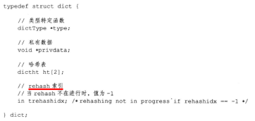
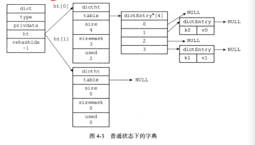
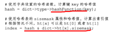
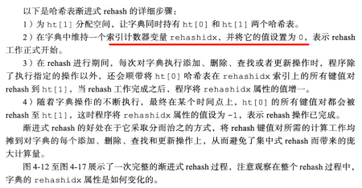

- 字典，又称为符号表，关联数组，或映射
- 是一种用于保存kv对的抽象数据结构
- 在字典中，一个key可以和一个value相关联
- 应用
  - redis的数据库就是用字典作为底层实现的，对数据库的CURD都是构建在对字典的操作之上
  - 也是哈希键的底层实现之一（当一个哈希键包含的键值对比较多时，又或者键值对中的元素都是比较长的字符串时）

# 字典的实现

- redis的字典使用哈希表作为底层实现

## 哈希表

- 
- table是一个数组，数组中的每个元素都是一个指向dictEntry的指针
- size记录了哈希表的大小，也就是table数组的大小
- used则记录哈希表目前已有节点的数量
- sizemask的值则是size-1
- 举例
  - 

## 哈希表节点

- 
- key中保存着键值对中的键值
- v保存着kv对中的v（使用union组织的）
- next属性是指向另一个哈希表节点的指针，这个指针将多个哈希值相同的键值对连再一次，用以解决hash冲突（链地址法解决hash冲突）

## 字典

- 
- type是一个指向dictType结构的指针（dictType保存了一簇用于操作特定类型键值对的函数）
  - 
- privata则保存了需要传给那些类型特定函数的可选参数
- ht是一个包含两个项的数组，其中每一项都是一个dictht哈希表，一般来字典只用ht[0]，ht[1]只会在ht[0]进行rehash的时候用上
- rehashidx记录了rehash目前的进度，如果没有rehash，那么就是-1
- 

# 哈希算法

- 当要把一个新的键值对添加到字典里面时，要先根据键值对的键计算出哈希值和索引值，然后根据索引值将新的哈希表节点放到对应的索引上
- 
- Redis使用的时MurmurHash2算法

# 解决键冲突

- Redis使用连地址法解决键冲突

# rehash

- 为了让hash表的负载因子维持在一个合理的范围内，当哈希表保存的键值对数量太多或太少时，需要对其进行相应的拓展或者收缩
- 即rehash

## 步骤

- 为字典的ht[1]哈希表分配空间，这个哈希表的空间大小取决于要执行的操作，以及ht[0]当前包含的kv对
  - 如果是拓展操作，那么ht[1]的大小为第一个大于等于ht[0].used * 2的2的n次方幂
  - 如果执行的是收缩操作，那么ht[1]的大小就是第一个大于等于ht[0].used的2的n次方幂
- 将保存在ht[0]中的所有键值对rehash到ht[1]上面，rehash指的是重新计算键的哈希值和索引值，然后将键值对放置到ht[1]哈希表的指定位置上
- 当ht[0]包含的所有键值对都迁移到ht[1]之后（ht[0]变为了空表），释放ht[0]，将ht[1]设置为ht[0]，并正在新的ht[1]上新建一个空白哈希表，为下一次rehash做准备

## 哈希表的拓展与收缩

- 当以下条件中的任意一个被满足时，就会rehash拓展操作
  - 服务器目前没有在执行BGSAVE命令或者BGREWRITEAOF命令，并且哈希表的负载因子大于等于1
  - 服务器目前正在执行BGSAVE或者BGREWRITEAOF，并且哈希表的负载因子大于等于5
- 哈希负载因子：哈希表已保存节点数量 / 哈希表大小
- 为什么有上述的区别：因为上面两个命令都会创建子进程来rehash，所以为了避免在子进程存在的期间进行rehash的操作，所以要提高负载因子的上限
- 当hash表的负载因子小于0.1时，程序自动开始对哈希表执行收缩操作

# 渐进式rehash

- rehash不是一次性完成的，而是分多次渐进式地完成的
  - 因为如果一次性全部rehash的话，就会导致服务器宕机一小段时间，影响性能

## 步骤

- 
- 渐进式hash时，字典的删除、查找、更新等操作会在两个hash表中进行
  - 比如说find，第一个hash中没有的话就会到第二个hash中找
- 而新添加到字典的kv对只会保存到ht[1]中，这一措施保证了ht[0]包含的kv对数量只减不增，并随着rehash操作的执行，最终变为空表

# 字典API

- 

# Conclusion

- 每个字典带有两个hash表，一个平时使用，另一个仅在进行rehash的时候使用
- 链地址解决hash冲突
- 在对hash进行拓展或者收缩的时候，程序需要将现有hash表包含的所有键值对rehash到新的hash表中，并且时渐进式rehash