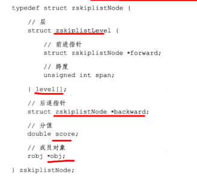
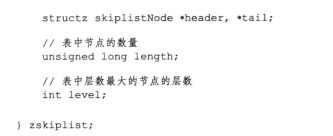
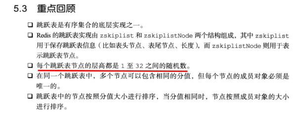

- skiplist，跳表，每个节点中维护多个指向其他节点的指针，从而达到快速访问节点的目的
- 支持平均O(log N)，最坏O(N)复杂度的节点查找
- 是有序集合键的底层实现之一
  - 如果一个有序集合包含的元素数量比较多，又或者有序集合中元素的成员是比较长的字符串时，就会用跳表实现有序集合键
- redis只有两个地方用到了跳表
  - 有序集合键
  - 集群节点中用作内部数据结构

# 跳跃表的实现

- zskiplistNode用于表示跳表的节点，zskiplist用于表示跳表节点的相关信息
- 
- zskiplist结构
  - header指向跳表的表头结点
  - tail指向表尾结点
  - level记录跳表内层数最大的那个结点的层数
  - length记录跳跃表的长度，即包含结点的数量
- zskiplistNode结构
  - 层数（level）：L1,L2表示层，每个层都带有两个属性，前进指针和跨度，前进指针用于访问位于表尾方向的其他结点，而跨度记录了前进指针所指向结点和当前结点的举例
  - 后退指针（backward）：节点中用BW标记节点的后退指针，指向位于当前节点的前一个结点，后退指针在程序从表尾向表头遍历时用
  - 分值（score）：在跳跃表中，结点按照各自所保存的分值从小到大排列（数据就按照这个顺序排列的）
  - 成员对象：各个结点中的o1，o2时节点所保存的成员对象

## 跳表节点

- 

层

- level数组可以包含多个元素，每个元素都包含一个指向其他节点的指针，程序可以通过这些层来加快访问其他节点的速度
  - 一般来说，层的数量越多，访问其他节点的速度越快
- 每次创建一个新的节点时，都根据幂次定律随机成成一个介于1和32之间的值作为level数组的大小，这个大小就是该节点层的高度

前进指针

- 每个层都有一个指向表尾方向的前进指针，用于从表头向表尾访问节点

跨度

- 用于记录两个节点之间的距离
  - 两个节点之间的跨度越大，距离越远
  - 指向null的所有前进指针的跨度都为0，因为它们没有连向任何节点
- 查找的遍历操作只使用前进指针就可以完成了
- 跨度是用来记录排位的，在查找某个节点的过程中，将沿途访问过的所有层的跨度累积起来，得到的结果就是目标节点在跳跃表中的排位（即跨度是用来记录目标节点的位置的）

后退指针

- 用来从表尾向表头方向访问节点

分值和成员

- 节点的分值（score）是一个double类型的浮点数，跳跃表中的所有节点都按照这个分值从大到小排序
- 节点的成员对象是一个指针，指向一个字符串对象，即SDS
- 各个节点保存的成员对象必须是唯一的，但多个节点保存的分值却可以是相同的，分值相同的按照对象的字典序进行排序（小的在前面，大的在后面）

## 跳跃表

= 

- header和tail指针分别指向跳表的表头和表尾
- length记录节点的数量
- level用于在O(1)的时间内获取跳表中层高最大的那个节点的层数量

# Conclusion

- 