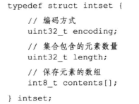

- 当一个集合只包含整数值元素，并且这个集合的元素数量不多时，就会使用整数集合作为集合键的底层实现

# 整数集合的实现

- 是用于保存整数值的集合抽象数据结构，可以保存类型为int16_t，int32_t或者int64_t，并且保证不会出现重复元素
- 
- contents数组是整数集合的底层实现，其中各个项按值得大小从小到大有序地排列
- length记录元素数量
- encoding决定数据的真正类型，值为INTSET_ENC_INT16，INTSET_ENC_INT32，INTSET_ENC_INT64

# 升级

- 每将一个新的元素插入时，并且新元素的类型比整数集合现有所有元素的类型都要长时，集合都需要升级，然后才能将新元素添加到整数集合中

步骤

- 根据新元素的类型，扩展整数集合底层数组的空间大小，并为新元素分配空间
- 将底层数组现有的所有元素转换成与新元素相同的类型，并将类型转换后的元素放置到正确的位置上，而且放置元素的过程中，需要继续维持底层数组的有序性不变
- 将新元素添加到底层数组里面

- 因为可能会引发升级，所以向整数集合添加新元素的时间复杂度时O(N)
- PS：新元素的长度时大于现有所有元素的长度的，所以新元素的位置要么在最左边，要么在最右边

# 升级的好处

- 提升灵活性
  - 为了避免类型错误，不会将两种不同类型的数据放在一起
  - 同时整数集合可以通过自动升级底层数组来适应新元素
- 节约内存
  - 只有在有需要的时候才会升级内存空间

# 降级

- 不支持降级操作

# Conclusion

- 整数集合是集合键的底层实现之一
- 整数集合的底层实现为数组，数组以有序无重复的方式保存集合元素，在有需要时会升级数据类型
- 升级操作为整数集合带来了操作上的灵活性，并且尽可能地节约内存
- 只支持升级，不支持降级