- 五种类型对象：字符串对象，列表对象，哈希对象，集合对象和有序集合对象
- 使用对象的优点：可以针对不同的使用场景，为对象设置不同的数据结构实现，从而优化对象在不同场景下的使用效率


# 对象的类型与编码

- 使用对象来表示数据库中的key和value
- 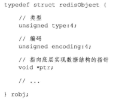


type

- 记录了对象的类型
- 对于Redis中的kv对来说，键总是一个字符串对象
- 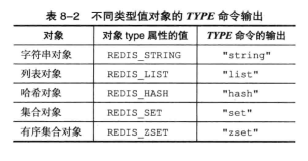


编码和底层实现

- 对象的ptr指针指向的对象的底层实现数据结构，而这些数据结构由对象的encoding决定
- 即redis这个版本只有五类对象，但是不同的对象在不同的场景下，有不同的实现，这里的encoding就是指其不同的实现
- 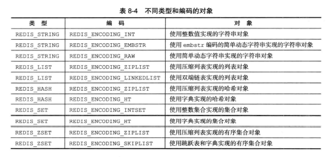


# 字符串对象

- 字符串的编码可以是**int，raw或者是embstr**
- 如果保存的是整数值，而且可以用long表示，那么字符串对象会将整数值保存在字符串对象结构的ptr属性里面，并将字符串对象的编码设置为int
- 如果是字符串值
  - 大于32字节的，用SDS保存，对象编码设置为raw
  - 小于等于32字节的，用embstr编码保存字符串值，即也是用SDS保存
  - 但二者的区别就是，raw编码会调用两次内存分配redisObject和sdshdr结构，而embstr用一次内存分配一块连续的空间
  - 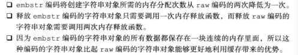
- 可以用long double类型标识的浮点数在redis中也是作为字符串值来保存的，如果要保存一个浮点数到字符串中，那么首先会将浮点数变为字符串值，然后保存
- 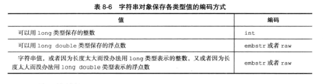


- int编码的字符串对象和embstr编码的字符串对象在条件满足的情况下，会被转换为raw编码


- 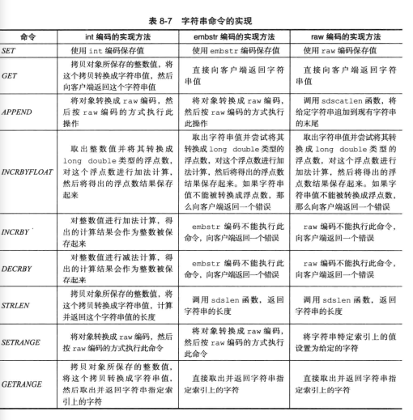


# 列表对象

- 可以是**ziplist或者linkedlist**
- ziplist编码的列表对象使用压缩列表作为底层实现，每个压缩列表节点保存了一个列表元素
  - 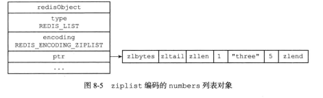
- linkedlist编码使用双端链表作为底层实现
  - 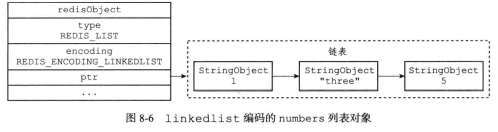


- 同时满足下列情况使用ziplist编码
  - 保存的所有字符串长度都小于64字节
  - 保存的元素数量小于512个
  - 不能满足这两个的时候用linkedlist编码


# 哈希对象

- 可以是**ziplist或者hashtable**
- ziplist编码的哈希对象使用压缩列表作为底层实现，每当有新的键值对要加入到哈希对象中时，会先将保存了键的压缩列表节点推入到压缩列表表尾，然后再将保存了值的压缩列表节点推入到压缩列表表尾
  - 因此保存了同一键值对的两个节点总是紧挨在一起，保存键的节点在前，保存值的节点在后
  - 先添加到哈希对象中的键值对会被放在亚朵列表的表头方向，而后来添加到哈希对象中的键值对会被放在压缩列表的表尾方向
- hashtable编码的哈希对象使用**字典**作为底层实现，哈希对象中的每个键值对都使用一个字典键值对来保存（键值对都是字符串对象）


- 当满足以下两个条件时，哈希对象使用ziplist编码
  - 哈希对象保存的所有键值对的键和值的字符串长度都小于64字节
  - 哈希对象保存的键值对数量小于512个
- 否则，都用hashtable实现


# 集合对象

- 可以是**intset或者hashtable**
- intset编码的集合对象使用整数集合作为底层实现，集合对象包含的所有元素都被保存到整数集合里面
- hashtable编码的集合对象使用字典作为底层实现，字典的每个键都是一个字符串对象每个字符串对象包含了一个集合元素，而字典的值被设置为NULL


- 当集合对象可以同时满足以下两种条件时，对象用intset编码
  - 集合对象保存的所有元素都是整数值
  - 集合对象保存的元素数量不超过512个
- 否则就用hashtable编码


# 有序集合对象

- 有序集合的编码可以是ziplist或者skiplist

- ziplist编码的压缩列表使用压缩列表作为底层实现，每个集合元素使用来个呢个紧挨在一起的压缩节点存储，第一个节点保存元素的成员，第二个节点保存元素的分值

  - ziplist中的元素按照分值进行由小到大的排序

- skiplist则使用zset作为底层实现，一个zset包括一个字典和一个跳表

  - ```c
    typedef struct zset {
        zskiplist *zsl;
        dict *ditc;
    }
    ```

  - zsl跳表按分值从小到大保存了所有集合元素，每个跳表节点都保存了一个集合元素（借助跳表实现**范围性操作**）

  - dict创建了一个成员到分值的映射，字典中的每个键值对都保存了一个集合元素（借助字典实现O(1)查找给定成员的分值，可以理解为利用dict实现**点操作**）

- 有序集合中每个成员都是字符串对象，分值则是一个double类型的浮点数

- PS：zset中dict和zsl会通过指针来共享相同的成员和分值，所以不会出现资源重复的浪费

- 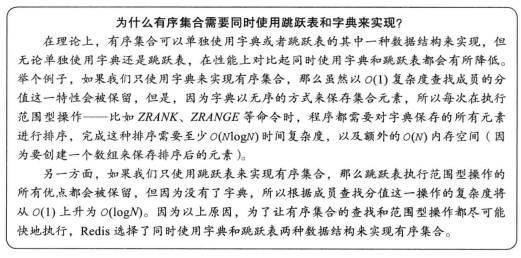

- zset示意图

  - 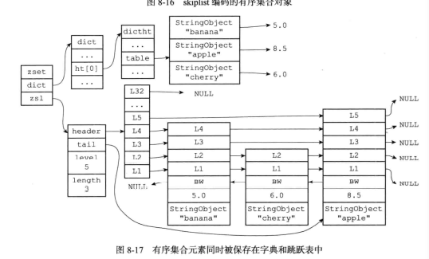


- 满足以下条件时用ziplist
  - 保存的元素数量小于128个
  - 保存的所有元素成员的长度都小于64字节
- 否则就用skiplist


# 类型检查与命令多态

redis用于操作键的命令分为两种

- 第一种是对任何类型的键执行，比如说DEL，EXPIRE，RENAME等
- 第二种是只能对特定类型的键执行，比如SET,GET等


## 类型检查的实现

- 在执行一个类型特定的命令之前，Redis会检查输入键的类型是否正确，然后再决定是否执行给定的命令（依靠redisObject的type属性实现的）
- 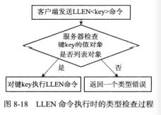


多态命令的实现

- redis还会根据值对象的编码方式，选择正确的命令实现代码来执行命令
  - 因为对象的实现有不同的方式实现的，对于同一个api，底层的实现各有不同
- 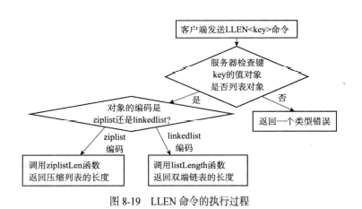


# 内存回收

- 在redisObject中实现了引用计数的内存回收机制

- ```c
  typedef struct redisObject {
      int refcount; // 引用计数
  };
  ```

- 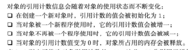


# 对象共享

- 如果有两个键值都保存了同一个数据，那么在Redis中可以让多个键共享同一个值对象
- 步骤：
  - 将数据库键的值指针指向一个现有的值对象
  - 将被共享的值对象的引用计数+1
- 目前来说，Redis会在初始化服务器时，创建一万个字符串对象，这些对象包含了从0到9999的所有整数值，当服务器需要用到值为0到9999的字符串时，服务器就会使用这些共享对象，而不是新创建对象
- 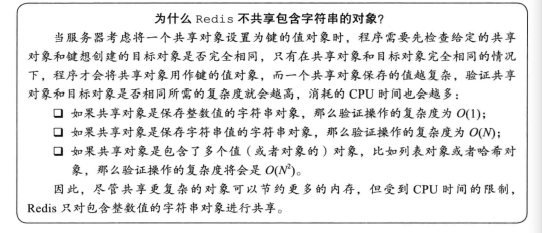


# 对象的空转时长

- redisObject中的lru属性，记录了对象最后一次被访问的时间：

- ```c
  typedef struct redisObject {
      unsigned lru:32;
  };
  ```


# Conclusion

- 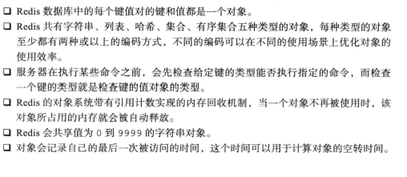