- redis服务器要处理的两类事件
  - 文件事件，通过socket与client进行连接，就是服务器对socket操作的抽象
  - 时间事件，redis中的一些操作需要在给定的事件点执行

# 文件事件

- Reactor模式开发了自己的网络事件处理器，被称为文件事件处理器
  - 用了IO多路复用
  - 当被监听的套接字准备好执行连接应答、读取、写入、关闭等操作时，与操作相对应文件时间就会产生
- 文件事件处理器是以**单线程**的方式运行的，但通过IO多路复用来监听socket，实现了高性能

## 文件事件处理器的构成

- 四个部分：socket，IO多路复用，文件事件分派器（dispatcher）以及事件处理器
- 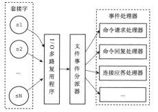
- 文件事件是对套接字操作的抽象
- IO多路复用程序负责监听多个套接字，并向文件事件分派器传送那些发生了事件的socket
- IO多路复用将所有发生了事件的socket放到一个**队列**中，然后通过这个队列，以有序、同步、每次一个套接字的方式向文件事件分派器传送套接字，当上一个套接字产生的事件处理完毕之后，IO多路复用才会继续向文件事件分配器传送下一个套接字
- 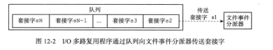

## 事件的类型

- 当socket变得可读时（client对socket执行write操作，或者执行close操作），或者有新的socket出现，就有AE_READABLE事件
- 当socket变得可写时（client对socket执行read操作），就有AE_WRITEABLE事件

- 如果两种事件同时出现，会优先处理AE_READABLE，处理完后在进行AE_WRITABLE事件

## API

- 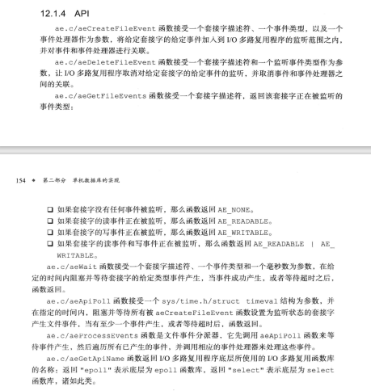

## 文件事件的处理器

- 为了对连接服务器的各个客户端进行应答，服务器要为监听socket关联**连接应答处理器**
- 为了接收客户端传来的命令请求，服务器要为client socket关联**命令请求处理器**
- 为了向客户端返回命令的执行结果，服务器要为client socket关联**命令回复处理器**
- 当主服务器和从服务器进行复制时，主从服务器都需要关联特别为复制功能编写的**复制处理器**

### 连接应答处理器

- 用于对连接服务器监听套接字的客户端进行应答
- 关联的是AE_READABLE事件
- 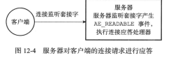

### 命令请求处理器

- 负责从socket中读入client发送的命令请求内容
- 关联的是AE_READABLE事件
- 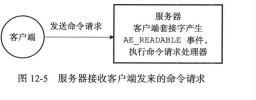

### 命令回复处理器

- 负责将服务器执行命令后得到的数据通过socket返回给client
- 关联的是AE_WEITABLE事件
- 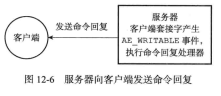

# 时间事件

- 两类
  - 定时事件：在指定的事件之后执行一次
  - 周期性事件：让一段程序每隔指定事件就执行一次
- 时间事件的三个属性
  - id：服务器为时间时间创建的全局唯一id
  - when：记录了时间事件的到达时间
  - timeProc：时间事件处理器函数
- 如何确认是定时事件还是周期性事件
  - 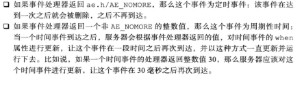
- 目前版本只有周期性事件

## 实现

- 所有时间时间都放在一个无序链表中，每当时间事件执行器运行时，就遍历整个链表，查找所有已到达的时间事件，并调用相应的事件处理器
- PS：连表示无序链表，所以每当时间事件执行器运行时，就要遍历所有的时间时间
  - 时间事件比较少，不会因此影响性能

## serverCron函数

- 更新服务器的各类统计信息，比如时间、内存占用、数据库占用情况
- 清理数据库中的过期键值对
- 关闭和清理连接失效的客户端
- 尝试执行AOF或RDB持久化操作
- 如果是主服务器，要对从服务器进行同步
- 如果是集群模式，对集群进行定期同步和连接测试

# 事件调度与执行

- 由ae.c/adProcessEvents负责
- 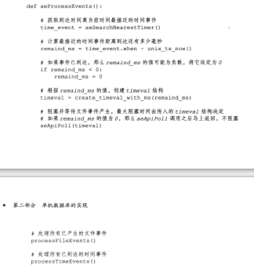
- 所以说是先获取时间时间，然后epoll，最后按顺序处理epoll的事件，在处理周期定时事件
- 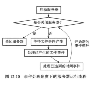

- 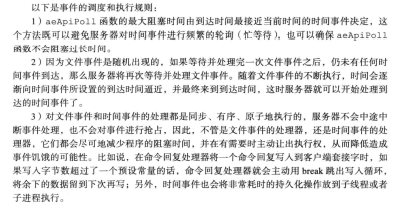

# Conclusion

- 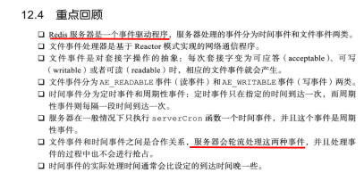