# 6.1 存储技术

- 这一节主要说的是计组，即存储技术的发展，后续补一下

# 6.2 局限性

- 一个编写良好的计算机程序常常具有良好的局部性，也就是它们倾向于引用临近于其他最近引用过的数据项的数据项
- 这种倾向就是**局部性原理**

- 时间局部性：
  - 在一个具有良好时间局部性的程序中，被引用过一次的内存位置很可能在不远的将来再被多次引用

- 空间局限性：
  - 在一个具有良好空间局部性的程序中，如果一个内存位置被引用了一次，那么程序很可能在不远的将来引用附近的一个内存位置

对程序数据引用的局限性

- 对于一个二维数组来说，不同的遍历方式，速度上是非常不同的

取指令的局部性

- 代码区别于程序数据的一个重要属性是它在运行的时候是不能被修改的，当程序正在执行时，CPU只从内存中读出它的指令，CPU很少会重写或修改这些指令

小结

- 重复引用相同变量的程序有良好的时间局限性
- 对于具有步长为k的引用模式的程序，步长越小，空间局部性越好。具有步长为l的引用模式的程序有很好的空间局部性。在内存中以大步长跳来跳去的程序空间局部性会很差
- 对于取指令来说，循环有好的时间和空间局部性。循环体越小，循环迭代次数越多，局部性越好

# 6.3 存储器层次结构

- 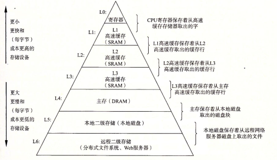
- 在最高层(L0)，是少量快速的CPU寄存器，CPU可以在一个时钟周期内访问它们
- 接下来是一个或多个小型到中型的基于SRAM的高速缓存存储器，可以在几个CPU时钟周期内访问它们
- 接下来就是慢速但是容量很大的本地磁盘

6.3.1 存储器层次结构中的缓存

- 高速缓存：小而快速的存储设备，作为存储在更大、也更慢的设备中的数据对象的缓冲区域
- 使用高速缓存的过程叫做缓存

- 存储器层次结构的中心思想：对于每个k，位于k层的更快更小的存储设备作为位于k+1层的更大更慢的存储设备的缓存
  - 即层次结构中的每一层都缓存来自较低一层的数据对象
- 第k+1层的存储器被划分为连续的数据对象组块，称为块
- 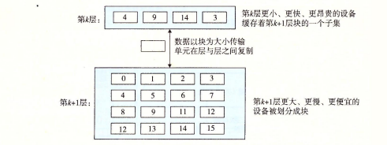
- 数据总是以块大小为传送单位在第k层和第k+1层之间来回复制

缓存命中

- 当程序需要第k+1层的某个数据对象d时，它首先在当前存储在第k层的一个块中查找d，如果d刚好缓存在第k层中，这就是缓存命中

缓存不命中

- 如果第k层中没有缓存数据对象d, 那么就是我们所说的**缓存不命中**
- 当发生缓存不命中时，第k层的缓存从第k+1层缓存中取出包含d的那个块，如果第k层的缓存已经满了，可能就会覆盖现存的一个块
- 覆盖一个现存的块的过程叫做**替换**或者驱逐这个块
- 被驱逐的这个块叫做**牺牲块**
- 决定该替换哪个块是由缓存的替换策略来控制的

缓存不命中的种类

- 如果第k层的缓存是空的，那么对任何数据对象的访问都会不命中。一个空的缓存有时被称为冷缓存 (cold cache) ，此类不命中称为强制不命中或冷不命中
  - 通常是短暂事件，不会再反复访问存储器使得缓存暖身之后的稳定状态中出现
- 冲突不命中：缓存足够大，能够保存被引用的数据对象，但是因为这些对象会映射到同一个缓存块，缓存会一直不命中
- 容量不命中：
  - 每个阶段访问缓存块的某个相对稳定的集合，称为这个阶段的工作集
  - 当工作集超过了缓存大小的时候，缓存会经历容量不命中
  - 即缓存太小了，不能处理这个工作量

缓存管理

- 编译器管理寄存器文件，缓存层次结构的最高层，它决定当发生不命中时何时发射加载，以及确定哪个寄存器来存放数据
- L1、L2和L3层的缓存是由内置在缓存中的硬件逻辑来管理的
- 在一个有虚拟内存的系统，DRAM主存作为存储在磁盘上的数据块的缓存，是由操作系统软件和CPU上的地址翻译硬件共同管理的
- 在大多数时候，缓存都是自动运行的，不需要程序采取特殊的或显式的行为

6.3.2 小结

- 存储器的层次结构也体现了程序的时间局限性和空间局限性
- 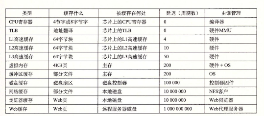

# 6.4 高速缓存存储器

- CPU寄存器文件和主存之间插入的一个小的SRAM高速缓存存储器，称为**L1高速缓冲**
- L1高速缓冲的访问速度几乎和寄存器一样快，大约是4个时钟周期

- 在L1高速缓存和主存之间又插入一个更大的高速缓存，称为**L2高速缓存**
- 可以在10个时钟周期内访问到它

- 现代系统还有更大的高速缓存，称为**L3高速缓存**
- 位于L2高速缓存和主存之间，可以在50个周期内访问到它

6.4.1 通用的高速缓冲存储器组织结构

- 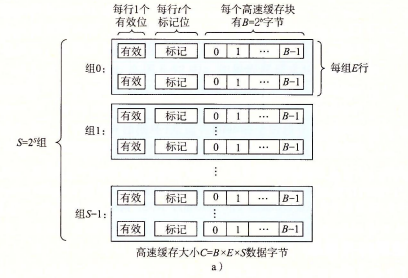
- 考虑一个计算机系统，其中每个存储器地址有m位，形成M=2^m个不同的地址
- 这样一个机器的高速缓存被组织成要给有S=2^s个高速缓存组的数组
- 每个组包含E个高速缓存行
- 每个行是由一个B=2^b字节的数据块组成，一个有效位指明这个行是否包含有意义的信息
- 还有t个标志位，它们是唯一地标识存储在这个高速缓存行中的块

- 一个高速缓存的结构可以用元组（S，E，B，m）来描述

- 当一条加载指令指示CPU从主存地址A中读一个字时，它将地址A发送到高速缓存
- 如果高速缓存正保存着地址A处那个字的副本，它就立即将那个字发回给CPU
  - 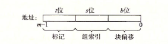
  - 参数S，B将m个地址位分为三个字段
  - A中**s**个组索引位是一个到S个组的数组的索引，第一个组时组0，第二个组是组1，以此类推（它告诉我们这个字必须存储在哪个组中）
  - 然后，A中的**t**个标志位就告诉我们这个组中的哪一行包含这个字（当且仅当设置了有效位并且该行的标记位与地址A中的标记为相匹配时，组中的这一行才包含了这个字）
  - 一旦我们在由组索引标识的组中定位了由标号所标识的行，那么**b**个块偏移位给出了在B个字节的数据块中的字偏移

6.4.2 直接映射高速缓存

- 根据每个组的高速缓存行数E，高速缓存被分为不同的类
- 每个组只有一行的高速缓存称为直接映射高速缓存
- 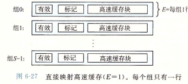
- 当CPU向L1高速缓存某个数据的时候，如果在L1里面，就直接返回；否则就要向主存请求了
- 高速缓存确认一个请求是否命中，然后抽取被请求的字的过程，分为三步：
  - 组选择
  - 行匹配
  - 字抽取

直接映射高速缓存中的组选择

- 在这一步中，高速缓存从w的地址中间抽取出s个组索引位
- 即如果把高速缓存看成是一个关于组的一堆数组，那么这些组索引位就是一个到这个数组的索引
- 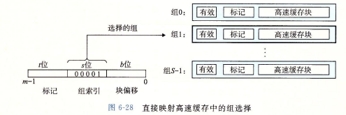

直接映射高速缓存中的行匹配

- 这一步是要确认是否有字w的一个副本存储在该组包含的一个高速缓存行中
- 这里很快找到的原因时此时每个组都只有一行数据.....
- 当且仅当设置了有效位，而且高速缓存中的标记与w的地址中的标记相匹配时，这一行中包含w的一个副本
- 如果此时的有效位没有设置，或者标记不匹配，那就是缓存不命中
- 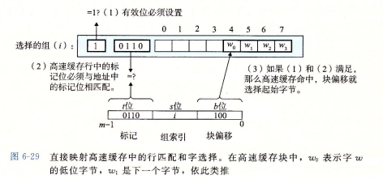

直接映射高速缓存中的字选择

- 最后一步就是确认所需要的字在块中是从哪里开始的的
- 而其中的块偏移提供了所需要的字的第一个字节的偏移
- 就像我们把高速缓存看成一个行的数组一样，我们把块看成一个字节的数组，而字节偏移是到这个数组的一个索引

直接映射高速缓存中不命中时的行替换

- 如果缓存不命中，那么它需要从存储器层次结构中的下一层取出被请求的块，然后将新的块存储在组索引位指示的组中的一个高速缓存行中

直接映射高速缓存中的冲突不命中

- 抖动：高速缓存反复地加载和驱逐相同的高速缓存块的组

为什么用中间的位来做索引

- 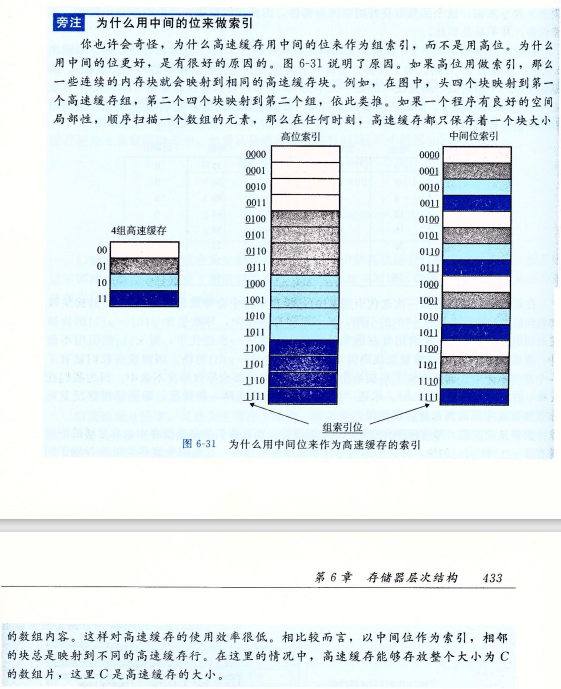

6.4.3 组相联高速缓存

- 背景：
  - 直接映射高速缓存中冲突不命中造成的问题源于每个组只有一行数据这个限制
  - 而组相连高速缓存每个组都保存有多于一个的高速缓存行
- 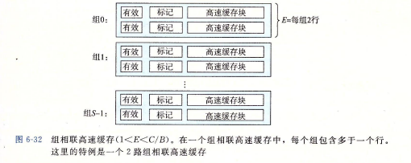
- 组选择
  - 和直接高速映射高速缓存的组选择一样
- 行匹配和字选择
  - 必须检查多个行的标记位和有效位，以确认所请求的字是否在集合中
  - 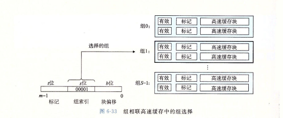
  - 组中的任何一行都可以包含任何映射到这个组的内存块
  - 所以高速缓存必须搜索组中的每一行，寻找一个有效的行，其标记与地址中的标记相匹配
  - 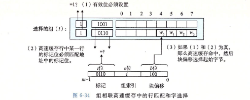
- 行替换
  - 如果CPU请求的字不在组的任何一行中，那么就是缓存不命中，高速缓存必须从内存中取出包含这个字的块
  - 这里就涉及替换策略了，比如说LFU和LRU

6.4.4 全相连高速缓存

- 是由一个包含所有高速缓存行的组组成的
- 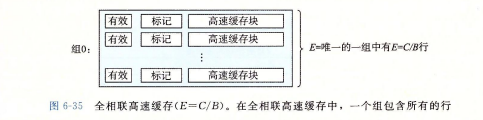
- 组选择
  - 只有一个组，就直接选了
- 行匹配和字选择
  - 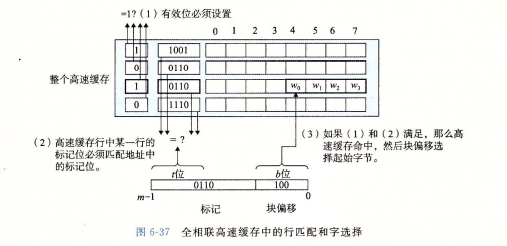

6.4.5 有关写的问题

- 其实写数据很容易，但是因为中间有很多的缓存，导致变得非常的复杂了....
- 背景：
  - 假设我们要写一个已经缓存了的字w（这就是写命中）
  - 在高速缓存更新了它的w的副本之后，怎么更新w在层次结构中紧接着低一层中的副本
- way01
  - 直写：立即将w的高速缓存块协会到紧接着的低一层中
  - 缺点是：每次写都会引起总线流量
- way02
  - 写回：尽可能推迟更新，只有当替换算法要驱逐这个更新过的块的时候，才把它写入到紧接着的低一层中
  - 由于局部性，写回能显著地减少总线流量
  - 缺点：增加了复杂性
  - 高速缓存还必须为每个高速缓存行维护一个额外的修改位，表明这个高速缓存块是否被修改过
- 另一个问题是，如何处理写不命中
  - **写分配**，加载相应的低一层的块到高速缓存中，然后更新这个高速缓存块
  - 写分配试图利用写的空间局部性，但缺点就是每次不命中都会导致一个块从低一层传送到高速缓存
  - 还有一种方法是**非写分配**，避开高速缓存，直接把这个字写到低一层中
  - PS：直写高速缓存通常是非写分配的，写回高速缓存通常是写分配的

- 虚拟内存系统只是用写回，我们在现代系统的所有层次上都能看到写回缓存

6.4.6 一个真实的高速缓存层次结构的解剖

- 
- 只保存指令的高速缓存称为i-cache，只保存数据的高速缓存称为d-cache
- 既保存指令又包括数据的高速缓存称为统一的高速缓存 (unified cache) 
- i-cache通常是只读的
- 每个 CPU 芯片有四个核
- 每个核有自己私有的 Ll i-cache Ll cl-cache L2 统一的高速缓存
- 所有的核共享片上 L3 统一的高速缓存

6.4.7 高速缓存参数的性能影响

- 不命中率：
  - 在一个程序执行或程序的一部分执行期间，内存引用不命中的比率（不命中数量/引用数量）
- 命中率：
  - 命中的内存引用比率（1-不命中率）
- 命中时间：
  - 从高速缓存传送一个字到CPU所需的时间
  - 包括组选择，行确认，字选择的时间
  - 对于L1高速缓存，命中时间通常是几个时钟周期
- 不命中处罚：
  - 由于不命中所需要的额外的时间。L1不命中需要从L2得到服务的处罚，通常是10个周期
  - 从L3得到服务的触发，50个周期
  - 从主存得到的服务的触发，200个周期

一些影响因素

- 高速缓存大小的影响（缓存越大，命中时间越多）
- 块大小的影响（比较大的块能够提高命中率，）
- 相连度的影响（）
- 写策略的影响
  - 直写高速缓存比较容易实现，而且能使用独立于高速缓存的写缓冲区，用来更新内存（不命中时也不会触发内存写）
  - 写回高速缓存引起的传动比较少
  - 一般来说，高速缓存越往下，越可能使用写回而不是直写

# 6.5 编写高速缓存友好的代码

- 让最常见的情况运行得快（程序通常把大部分时间都花在少量的核心函数上，而这些函数通常把大部分时间都花在了少量的循环上，所以要把注意力集中在核心函数里的循环上，而忽略其他部分）
- 尽量减少每个循环内部的缓存不命中数量（在其他条件相同的情况下，不命中率较低的循环运行得更快）

- 这里书上举了个例子，后续看书就好了.....

# 6.6 综合：高速缓存对程序性能的影响

6.6.1 存储器山

- 一个程序从存储系统中读数据得速率称为**读吞吐量**，或者读带宽
- 如果一个程序在s秒的时间段内读n个字节，那么这段时间内的读吞吐最就等于n/s, 通常以兆字节每秒 (MB/s) 为单位
- 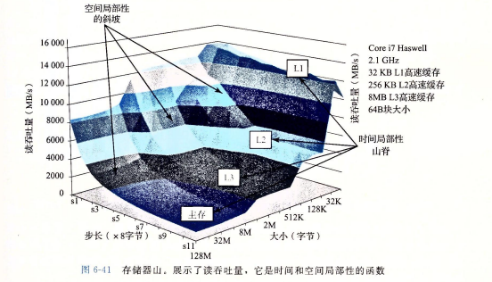
- 有点没读懂这幅图....
- 总结：
  - 存储器系统的性能不是一个数字就能描述的
  - 相反，它是一座时间和空间局部性的山，这座山的上升高度差别可以超过一个数量级
  - 明智的程序员会试图构造他们的程序，使得程序运行在山峰而不是低谷
  - 目标就是利用时间局部性，使得频繁使用的字从 L1 中取出，还要利用空间局部性，使得尽可能多的字从一个 L1 高速缓存行中访问到。

6.6.2 重新排列循环以提高空间局限性

- 书上的例子，后续补上