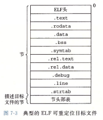
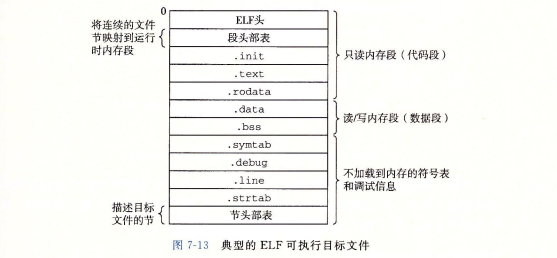
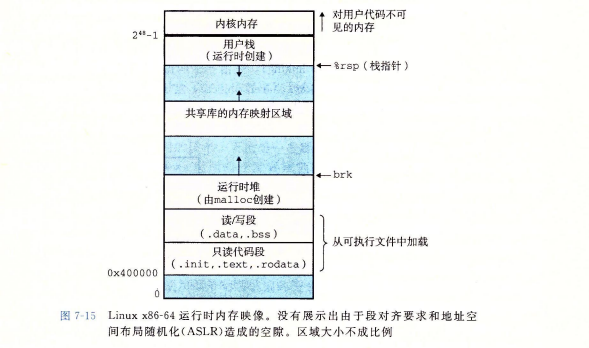
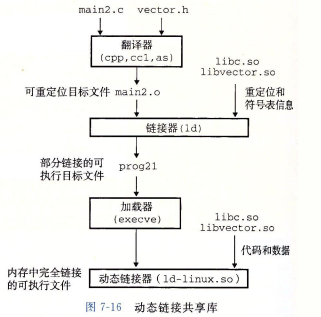

# 7.1 编译器驱动程序

- 编译器驱动程序：语言预处理器，编译器，汇编器和链接器
- 首先运行C预处理器，将main.c翻译成一个ASCII码的中间文件main.i
- 接着运行C编译器，将main.i翻译成一个ASCII汇编语言文件main.s
- 然后运行汇编器，将main.s翻译成一个可重定位目标文件main.o
- 最后运行链接器程序，将多个.o文件以及一些必要的系统目标文件组合起来，创建一个可执行目标文件
- 执行可执行目标文件
  - shell调用操作系统中一个叫做加载器的函数，它将可执行文件中的代码和数据复制到内存，然后将控制转移到这个程序的开头


# 7.2 静态链接

- 静态链接器以一组可重定位目标文件和命令行参数作为输入，生成一个完全链接的、可以加载和运行的可执行目标文件作为输出


链接器的两个任务

- 符号解析
  - 目标文件定义和引用符号，每个符号对应于一个函数、一个全局变量或一个静态变量
  - 目的是将每个符号引用正好和一个符号定义关联起来
- 重定位
  - 编译器和汇编器生成从地址0开始的代码和数据节
  - 链接器通过把每个符号定义与一个内存位置关联起来，从而重定位这些节，然后修改所有对这些符号的引用，使得它们指向这个内存位置
  - 链接器使用汇编器产生的重定位条目的详细指令，执行重定位


- 目标文件纯粹时字节块的集合，这些块中有程序代码，有程序数据，其他的则包含引导链接器和加载器的数据结构
- 链接器将这些块链接起来，确定被连接块的运行时位置，并且修改代码和数据块中的各种位置


# 7.3 目标文件

- 可重定位目标文件：包含二进制代码和数据，可以在编译时与其他可重定位目标文件合并起来，创建一个可执行目标文件
- 可执行目标文件：包含二进制代码和数据，其形式可以被直接复制到内存并执行
- 共享目标文件：一种特殊类型的可重定位目标文件，可以在加载或者运行时被动态地加载到内存中并链接


# 7.4 可重定位目标文件

- 
- **ELF头**以一个16字节的序列开始，这个序列描述了生成该文件的系统的字的大小和字节顺序
- ELF头部剩下的部分包含帮助链接器语法分析和解释目标文件的信息
  - 其中包括ELF 头的大小、目标文件的类型（如可重定位、可执行或者共享的）、机器类型（如 x86-64) 、节头部表 (section header table) 的文件偏移，以及节头部表中条目的大小和数量
- **节头部表**描述的不同节的位置和大小，其中目标文件中每个节都有一个固定大小的条目
- **.text**：已编译程序的机器代码
- **.rodata**：只读数据，比如 printf 语句中的格式串和开关语句的跳转表
- **.data**：已初始化的全局和静态变量（局部变量在运行时被保存在栈中，既不出现在 .data 节中，也不出现在 .bss 节中）
- **.bss**：未初始化的全局和静态变量，以及所有被初始化为0的全局或静态变量
  - 在目标文件中这个节不占据实际的空间，它仅仅是个占位符
  - 目标文件格式区分已初始化和未初始化变量是为了空间效率
  - 在目标文件中，未初始化变量不需要占据任何实际的磁盘空间
  - 运行时，在内存中分配这些变量，初始值为0
- **.syrntab**：一个符号表，它存放在程序中定义和引用的函数和全局变量的信息
  - 每个可重定位目标文件在.syrntab中都有一张符号表
  - 不包含局部变量的条目
- **.rel.text**：一个.text节中位置的列表，当链接器把这个目标文件和其他文件组合时，需要修改这些位置
- **.rel.data**：被模块引用或定义的所有全局变量的重定位信息
- **.debug**：一个调试符号表，其条目是程序中定义的局部变量和类型定义，程序中定义和引用的全局变量，以及原始的C源文件
- **.line**：原始C源程序中的行号和.text节中机器指令之间的映射
- **.strtab**：一个字符串表，其内容包括.symtab和.debug节中的符号表


# 7.5 符号和符号表

- 每个可重定位目标模块m都有一个符号表，包含m定义和引用的符号信息
- 在链接器的上下文中，有三种不同的符号
  - 由模块定义并能被其他模块引用的全局符号，全局链接器符号对应于非静态的C函数和全局变量
  - 由其他模块定义并被模块m引用的全局符号。这些符号称为外部符号，对应于在其他模块中定义的非静态C函数和全局变量
  - 只被模块m定义和引用的局部符号。对应于带static属性的C函数和全局变量。这些符号在模块m中任何位置都可见的，但是不能被其他模块引用
- .symtab中的符号表不包含对应于本地非静态程序变量的任何符号，这些符号在运行时在栈中被管理，链接器对此类符号不感兴趣
- 定义为带有C static属性的本地过程变量是不在栈中管理的，相反，编译器在.data或.bss中为每个定义分配空间，并在符号表中创建一个有唯一名字的本地链接器符号


利用static属性隐藏变量和函数名字

- 在C中，源文件扮演模块的角色。任何带有static属性声明的全局变量或者函数都是模块私有的
- 类似的，任何不带static属性声明的全局变量和函数都是公共的，可以被其他模块访问


- 后续符号表的部分有点没看懂。。。。。


# 7.6 符号解析

- 链接器解析符号引用的方法是将每个引用与它输入的可重定位目标文件的符号表中的一个确定的符号定义关联起来


- 对那些和引用定义在相同模块中的局部符号的引用，符号解析很容易
  - 编译器只允许每一个模块中每个局部符号有一个定义
  - 静态局部变量也会有本地链接器符号，编译器还要确保它们拥有唯一的名字


- 但是对于全局符号来说
- 当编译器遇到一个不是在当前模块中定义的符号时，会假设该符号是在其他某个模块中定义的，生成一个链接器符号表条目，并把它交给链接器处理
- 如果链接器在它的任何输入模块中都找不到这个被引用符号的定义，就输出一条错误信息并终止


- 对全局符号的符号解析很棘手，还因为多个目标文件可能会定义相同名字的全局符号
- 在这种情况下，链接器必须要么标志一个错误，要么以某种方式选出一个定义并抛弃其他定义


对cpp和java中链接器符号的重整

- C++和Java中能使用重载函数，是因为编译器将每个唯一的方法和参数列表组合编码成一个对链接器来说唯一的名字
- 这种编码过程叫做重整 (mangling)
- 而相反的过程叫做恢复 (demangling)
- 一个被重整的类名字是由名宇中字符的整数数量，后面跟原始名宇组成的


7.6.1 链接器如何解析多重定义的全局符号

- 在编译时，编译器向汇编器输出每个全局符号，或者是强或者是弱
- 而汇编器把这个信息隐含地编码在可重定位目标文件的符号表里
- 函数和已初始化的全局变量是强符号，未初始化的全局变量是弱符号
  - 强符号和弱符号是针对定义来说的，不是针对引用


Linux下链接器的规则

- 不允许有多个同名的强符号
- 如果有一个强符号和多个弱符号同名，那么就选择强符号
- 如果有多个弱符号同名，那么就从这些弱符号中任意选择一个


- 我的一个推断：函数的声明和全局变量的声明都是弱符号


7.6.2 与静态库链接


# 7.7 重定位

- 符号解析之后，代码中的每个符号引用和正好一个符号定义关联起来
- 重定位：合并输入模块，并为每个符号分配运行时地址
  - 重定义节和符号定义：链接器将所有相同类型的节合并为同一类型的新的聚合节，然后将运行时内存地址赋给新的聚合节，赋给输入模块定义的每个节，以及赋给输入模块定义的每个符号（此时程序中的每条指令和全局变量都有唯一的运行时内存地址）
  - 重定义节中的符号引用：链接器修改代码节和数据节中对每个符号的引用，使得它们指向正确的运行时地址（依赖于可重定位目标模块中的重定位条目）


重定位条目

- 当汇编器生成一个目标模块时，它不知道数据和代码最终会在内存的什么位置，也不知道这个模块引用的任何外部定义的函数或者全局变量的位置
- 所以汇编器遇到对最终位置的目标引用，就会生成一个重定位条目，告诉链接器在将目标文件合并成可执行文件时如何修改这个引用
- 代码的重定位条目放在.rel，.text中，已初始化数据的重定位条目放在.rel，.data中


# 7.8 可执行目标文件

- 
- 因为可执行文件是完全链接的，所以不需要.rel节


# 7.9 加载可执行目标文件

- ```shell
  ./prog
  ```

- shell会认为prog是一个可执行目标文件，通过调用某个驻留在存储器中称为加载器的操作系统代码来运行它

- 任何Linux程序都可以通过调用execve函数调用加载器，加载器将可执行目标文件中的代码和数据从磁盘复制到内存中，然后通过跳转到程序的第一条指令或入口点来运行该程序，这个将程序复制到内存并运行的过程叫做**加载**

- 每个linux程序都有一个运行时内存映像，代码段总时从地址0x400000处开始，后面是数据段

  - 


- 当加载器运行时，在程序头部表的引导下，加载器将可执行文件的片复制到代码段和数据段


- linux系统中的每个程序都运行在一个进程上下文中，有自己的虚拟地址空间，当shell运行一个程序时，父shell进程生成一个子进程，它是父进程的一个复制
- 子进程通过execve系统调用启动加载器，加载器删除子进程现有的虚拟内存段，并创建一组新的代码、数据、堆和栈段
- 新的栈和堆段都被初始化为零
- 通过将虚拟地址空间中的页映射到可执行文件的页大小的片，新的代码和数据段被初始化为可执行文件的内容（这一步可以认为是调整页表的指针方向）
- 最后加载器跳转到_strat地址，它最终会调用应用程序的main函数
- 在加载过程中，没有任何从磁盘到内存的数据复制，直到CPU引用一个被映射的虚拟页时才会进行复制，此时操作系统利用它的页面调度机制自动将页面从磁盘传送到内存


# 7.10 动态链接共享库

静态库的缺点

- 需要定期维护和更新
- 几乎每个C程序都是用标准IO函数，这些函数的代码会被复制到每个运行进程的文本段中，对稀缺的内存系统资源是一种浪费


- **共享库**是一个目标模块，在运行或加载时，可以加载到任意的内存地址，并和一个在内存中的程序链接起来，这个过程叫做**动态链接**，是由一个叫做**动态链接器**的程序来执行的
- 共享库也称为共享目标，在linux系统中通常用.so后缀来表示，微软的操作系统称为DDL（动态链接库）


- 在任何给定的文件系统中，对于一个库只有一个.so文件，所有引用该库的可执行目标文件共享这个.so文件中的代码和数据，而不是像静态库的内容那样被复制和嵌入到引用它们的可执行文件中
- 在内存中，一个共享库的.text节的一个副本可以被不同的正在运行的进程共享


- 


- 基本思路：当创建可执行文件时，静态执行一些链接，然后再程序加载时，动态完成链接过程
- 此时没有任何libvector.so的代码和书局街真的被复制到可执行文件prog21中
- 反之，链接器复制了一些重定位和符号表信息，它们使得运行时可以解析对libvector.so中代码和数据的引用


动态链接的使用

- 当加载器加载和运行可执行文件prog2时，加载部分链接的可执行文件prog21
- 文件中的.interp节，这一节包含动态链接器的路径名，动态链接器本身就是一个共享目标
- 加载器不会像它通常所做地那样将控制传递给应用，而是加载和运行这个动态链接器，然后动态链接器通过执行下面的重定位完成链接任务
  - 各种重定位
- 最后，动态链接器将控制传递给应用程序


# 7.11 从应用程序中加载和链接共享库

- 应用程序还可能在它运行时要求动态链接器加载和链接某个共享库，而无需在编译时将那些库链接到应用中
- 每个生成动态内容的函数打包在共享库中，当一个来自web浏览器的请求到达时，服务器动态地加载和链接适当的函数，然后直接调用它，而不是使用fork和execve在子进程的上下文中运行函数
- 函数会一直缓存在服务器的地址空间中，所以只要一个简单的函数调用的开销就可以处理随后的请求
- （有点像热更新了...）


- java定义了一个标准调用规则，叫做java本地接口，允许java程序调用本地的c/cpp函数
- 基本思想就是将本地c函数编译到一个共享库中（.so）
- 当一个正在运行的java程序试图调用函数foo时，java解释器利用dlopen接口动态链接和加载foo.so，然后再调用foo


# 7.12 位置无关代码

- 共享库的一个主要目的就是允许多个正在运行的进程共享内存中相同的库代码
- 一种不好的方法：每个共享库分配一个实现预备的专用的地址空间片，然后要求加载器总是在这个地址加载共享库
  - 缺点：浪费空间，并且对每个系统而言，库在内存中的分配都是不同的；每次库的修改必须确认已分配给它的片还适合它的大小
- 一种解决办法：使得无限多个进程可以共享一个共享模块的代码段的单一副本


- 可以加载而无需重定位的代码称为位置无关代码（PIC）
- 在一个x86-64系统中，对同一个目标模块中符号的引用时不需要特殊处理使之成为PIC
  - 可以用PC相对寻址来编译这些引用，构造文件时由静态链接器重定位


PIC数据引用（有点没看懂）

- 无论在内存中的何处加载一个目标模块（包括共享目标模块），数据段与代码段的距离总是保持不变
- 因此，代码段中任何指令和数据段中任何变量之间的距离都是一个运行时常量，与代码段和数据段的绝对内存位置是无关的
- 在数据段开始的地方创建一个表，叫做**全局偏移量表**（GOT）
- 每个被这个目标模块引用的全局数据目标都有一个8字节条目
- 编译器还为GOT中每个条目生成一个重定位记录
- 在加载时，动态链接器会重定位GOP中的每个条目，使得它包含目标的正确的绝对地址
- 每个引用全局目标的目标模块都有自己的GOT


PIC函数调用

- 


# 7.13 库打桩机制

- linux链接器支持库打桩，允许截获对共享库函数的调用，取而代之执行自己的代码


# 7.14 处理目标文件的工具


# 7.15 小结