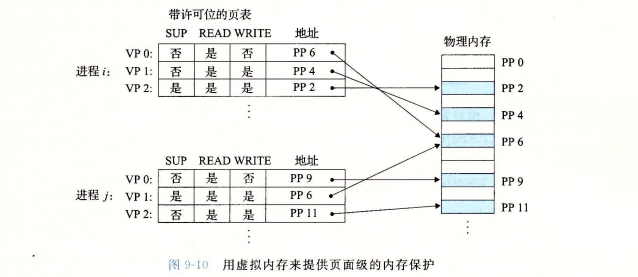

虚拟内存三个重要的能力

- 它将主存看成是一个存储在磁盘上的地址空间的高速缓存，在主存中只保存活动区域，并根据需要在磁盘和主存之间来回传送数据，通过这种方式，高效地使用主存
- 它为每个进程提供了一致的地址空间，从而简化了内存管理
- 保护了每个进程的地址空间不被其他进程破坏

# 9.1 物理和虚拟地址

- 物理地址，物理寻址
- 地址翻译：将一个虚拟地址转换为物理地址
- 内存管理单元（MMU），在CPU芯片上，利用存放在主存中的查询表来动态翻译虚拟地址，该表的内存由操作系统管理

# 9.4 虚拟内存作为内存管理工具

简化链接

- 独立的地址空间允许每个进程的内存映像使用相同的基本格式，而不管代码和数据实际存放的物理内存的何处

简化加载

- 虚拟内存还使得容易向内存中加载可执行文件和共享对象文件
- 要把目标文件的.text和.data加载到一个新创建的进程中，linux加载器为代码和数据段分配虚拟页，把它们标记为无效的（即未被缓存的），将页表条目指向目标文件中适当的位置
- 加载器从来不从磁盘到内存实际复制任何数据
- 在每个页初次被引用的时候，要么是CPU取指令时引用，要么是一条正在执行的指令引用一个内存位置时引用

- 将一组连续的虚拟页映射到任意一个文件中的任意位置的表示法称作内存映射
- linux提供mmap的系统调用，允许应用程序自己做内存映射

简化共享

- 独立地址空间为操作系统提供了一个管理用户进程和操作系统自身之间共享的一致机制
- 每个进程都有自己私有的代码、数据、堆栈
- 比如，每个C程序都会调用C标准库的程序，操作系统将不同进程中适当的虚拟页面映射到相同的物理页面上，而不是在每个进程中都包括单独的内核和C标准库的副本（参考动态库）

简化内存分配

- 虚拟内存为向用户进程提供一个简单的分配额外内存的机制

- 当一个运行在用户进程中的程序要求额外的堆空间时，操作系统分配一个适当数量的连续的虚拟内存页面，并且将它们映射到物理内存中任意位置的k个任意的物理页面
- 即这些堆空间可以不是连续的，内存页可以随机地分散在物理内存中

# 9.5 虚拟内存作为内存保护的工具

- 背景：任何现代计算机系统必须为操作系统提供手段来控制对内存系统的访问

- 通过在每个PTE（页表）中添加数个许可位，实现对内存的保护
- sup位表示进程是否必须运行在内核模式才能访问该页
  - 运行在内核模式中的进程可以访问任何页面
  - 但运行在用户模式中的进程只允许访问那些SUP为0的页面
- read位
- write位
- 
- 如果一条指令违反了这些许可条件，那么CPU就触发了一个一般保护故障，将控制传递给一个内核中的异常处理程序，即段错误

# 9.6 地址翻译

我理解的地址翻译的过程

- 处理器将虚拟地址（VA）给MMU
- MMU从虚拟地址中换算出页表条目地址（PTEA）（可以认为页表是一个数组（也是指针），页表条目地址是从该指针的偏移量，也可以认为是虚拟页号VPN，通过这个页号作为索引在页表中寻找），给高速缓存或内存
- 高速缓存或内存将页表条目（PTE）（即一条记录，上面有有效位，物理地址和虚拟地址的相互映射）给回MMU
- MMU再根据页表条目换算出实际的物理地址（PA），给高速缓存/主存
- 最后高速缓存/主存根据物理地址将返回的数据给处理器

9.9.4 碎片

- 内部碎片是一个已分配块比有效载荷大时发生的
- 外部碎片是当空闲内存合计起来足够满足一个分配请求，但是没有一个单独的空闲块足够大可以来处理这个请求时发生的