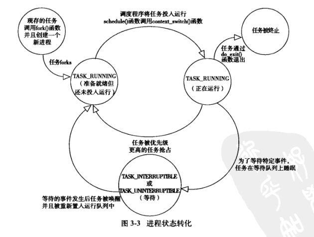
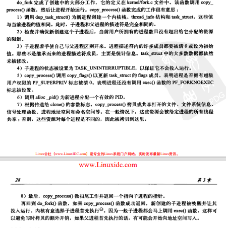
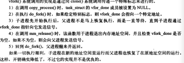
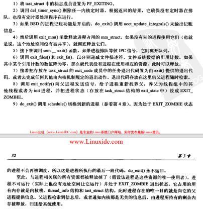

# 3.1 进程

- 进程的概念
  - 是处于执行期的程序
  - 是正在执行的程序代码的实时结果

- 进程包含的资源
  - 打开的文件，挂起的信号，内核内部数据，处理器状态，一个或多个具有内存映射的内存地址空间及一个或多个执行线程，当然还包括用来存放全局变量的数据段


- 线程，是在进程中活动的对象
  - 每个线程都拥有一个独立的程序计数器、进程栈和一组进程寄存器
  - 内核调度的对象是线程


- 进程提供的两种虚拟机制：虚拟处理器和虚拟内存
- 程序本身并不是进程，进程是处于执行期的程序以及相关的资源的总称


- fork()：通过复制一个现有进程来创建一个全新的进程，调用fork()的进程称为**父进程**，新产生的进程称为**子进程**，在这调用结束时，在返回点这个相同位置上，父进程恢复执行，子进程开始执行
  - 从内核返回两次，一次回到父进程，另一次回到新产生的子进程
  - 由clone()系统调用实现


- exec()：创建新的地址空间，并把新的程序载入其中


- exit()系统调用退出执行，这个函数会终结进程并将其占用的资源释放掉
- 父进程可以通过wait4()查询子进程是否终结


# 3.2 进程描述符及任务结构

- 内核把进程的列表存放在任务队列的双向循环链表中，每一项都是类型为**task_struct**，称为**进程描述符**


- 进程描述符中包含的数据能完整地描述一个正在执行的程序：它打开的文件，进程的地址空间，挂起的信号，进程的状态


进程描述符的存放

- 内核通过一个唯一的进程标识值或PID来标识这个进程（实际上是int类型）
- pid默认max为32768，可以修改（例：一些大型服务器）
- pid的最大值是系统中允许同时存在的进程的最大数目
- 在内核中，可以通过current宏查找当前正在运行进程的pid


进程状态

- TASK_RUNNING（运行），进程是可执行的，或者正在执行，或者在运行队列中等待，这是进程在用户空间中执行的唯一可能状态，这种状态也可以应用到内核空间中正在执行的进程
- TASK_INTERRUPTIBLE（可中断），进程正在睡眠（也可以说是被**阻塞**），等待某些条件的达成
  - 一旦这些条件成立，内核就会把进程状态设置为运行，处于次状态的进程也会因为接收到信号而提前被唤醒并随时准备投入运行
- TASK_UNINTERRUPTIBLE（不可中断），接收到信号也不会被唤醒或准备投入运行（除开这个条件，其他的与可打断状态相同）
  - 这个状态通常在进程必须在等待时不受干扰或等待很快就会发生时出现
  - 使用得较少
- _TASK_TRACED，被其他进程跟踪的进程
- _TASK_STOPPED，停止，进程停止执行
  - 通常这种状态发生在接收到SIGSTOP、SIGTSTP等信号时
- 


设置当前进程状态

- ```c
  set_task_state(task, state);/*将任务task的状态设置为state*/
  set_current_stae(state);/*等价*/
  task->state = state;
  ```


进程上下文

- 一般程序在用户空间执行，当一个程序执行了系统调用或者触发了某个异常，就陷入了内核空间


进程家庭树

- 所有的进程都是pid为1的init进程的后代，内核在系统启动的最后阶段启动init进程

- 系统中的每个进程必有一个父进程，每个进程可以拥有零个或多个子进程，拥有同一个父进程得所有进程被称为兄弟

- 每个task_struct都包含一个指向其父进程tast_struct，叫做parent的指针，还包含一个称为children的子进程链表

- ```c
  /*指向init进程*/
  struct task_struct *task;
  for (task = current; task != &init_task; task = task -> parent);
  
  /*获取链表中的下一个进程*/
  list_entry(task->tasks.next, struct task_struct, tasks)
  ```


# 3.3 进程创建

- 首先在新的地址空间里创建进程，读入可执行文件，最后开始执行


进程的产生分为fork()和exec()两个函数
- fork()通过拷贝当前进程创建一个子进程，子进程与父进程仅仅在pid（每个进程唯一）、ppid（父进程得进程号，子进程将其设置为被拷贝进程的pid）和一些边边角角不一样（例如挂起的信号，这是不能被继承的..）
- exec()函数负责读取可执行文件并将其载入地址空间开始运行


写时拷贝（copy-on-write，COW）

- 是一种可以推迟甚至免除拷贝数据的技术

- 内核此时并不复制整个进程地址空间，而是让父子进程共享同一个拷贝（读写方式共享）
- 只有在需要写入的时候，数据才会被复制，即资源的复制只在需要写入的时候才会进行，在此之前都是**只读方式**共享
- 使地址空间上的页的拷贝推迟到实际发生写入的时候才进行，在页更笨不会被写入的情况下，就无须复制
- fork()的实际开销就是**复制父进程的页表以及给子进程创建唯一的进程描述符**


fork()

- linux通过clone系统调用实现fork()
- fork()、vfork()和__clone()都根据各自需要的参数去调用clone()，然后由clone调用do_fork()
- do_fork调用copy_process()函数，然后进程开始运行
- 


vfork()

- 除了不拷贝父进程的页表项外，vfork()和fork()的功能相同，生成的子进程作为父进程的一个单独的线程在它的地址空间中运行
- 此时的父进程阻塞，直到子进程退出或者执行exec()
- 生成的子进程不能向地址空间写入
- PS：个人感觉，这是因为以前的fork没有用cow，比如说如果想要新来一个进程执行某些新的程序，如果是直接全量fork的话，那么实际上拷贝来的数据都是不能用的，就相当于浪费得了（因为真正要执行的是新的程序，而不是这个旧的,,），因此才有了vfork的说法
- 


# 3.4 线程在linux中的实现

- 该机制提供了同一程序共享内存地址空间运行一组线程，这些线程还可以共享打开的文件和其他资源


- linux中没有线程，而是把线程当作进程来实现，视为一个与其他进程共享某些资源的进程


- 在其他系统中，线程被抽象成一种耗费较少资源，运行迅速的执行单元
- 而在linux中，它不过是进程间共享资源的手段...


创建线程

- 和创建进程类似，不过调用clone时需要添加一些参数
- 


内核线程

- 内核需要在后台执行一些操作，通过内核线程实现
- 是独立运行在内核空间的标准进程
- 和普通进程的区别就是内核线程没有独立的地址空间（实际上指向地址空间的mm指针被设置为null）
- 它们只在内核空间运行，从来不切换到用户空间中
- 可以被调度，也可以被抢占
- PS：这里要区别于os里面的内核态线程，在os中，我们是将在用户态中管理的线程称为用户态线程，被内核管理的内核线程称为内核态线程，但这个内核态线程只是说管理由kernel管理，实际的操作还是在用户态的，而我们这里说的内核线程，是内核用于处理某些事务的


# 3.5 进程终结

- 一个进程终结时，内核必须释放它所占有的资源，并告诉父进程
- 进程的析构是自身引起的，发生在exit调用
  - 可能显式地调用这个系统调用
  - 也可能隐式地，从某个主函数返回（c中的main()返回点后面放置调用exit()的代码）
- 进程的终结最终会落到do_exit()上
- 


删除进程描述符

- 在调用了do_exit之后，系统还是保留了它的进程描述符，这是为了让系统有办法在子进程终结之后仍能获得它的信息
- 所以，进程终结时所需的清理工作和进程描述符的删除被分开执行
- 在父进程获得已终结的子进程的信息后，或者通知内核它并不关注那些信息后，子进程的task_struct才被释放


- wait这一簇函数都是通过唯一的系统调用wait4实现，作用是挂起调用它的进程，直到其中的一个子进程退出，此时函数会返回子进程的PID


孤儿进程造成的进退维谷

- 如果父进程在子进程之前退出，必须有机制来保证子进程能找到一个新的父亲，否则该孤儿进程就会在退出时永远处于僵死状态
- 解决办法：给子进程在当前的线程组内找一个线程作为父亲，否则就让init作为其父进程