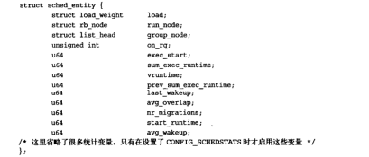
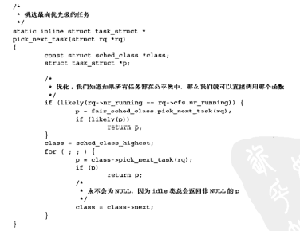
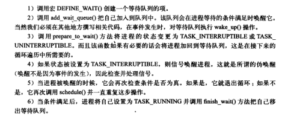
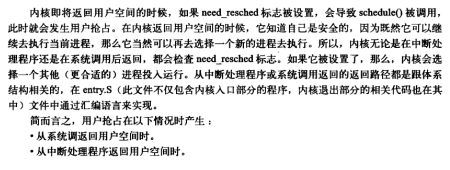
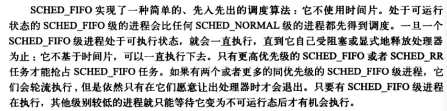
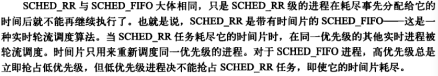

- 调度程序负责决定将哪个进程投入运行，何时运行以及运行多长时间
- 进程调度程序可看做在可运行进程之间分配有限的处理器时间资源的内核子系统

# 多任务

- 多任务操作系统就是能同时并发地交互执行多个进程的操作系统
- 阻塞或睡眠状态：这些进程利用内核阻塞自己，直到某一时间发生

多任务系统分为两类：

- 非抢占式多任务：除非进程自己主动停止运行，否则它会一直执行下去
  - 进程主动挂起自己的操作称为让步
  - 缺点：进程独占的处理器时间可能超出用户的预料
- 抢占式多任务：由调度程序来决定什么时候停止一个进程的运行，以便其他进程能够得到执行机会
  - 这个强制挂起动作叫作**抢占**
  - 进程在被抢占之前能够运行的时间都是设置好的，叫做进程的**时间片**
  - 时间片实际上就是分配给每个可运行进程的处理器时间段

# Linux的进程调度

- kernel 2.5以前的版本设计简陋
- 2.5采用了一种O(1)的调度程序
  - 缺点：对于那些响应时间敏感的程序却有一些先天不足
- 所以，2.6的版本引入CFS调度算法

# 策略

- 决定调度程序在何时让什么进程运行

I/O消耗型和处理器消耗型的进程

- I/O消耗型是指进程大部分时间用来提交I/O请求或是等待IO请求（运行时间短，因为大部分时间都是在等待IO，即阻塞）
- 处理器消耗型是指进程把大部分时间用在执行代码上，除非被独占，否则一直都在不停的运行

进程优先级

- 优先级高的进程先运行，低的后运行，相同优先级的进程按轮转方式进行调度（一个接一个，重复进行）

两种不同的优先级范围

- nice值，范围是从-20到19，默认值是0，越大的nice值意味着更低的优先级（代表这个进程对其他的进程很nice，给其他的进程更多的时间片），因此低nice值得进程可以获得更高的处理器时间
- 实时优先级，变化范围是0到99，越高的实时优先级意味着进程优先级越高，任何实时进程的优先级都高于普通进程
  - 即实时优先级和nice优先级处于不同的两个范畴

时间片

- 是一个数值，表明进程在被抢占前所能持续运行的时间
- 太长会导致系统对交互的响应表现欠佳
- 太短会明显增大进程切换带来的处理器耗时，因为会有相当一部分时间用在进程切换上

- CFS是将处理器的使用比例分给了进程，即处理器时间和系统负载密切相关
- nice值作为权重将调整进程所使用的处理器时间使用比，具有更高nice值得进程被赋予低权重，更小nice值得进程则会赋予高权重

- CFD调度器得抢占实际取决于新的可运行程序消耗了多少处理器使用比，如果消耗的使用比比当前进程小，则新进程立刻投入运行，抢占当前进程

# Liunx调度算法

调度器类

- linux调度器是以模块方式提供的，目的是允许不同类型的进程可以有针对地选择调度算法

 

- 每个调度器都有一个优先级，它会按照优先级顺序遍历调度类，拥有一个可执行进程的最高优先级的调度器类胜出，去选择下面要执行的那一个程序

- CFS是一个针对**普通进程**的调度类，称为SCHED_NORMAL

unix系统中的进程调用

- 具有更高优先级的进程运行得更频繁，而且（在多数系统上）也会被赋予更多的时间片

- 主要讲了时间片和优先级的一些问题

公平调度

- CFS的理念：进程调度的效果应如同系统具备一个理想中的完美的多任务处理器，在这个系统中，每个进程将能获得1/n的处理器时间（n是可运行进程的数量）
- 现实：如果每个进程运行无限小的时间周期也是不高效的，因为调度时进程抢占会带来一定的代价，还会影响到缓存的效率（即要考虑进程抢占带来的消耗）
- CFS的做法是允许每个进程允许一段时间，循环轮转，选择允许最少的进程作为下一个运行进程，而不再采用分配给每个进程时间片的做法
  - 在所有可运行进程总数基础上计算出一个进程应该运行多久，而不是依靠nice值来计算时间片
  - nice值在CFS中被作为进程获得的处理器运行比重：越高的nice值进程获得更低的处理器权重，这是相对默认nice值的进程而言的，相反，更低的nice值得进程获得更高的处理器权重
  - 每个进程都按其权重在全部可运行进程中所占比例的"时间片"运行
  - 如果可允许任务数量趋于无限时，每个任务获得的处理器使用比和时间片都趋于0，因此CFS引入每个进程获得的时间片底线（即最小粒度，默认为1ms）
  - PS：不再根据单独的nice去分配时间片，而是从整体的公平性出发，绝对的nice值不再影响调度决策，只有相对值才会影响处理器时间的分配比例
  - 为了计算准确的时间片，CFS为完美多任务的无限小调度周期的近似值设立了一个目标，这个目标称为"目标延迟"，越小的调度周期将带了更好的交互性，但也增加了进程切换的高代价和更差的系统总吞吐能力
- 总结：任何进程所获得的处理器时间是由他自己和其他所有可运行进程nice值得相对差值决定的，nice值对时间片的作用不再是算数加权，而是几何加权
- 我的理解：即将多任务系统看成一个整体，所有的任务都在一个调度周期中运行，其中周期会被不断的循环，而周期中时间片的分配，是按照每个task的nice值占比总nice值的多少来决定的（这么说也不准确，但每个task的时间片必然是和全体任务挂钩的)

# linux调度的实现

时间记账

- 所有调度器都必须对进程运行的时间做记账
- 分配一个时间片给每一个进程，那么当每次系统时钟节拍发生时，时间片就会减少一个节拍周期，当一个进程的时间片减少到0时，它就会被另一个尚未减到0的时间片可运行进程抢占
- CFS中没有时间片的概念，但是需要维护每个进程运行的时间记账，需要确保每个进程只在公平分配给它的处理器时间内运行

- 

虚拟实时

- vruntime存放进程的虚拟运行时间，是经过了所有可运行进程总数的标准化
- 是以ns为单位，所以vruntime和定时器节拍不再相关
- update_curr()实现了记账功能
  - 计算当前进程的执行时间，并且将其保存在变量dclta_cxcc中，然后又将运行时间传递给了__update_curr()，由后者再根据当前可运行进程总数对运行时间进行加权此计算，最后将上述的权重值与当前运行进程的vruntime相加
- update_curr()是由系统定时器周期性调用的，无论是在进程处于可运行态，还是被阻塞处于不可运行态

进程选择

- 从实现上，我们希望所有可运行进程的vruntime是一样的，但实际上很难实现
- 因此CFS利用一个简单的规则去均衡进程的虚拟运行时间
- 当CFS需要选择下一个运行进程时，会挑一个具有最小vruntime的进程执行
- 因此CFS用红黑树来组织可运行进程队列，利用其迅速找到最小vruntime值的进程

调度器入口

- 进程调度的入口是schedule()，是内核其他部分用于调用进程调度器的入口
- schedule通常要和一个具体的调度类挂钩，也就是说，它会先找到一个最高优先级的调度类（该类有自己的可运行队列），然后问后者谁才是下一个该运行的进程
- 因此，该函数唯一重要的事情就是调用pick_next_task()，pick_next_task会以优先级为序，从高到低，依次检查每个调度类，并且从最高优先级的调度类中，选择最高优先级的进程
- 
- for循环为core，它以优先级为序，从最高的优先级类开始，遍历每一个调度类，每个调度类都实现了pick_next_task函数，它会返回指向下一个可运行进程的指针，或者没有的时候就返回null
- 接着会从第一个返回为非null的类中选择下一个可运行进程

睡眠和唤醒

- 进程因为某些原因（比如说等待一些IO事件）而阻塞休眠，从可执行rbtree中移出，放入等待队列，然后调用schedule()选择和执行一个其他进程
- 唤醒则是，进程被设置为可执行状态，然后再从等待队列中移到可执行rbtree中

等待队列

- 休眠通过等待队列进行处理，等待队列是由等待某些事件发生的进程组成的简单链表，kernel中用wake_queue_head_t来代表等待队列
- 进程把自己放入等待队列中并设置成不可执行状态，当与等待队列相关的事件发生的时候，队列上的进程会被唤醒
- 
- 如果在进程开始休眠之前条件就已经达成了，那么循环就会退出，不会休眠

唤醒

- 唤醒操作由wake_up实现，它会唤醒指定的等待队列上的所有进程，调用try_to_wake_up()，该函数将进程设置为TASK_RUNNING，调用enqueue_task()将进程放入rbtree
- 如果被唤醒的进程优先级比当前正在执行的进程的优先级要高，还要设置need_resched标志
- 存在虚假的唤醒，即有时候进程被唤醒并不是因为它所等待的条件达成，因此需要一个循环处理保证它等待的条件正在达到

# 抢占和上下文切换

- 上下文切换就是从一个可执行进程切换到另一个可执行进程，由context_switch处理
- 每当一个新的进程被选出来运行时，schedule就会调用该函数

context_switch的两个步骤

- 调用switch_mm()，该函数负责把虚拟内存从上一个进程映射切换到新进程中
- 调用switch_to()，负责从上一个进程的处理器状态切换到新进程的处理器状态（包括保存、恢复栈信息和寄存器信息）
- PS：所以如何看待进程的信息，我认为分为两部分，一个是内存上的（用户态的地址空间，内核态的task_struct，内存中的页表），另一个是cpu上的（寄存器的信息）

- 内核使用need_resched标志来表明是否需要重新执行依次调度
  - 当某个进程应该被抢占时，scheduler_tick就会设置这个标志
  - 当一个优先级高的进程进入可执行状态时，try_to_wake_up也会设置这个标志
- 内核检查这个标志，确认其被设置，调用schedule来切换到一个新的进程
- 每个进程都包含一个need_resched标志，因为访问进程描述符的数值要比访问一个全局变量要快

用户抢占

- 

内核抢占

- 1

# 实时调度策略

- SCHED_FIFO和SCHED_RR
- 这些实时策略并不被完全公平调度器来管理，而是被一个特殊的实时调度器管理

SCHED_FIFO

- 

SCHED_RR

- 

- linux实时调度算法提供了一种软实时工作方式，即内核调度进程，尽力使进程在它的限定事件到啦前运行，但并不保证总能满足这些进程的要求

# 与调度相关的系统调用