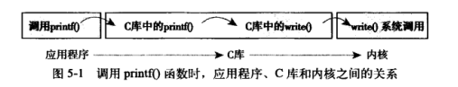

# 与内核通信

- 系统调用在用户空间进程和硬件设备之间添加了一个中间层
- 主要有三个作用：
  - 为用户空间提供了一种硬件的抽象接口，不管硬件层是如何实现的，只管使用接口得到结果即可
  - 系统调用保证了系统的稳定和安全（内核可以基于权限、用户类型和其他一些规则对需要进行的访问进行裁决，有点类似权限控制，资源控制一样）
  - 每个进程都运行在虚拟系统中，而在用户空间和系统的其余部分提供这样一层公共接口

# API、POSIX和C库

- 应用程序通过在用户空间实现的API而不是系统调用来编程
- 

# 系统调用

- 系统调用用一个负的返回值表示错误，返回一个0通常表明成功
- 系统调用在出现错误的时候C库会把错误码写入error全局变量，通过调用perror函数，可以把该变量翻译为用户可以理解的错误字符串

定义一个系统调用

- asmlinkage，这是一个编译指令，通知编译器仅从栈中提取该函数的参数
- 所有的系统调用都需要这个限定词
- 其次，函数返回long
  - 为了保证32位和64位系统的兼容，系统调用在用户空间和内核空间有不同的返回值类型，在用户空间位int，在内核空间为long
- 系统调用函数前都会加上sys_的标记，这是linux中所有系统调用都应该遵循的命名规则

系统调用号

- 在linux中，每个系统调用被赋予一个系统调用号，这样通过这个独一无二的号就可以关联系统调用，当用户空间的进程执行一个系统调用时，这个系统调用号就用来指明到底是要执行哪个系统调用
- 进程不会提及系统调用的名称
- 如果一个系统调用被删除，它所占用的系统调用号也不允许被回收利用；否则以前编译过的代码就会调用这个系统调用，但事实上却调用的时另一个系统调用

- 内核记录了系统调用表中的所有已注册过的系统调用的列表，存储在sys_call_table中

系统调用的性能

- linux系统调用比其他许多操作系统执行得要快，linux很短得上下文切换时间是一个重要原因；另一个原因是系统调用处理程序和每个系统调用本身也都很简洁

# 系统调用处理程序

- 用户空间无法直接执行内核代码，因为内核驻留在受保护得地址空间上
- 因此应用程序应该以某种方式通知系统，告诉内核自己需要执行一个系统调用
- 通知内核的机制是靠**软中断**实现的，通过引发一个异常来促使系统切换到内核态去执行异常处理程序，此时的异常处理程序实际上就是系统调用处理程序
- 在x86系统上预定义的软中断是中断号128，通过int 0x80指令触发该中断
  - 这条指令会触发一个异常导致系统切换到内核态并执行128号异常处理程序，而该程序正是系统调用处理程序
  - 名为system_call，x86-64的系统上在enrty_64.S文件中用汇编语言编写
- x86新加了一条sysenter的指令，能够更快的陷入内核执行系统调用的方式