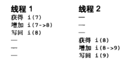
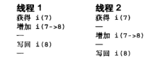
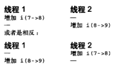

- 共享资源之所以需要放置并发访问，是因为多个执行线程同时访问和操作数据，就有可能发生各线程之间互相覆盖共享数据的情况i昂，造成被访问数据处于不一致状态
- 现状：kernel2.6以后发展成了抢占式内核，调度程序可以在任何时刻抢占正在运行的内核代码，重新调度其他的进程执行

# 临界区和竞争条件

- **临界区**就是访问和操作共享数据的代码段
- 如果有两个执行线程有可能处于同一个临界区中同时执行，那么就是**竞争条件**

- `i++`的机器指令序列
  - 得到当前变量i的值并且拷贝到一个寄存器中
  - 将寄存器中的值加一
  - 把i的新值写回到内存中
- 而如果多线程执行这个命令，就会有以下不同的情况
  - 
  - 
  - 一个解决的思路：将这些指令打包成一个原子指令即可
  - 

# 加锁

- linux实现了几种不同锁的机制
  - 当锁已经被其他线程持有，因而不可用时的行为表现——一些锁争用时会简单地执行忙于等待
  - 另外一些锁会使当前任务睡眠直到锁可用为止
- 锁都是原子操作实现，不存在竞争

造成并发执行的原因

- 用户空间需要同步的原因：用户程序会被调度程序抢占和重新调度
  - 由于用户进程可能在任何时刻被抢占，而调度程序完全可能选择另一个高优先级的进程到处理器上执行，所以就会使得一个程序正处于临界区时，被非自愿地抢占
- 内核空间造成并发执行的原因
  - 中断：中断几乎可以在任何时刻异步发生，也就可能随时打断当前正在执行的代码
  - 软中断和tasklet：内核能在任何时刻唤醒或调度软中断和tasklet，打断当前正在执行的代码
  - 内核抢占：内核中的任务可能会被另一个任务抢占
  - 睡眠及与用户空间的同步：在内核执行的进程可能会睡眠，这就会唤醒调度程序，从而导致调度一个新的用户进程执行
  - 对称多处理：两个或多个处理器可以同时执行代码

- 在中断处理程序中能避免并发访问的安全代码称为**中断安全代码**，在对称多处理的机器中能避免并发的安全代码称为**SMP安全代码**，在内核抢占时能避免并发访问的安全代码称为**抢占安全代码**

- 大多数内核数据结构都需要加锁
- 如果有其他执行线程可以访问这些数据，那么就给这些数据加上某种形式的锁，如果任何其他什么东西都能看到它，那么就要锁住它

# 死锁

- 产生的条件：
  - 要有一个或多个执行线程和一个或多个资源，每个线程都在等待其中的一个资源，但所有的资源都已经被占用了
  - 所有线程都在相互等待，但它们永远不会释放已经占有的资源，于是任何线程都无法继续
- 比如说：一个执行线程试图去获得一个自己已经持有的锁，它将不得不等待锁被释放，但因为它正在忙着等待这个锁，所以自己永远也不会有机会释放锁
- 避免死锁的一些规则
  - 按顺序加锁，使用嵌套的锁时必须保证以相同顺序获取锁
  - 防止发生饥饿
  - 不要重复请求同一个锁
  - 如果有两个或多个锁曾在同一时间被请求，那么以后其他函数请求它们也必须按照上一次的加锁顺序进行

# 争用和拓展性

- 锁的争用是指当锁正在被占用时，有其他线程试图获得该锁
- 说一个锁处于高度争用状态，是指有多个其他线程在等待获得该锁
- 由于锁的作用是使程序以串行方式对资源进程访问，所以使用锁无疑会降低系统的性能

- 拓展性是对系统可拓展程序的一个量度
- 加锁粒度是用来描述加锁保护的数据规模