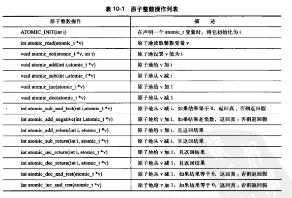

# 原子操作

- 可以保证指令以原子的方式进程，执行过程中不被打断
- 内核提供了两组原子操作接口：一组针对整数进行操作，另一组针对单独的位进行操作


原子整数操作

- 针对整数的原子操作只能对atomic_t类型进行处理

  - 原子函数只接收atomic_t类型的操作数，可以确保原子操作只与这种特殊类型数据一起使用
  - 保证该类的数据不会被传递给任何非原子函数

- ```c
  typedef struct {
      volatile int counter;
  } atomic_t;
  ```

- 


原子操作

- 


- 原子操作通常是内联函数，往往是通过内嵌汇编指令来实现的，如果某个函数本来就是原子的，那么它往往会被定义成一个宏


顺序性和原子性的比较

- 原子性确保指令执行期间不被打断，要么全部执行完，要么根本不执行
- 顺序性确保即使两条或多条指令出现在独立的执行线程中，甚至独立的处理器上，它本该的执行顺序依然要保持不变


64位的原子操作


原子位操作

- 位操作函数是对普通的内存地址进行操作的，它的参数是一个指针和一个位号
- 


# 自旋锁

- linux内核中最常见的锁就是自旋锁，自旋锁最多只能被一个可执行线程持有，如果一个执行线程试图获得一个被已经持有的自旋锁，那么该线程就会一直进行忙循环-旋转-等待锁重新可用
- 在任意时间，自旋锁都可以防止