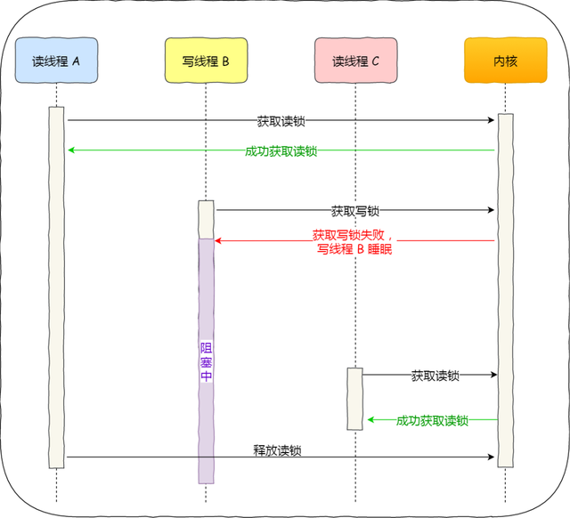
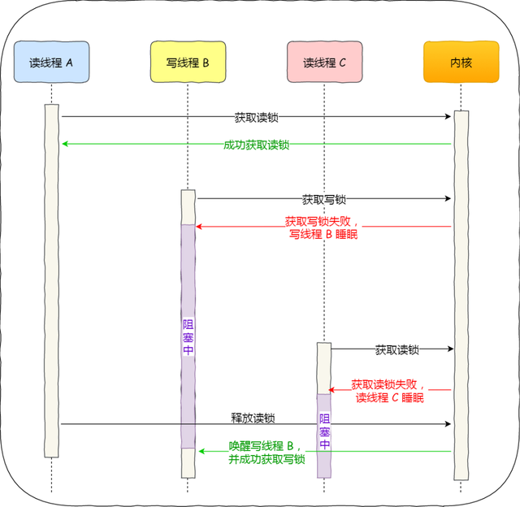

- pthreads提供的锁机制：
  - Mutex(互斥量)：pthread_mutex_t
  - Spin lock(自旋锁): pthread_spin_t
  - Condition Variable(条件变量): pthread_cond_t
  - Read/Write lock(读写锁)：pthread_rwlock_t


# Mutex

- mutex（互斥锁）属于sleep-waiting类型的锁
  - 如果有人要抢别人的锁的话，那么该线程就会被阻塞，cpu就可以先去执行其他的任务而不是忙等待
  - 此时该线程的context就会放在持有锁的线程的等待队列
  - 可以理解为如果抢不到锁，线程就会休眠阻塞，后续锁被释放的时候，内核就会唤醒线程重新工作
  
- 开销大，独占锁（为什么说开销成本大，因为会有两次上下文切换的时候）

  - 当线程加锁失败时，内核会把线程的状态从「运行」状态设置为「睡眠」状态，然后把 CPU 切换给其他线程运行
  - 接着，当锁被释放时，之前「睡眠」状态的线程会变为「就绪」状态，然后内核会在合适的时间，把 CPU 切换给该线程运行
  - 时间大概在几十纳秒到几微妙之间
  - 所以如果被锁的代码执行时间很短的话，就用自旋锁

- ```cpp
  // 声明一个互斥量    
  pthread_mutex_t mtx;
  // 初始化 
  pthread_mutex_init(&mtx, NULL);
  // 加锁  
  pthread_mutex_lock(&mtx);
  // 解锁 
  pthread_mutex_unlock(&mtx);
  // 销毁
  pthread_mutex_destroy(&mtx); 
  // 非阻塞模式请求锁，并返回值
  pthread_mutex_trylock(&mtx);
  ```

- 优点就是节省CPU资源，缺点就是休眠唤醒会消耗一点时间

- 自从linux2.6以后，mutex完全用futex的api来实现，内部系统调用的开销大大减小


- 依据同一线程是否能多次加锁，把互斥量分为两类：
  - 是：称为『递归互斥量』recursive mutex ，也称『**可重入锁**』reentrant lock
  - 否：即『非递归互斥量』non-recursive mute），也称『**不可重入锁**』non-reentrant mutex
- 若同一线程对非递归的互斥量多次加锁，可能会造成死锁。递归互斥量则无此风险
- 最好用非递归互斥量


# Read-write lock

- 读写锁
- 分为读优先锁和写优先锁
  - 读优先锁
  - 
  - 写优先锁
  - 


# Spin lock

- ```cpp
  pthread_spin_lock(pthread_spinlock_t *lock);
  pthread_spin_trylock(pthread_spinlock_t *lock);
  pthread_spin_unlock(pthread_spinlock_t *lock);
  ```

- spin lock（自旋锁）属于busy-waiting类型的锁
  - 如果有线程去抢锁，那么该线程就会进行忙等待不停的进行锁请求，直到得到这把锁
- 作用：为了解决某项资源的互斥使用，因为自旋锁不会引起调用者睡眠，所以自旋锁的效率远高于互斥锁
- 缺点：
  - 自旋锁一直占用着CPU，他在未获得锁的情况下，一直运行（自旋），所以占用着CPU，如果不能在很短的时间内获得锁，这无疑会使CPU效率降低（所以要限制尝试次数，超出后放弃当前的时间片，等待下一次机会）
  - 递归调用自旋锁可能会死锁（递归程序的持有实例在第二个实例循环，以试图获得相同自旋锁时，不会释放此自旋锁），因此在递归程序中不能在持有自旋锁时调用它自己，也决不能在递归调用时试图获得相同的自旋锁
- 只有在内核可抢占式或SMP的情况下才真正需要，在单CPU且不可抢占式的内核下，自旋锁的操作为空操作
- 自旋锁适用于锁使用者保持锁时间比较短的情况下,自旋锁的效率远高于互斥锁 
- 信号量和读写信号量适合于保持时间较长的情况，它们会导致调用者睡眠，因此只能在进程上下文使用，而自旋锁适合于保持时间非常短的情况，它可以在任何上下文使用
- 轻量级锁，开销小，适用于短时间内对锁的使用
- 规定了自旋锁的时候，禁止内核抢占当前的锁的进程，直到释放锁为止
- 这也就理解了为什么自旋锁适合用在内核中处理中断问题：中断来了，内核抢到自旋锁，关闭中断，进入中断处理函数
  - 如果用信号量或者读写信号量的话，就会导致有可能死锁（我拿了锁，然后内核又因为中断抢占了别的任务，可此时锁是被别的中断拿了，就一直这样迭代下去，bug了）
- 自旋锁只有在内核可抢占或smp（多处理器）的情况下才真正需要，在单CPU且不可抢占的内核下，自旋锁的所有操作都是空操作
- 如果被保护的共享资源需要在中断上下文访问（底半部及中断句柄和顶半部的软中断），就必须使用自旋锁


- cpu通过cas（compare and swap）函数实现自旋锁，在用户态完成加锁和解锁操作，不会主动产生线程上下文切换
- 两个步骤
  - 查看锁的状态，如果锁是空闲的，则执行第二步（compare）
  - 将锁设置为当前线程持有（swap）
- CAS 函数就把这两个步骤合并成一条硬件级指令，形成**原子指令**，这样就保证了这两个步骤是不可分割的，要么一次性执行完两个步骤，要么两个步骤都不执行


- 需要注意，在单核 CPU 上，需要抢占式的调度器（即不断通过时钟中断一个线程，运行其他线程）。否则，自旋锁在单 CPU 上无法使用，因为一个自旋的线程永远不会放弃 CPU


# RCU


# Futex

- 这是linux2.6及以后，内核对mutex的一种实现


背景

- 在futex诞生之前，linux下的同步机制可以归为两类：用户态的同步机制和内核同步机制
- 用户态的同步机制基本上就是利用原子指令实现的spinlock
- 内核提供的同步机制，诸如semaphore、等，其实骨子里也是利用原子指令实现的spinlock，内核在此基础上实现了进程的睡眠与唤醒
  - 使用这样的锁，能很好的支持进程挂起等待。但是最大的缺点是每次lock与unlock都是一次系统调用，即使没有锁冲突，也必须要通过系统调用进入内核之后才能识别
- 理想的情况：没有锁冲突的时候，用户态利用原子指令就可以解决问题；而需要挂起等待时在使用内核提供的系统调用与唤醒
  - 换句话说，用户态的spinlock在trylock失败时，能不能让进程挂起，并且由持有锁的线程在unlock时将其唤醒


# lock free ds

https://zhuanlan.zhihu.com/p/53012280


# 死锁

四个必要条件：

- 互斥：一个资源每次只能被一个进程使用
- 请求与保持：一个进程请求阻塞时，不释放已获得的资源
- 不剥夺：进程已获得的资源不能强行剥夺
- 循环等待：若干进程之间形成头尾相接的循环等待资源关系


# 其他

- js中的并发事件较少，比如我想要把一个图标移动到另一个位置，后台就需要计算坐标移动的距离，然后可视化
- 在这个过程中是一直执行到末尾的，中途不会停断
- 而对于耗时的api（比如网络请求数据），js首先会立即返回（然后后台再默默的执行），相当于是异步编程了吧
- 单线程模型，无锁
- 不过异步编程容易造成回调地狱，屎山


# 参考

- https://www.zhihu.com/question/66733477/answer/1267625567
- https://baijiahao.baidu.com/s?id=1678252166115910894
- https://blog.csdn.net/lianhunqianr1/article/details/118215624
- https://blog.csdn.net/Zerore/article/details/120223681
- https://www.jianshu.com/p/d534f6c1fc5d
- https://hardcore.feishu.cn/docs/doccn9Ld4O9tGh7DenRv3GOj7Uh
- [Linux内核中futex锁原理及应用讲解_哔哩哔哩_bilibili](https://www.bilibili.com/video/BV1d54y1a76e?from=search&seid=110121331632919412&spm_id_from=333.337.0.0)


