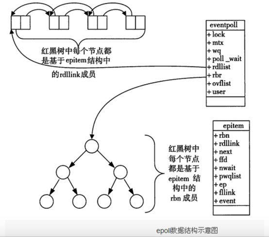

# background

- select和poll性能太差，而且支持句柄数量太少
  - select有fd数量上的限制（poll略去了fd数量的限制）
  - select和poll的问题是，每次调用都需要从用户空间把描述符集合拷贝到内核空间，当描述符集合变大之后，用户空间和内核空间的内存拷贝会导致效率低下
  - 而epoll则在kernel中维护一个的rb-tree，应用程序直接把需要监控的 socket 对象添加到这棵树上，直接从用户态到内核态了，而且后续也不需要再次拷贝了（最后返回一个有就绪fd的链表即可）
  - 并且，select和poll只是告诉用户有fd就绪，但并没有说哪些fd就绪，导致还得轮询一遍（而epoll就直接返回就绪fd集合）
- PS：epoll是在linux内核版本2.544才被引入的


# data structure




## rb-root

- 需求：**能够高效的对大批量的fd进行插入，删除以及查找操作**；在avl，hashmap和rb-tree中，选择了当时看来性能更好的rb-tree

- 用途：用于存放需要监听的fd

- 实现：在**内核空间**开辟一块空间，创建epoll的红黑树

- ```cpp
  struct rb_root rbr;
  ```


## list_head

- 用途：存放就绪的fd

- 双向链表从内核空间到用户空间是直接拷贝的，**没有用mmap**（因为数量不多，所以从内核拷贝到用户途中，效率不会低）

- 内核向双向链表增加节点主要是以下四种情况：
  - 客户端完成三路握手，服务器要accept
  - 客户端发送数据，服务器要用read，recv来接收数据
  - 客户端关闭连接，服务器也要调用close关闭
  - 服务端发送数据，需要调用send，write

- ```cpp
  struct list_head rdllist;
  ```


## eventpoll

- ```cpp
  struct eventpoll {
      struct rb_root rbr;		//红黑树的根节点，这棵树中存储所有添加到epoll中的需要监控的fd
      struct list_head rdlist;		//双向链表中存放着将要通过epoll_wait返回给用户的满足条件的fd
  };
  ```


## epitem

- ```cpp
  struct epitem {		//红黑树的叶子节点
     ...
     
  	union {
  		/* RB tree node links this structure to the eventpoll RB tree */
  		struct rb_node rbn;
  		/* Used to free the struct epitem */
  		struct rcu_head rcu;
  	};
  
  	/* List header used to link this structure to the eventpoll ready list */
  	struct list_head rdllink; //指向了上述的就绪链表
  
  	/* The file descriptor information this item refers to */
  	struct epoll_filefd ffd;
  
  	/* The "container" of this item */
  	struct eventpoll *ep; // 隶属于那一个epoll
  
  	/* List header used to link this item to the "struct file" items list */
  	struct list_head fllink;
  
  	/* wakeup_source used when EPOLLWAKEUP is set */
  	struct wakeup_source __rcu *ws;
  
  	/* The structure that describe the interested events and the source fd */
  	struct epoll_event event;	//表示socket fd关心的事件
  	
  	...
  };
  ```

- epitem结构设计的高明之处，既能够作为红黑树的节点，又能够作为双向链表中的节点（而不用把数据分为两份）


## epoll_event

- ```cpp
  typedef union epoll_data {
      void *ptr;
      int fd;
      uint32_t u32;
      uint64_t u64;
  } epoll_data_t;
  
  struct epoll_event {
      uint32_t events;		//Epoll事件
      epoll_data_t data;		//用户数据变量
  };
  
  //	envents的取值
  //	EPOLLIN ：关注fd的可读事件
  //	EPOLLOUT：关注fd的可写事件
  //	EPOLLET： 将EPOLL设为ET模式
  //	EPOLLONESHOT：只监听一次事件，当监听完这次事件之后，如果还需要继续监听这个fd的话，需要再次把这个fd加入到EPOLL中
  
  //	EPOLLPRI：表示对应的fd有紧急的数据可读（这里应该表示有带外数据到来）
  //	EPOLLERR：表示对应的fd发生错误
  //	EPOLLHUP：表示对应的fd被挂断
  ```

- EPOLLIN时触发的条件
  - **有新的连接请求**
  - **接收到普通数据**（且接收缓冲区没满）
  - **客户端正常关闭连接**（如：程序调用close()，shell下kill 或 ctrl+C），会触发EPOLLIN和 EPOLLRDHUP，不触发EPOLLERR和EPOLLHUP（这两个是服务端出错才触发）
  
- EPOLLOUT时触发的条件
  - **只要发送缓冲区未满，就会触发**


# API

## epoll_create

- ```cpp
  //	open an epoll file descriptor
  int epoll_create(int size);
  //	epoll_create1 可以理解为 epoll_create 的增强版（主要支持了 close-on-exec）
  int epoll_create1(int flags);
  //	实际上是在内核空间创建了一个eventpoll实例，其中包含了一个红黑树和一个双向链表
  
  //	size和flags的值可以随便取
  ```


## epoll_ctl

- ```cpp
  //	往 epoll instance 上添加、删除、更改一个fd
  int epoll_ctl(int epfd, int op, int fd, struct epoll_event *event);
  
  //	epfd对应epoll实例的fd
  
  //	op参数的有效值
  //	EPOLL_CTL_ADD：在epfd所引用的epoll实例上注册fd，并将事件事件与内部文件链接到fd
  //	EPOLL_CTL_MOD：修改与目标文件描述符fd相关联的事件事件
  //	EPOLL_CTL_DEL：在epfd所引用的epoll实例上删除（注销）fd。该事件将被忽略，并且可以为NULL
  
  //	fd为需要进行操作的fd
  
  //	event为由fd构建的epoll_event
  ```
  
- 当我们向eventpoll添加节点时，实际上还会在这个socket的wait queue上注册一个**callback function**

- 用于告诉kernel，如果这个fd对应事件的中断到了（有事件发生），就把它放到准备就绪的链表中

- 这个 socket 在添加到这棵 epoll 树上时，会在这个 socket 的 wait queue 里注册一个回调函数，当有事件发生的时候再调用这个回调函数（而不是唤醒进程）

- PS：我认为这是EPOLL比其他二者设计思路上更加优秀的地方（**回调**）

- 回调函数的作用：

  - 把这个 socket 添加到创建 epoll instance 时对应的 eventpoll 实例中的就绪链表上，也就是 rdllist 上，并唤醒 epoll_wait，通知 epoll 有 socket 就绪


## epoll_wait

- ```cpp
  //# wait for events on epoll instance
  int epoll_wait(int epfd, struct epoll_event *events, int maxevents, int timeout);
  
  //	epfd：epoll对象实例的fd
  
  //	events：是存放fd的数组；将发生事情的fd放入events中（长度一般要大于maxevents）
  
  //	maxevents：期望捕获的事件的个数
  
  //	timeout：阻塞等待的最小时长（单位是ms）；-1表示无限阻塞，0表示不阻塞
  
  //	返回值是就绪fd的数量；超时则返回0；发生错误则返回-1
  ```

- 该函数的主要作用就是，把就绪链表中的内容复制到用户空间，向应用程序通知事件
  
- 返回的时机：

  - 有至少一个事件发生
  - 调用过程中被信号中断（会返回-1；设置error）
  - 超时
  - 其他错误（直接返回-1）

- 拓展API：**epoll_pwait**


# ET和LT

## 背景

- 这两个词汇来自电学术语，你可以将 fd 上有数据认为是**高电平**，没有数据认为是**低电平**
- 即将 fd 可写认为是**高电平**，fd 不可写认为是**低电平**
- 则水平模式的触发条件是状态处于高电平（或者低电平 => 高电平）
- 而边缘模式的触发条件是新来一次电信号将当前状态变为高电平（或者说只要有新来的电信号，就会触发）


## Level Triggered (LT,水平触发) 

- LT下可读事件的触发：
  - socket上无数据 => socket上有数据
  - socket处于有数据状态
- LT下可写事件的触发：
  - socket可写   => socket可写（PS如果socket发送缓冲区一直不满，就会一直触发，所以需要注意LT下的可写事件）
  - socket不可写 => socket可写
- 是**EPOLL默认的模式**


LT的处理过程：

- accept一个连接，添加到epoll中监听EPOLLIN事件
- 当EPOLLIN事件到达时，read fd中的数据并处理
- 当需要写出数据时，把数据write到fd中；如果数据较大，无法一次性写出，那么在epoll中监听EPOLLOUT事件
- 当EPOLLOUT事件到达时，继续把数据write到fd中；如果数据写出完毕，那么在epoll中关闭EPOLLOUT事件
- PS:epollin代表缓冲区的数据可读；epollout代表缓冲区的数据可写


## Edge Triggered (ET,边缘触发) 

- ET下可读事件的触发：
  - socket上无数据 => socket上有数据
  - socket上有新的数据
- ET下可写事件的触发：
  - socket不可写 => socket可写（满的缓冲区 => 不满的缓冲区）

- ET下一般来说在epoll返回后需要循环把数据读完（否则剩余的数据要一直等到下一次epoll返回才能读了，而下一次返回的时候就不知啥时候了）
  - 因此要设置非阻塞的，否则循环read的时候就会阻塞在read上


ET的处理过程：

- accept一个一个连接，添加到epoll中监听EPOLLIN|EPOLLOUT事件
- 当EPOLLIN事件到达时，read fd中的数据并处理，read需要一直读，直到返回EAGAIN为止
- 当需要写出数据时，把数据write到fd中，直到数据全部写完，或者write返回EAGAIN
- 当EPOLLOUT事件到达时，继续把数据write到fd中，直到数据全部写完，或者write返回EAGAIN


ET模式下测试可读事件

- ```cpp
  #include <sys/types.h>
  #include <sys/socket.h>
  #include <arpa/inet.h>
  #include <unistd.h>
  #include <fcntl.h>
  #include <sys/epoll.h>
  #include <poll.h>
  #include <iostream>
  #include <string.h>
  #include <vector>
  #include <errno.h>
  #include <iostream>
  
  int main() {
      //创建一个监听socket
      int listenfd = socket(AF_INET, SOCK_STREAM, 0);
      if (listenfd == -1) {
          std::cout << "create listen socket error" << std::endl;
          return -1;
      }
  
      //设置重用ip地址和端口号
      int on = 1;
      setsockopt(listenfd, SOL_SOCKET, SO_REUSEADDR, (char *)&on, sizeof(on));
      setsockopt(listenfd, SOL_SOCKET, SO_REUSEPORT, (char *)&on, sizeof(on));
  
      //将监听socker设置为非阻塞的
      int oldSocketFlag = fcntl(listenfd, F_GETFL, 0);
      int newSocketFlag = oldSocketFlag | O_NONBLOCK;
      if (fcntl(listenfd, F_SETFL, newSocketFlag) == -1) {
          close(listenfd);
          std::cout << "set listenfd to nonblock error" << std::endl;
          return -1;
      }
  
      //初始化服务器地址
      struct sockaddr_in bindaddr;
      bindaddr.sin_family = AF_INET;
      bindaddr.sin_addr.s_addr = htonl(INADDR_ANY);
      bindaddr.sin_port = htons(3000);
  
      if (bind(listenfd, (struct sockaddr *)&bindaddr, sizeof(bindaddr)) == -1) {
          std::cout << "bind listen socker error." << std::endl;
          close(listenfd);
          return -1;
      }
  
      //启动监听
      if (listen(listenfd, SOMAXCONN) == -1) {
          std::cout << "listen error." << std::endl;
          close(listenfd);
          return -1;
      }
  
      //创建epollfd
      int epollfd = epoll_create(1);
      if (epollfd == -1) {
          std::cout << "create epollfd error." << std::endl;
          close(listenfd);
          return -1;
      }
  
      epoll_event listen_fd_event;
      listen_fd_event.data.fd = listenfd;
      listen_fd_event.events = EPOLLIN;
      //------------------------------------------------设置ET模式---------------------------------------------------
      // listen_fd_event.events |= EPOLLET; // 取消注释掉这一行，则使用ET模式
  
      //将监听sokcet绑定到epollfd上去
      if (epoll_ctl(epollfd, EPOLL_CTL_ADD, listenfd, &listen_fd_event) == -1) {
          std::cout << "epoll_ctl error" << std::endl;
          close(listenfd);
          return -1;
      }
  
      int n;
      while (true) {
          epoll_event epoll_events[1024];
          n = epoll_wait(epollfd, epoll_events, 1024, 1000);
          if (n < 0) {
              //被信号中断
              if (errno == EINTR)
                  continue;
  
              //出错,退出
              break;
          } else if (n == 0) {
              //超时,继续
              continue;
          }
          for (size_t i = 0; i < n; ++i) {
              //事件可读
              if (epoll_events[i].events & EPOLLIN) {
                  if (epoll_events[i].data.fd == listenfd) {
                      //侦听socket,接受新连接
                      struct sockaddr_in clientaddr;
                      socklen_t clientaddrlen = sizeof(clientaddr);
                      int clientfd = accept(listenfd, (struct sockaddr *)&clientaddr, &clientaddrlen);
                      if (clientfd != -1) {
                          int oldSocketFlag = fcntl(clientfd, F_GETFL, 0);
                          int newSocketFlag = oldSocketFlag | O_NONBLOCK;
                          if (fcntl(clientfd, F_SETFD, newSocketFlag) == -1) {
                              close(clientfd);
                              std::cout << "set clientfd to nonblocking error." << std::endl;
                          } else {
                              epoll_event client_fd_event;
                              client_fd_event.data.fd = clientfd;
                              client_fd_event.events = EPOLLIN;
                              //取消注释这一行，则使用ET模式
                              //------------------------------------------------设置ET模式---------------------------------------------------
                              client_fd_event.events |= EPOLLET;
                              if (epoll_ctl(epollfd, EPOLL_CTL_ADD, clientfd, &client_fd_event) != -1) {
                                  std::cout << "new client accepted,clientfd: " << clientfd << std::endl;
                              } else {
                                  std::cout << "add client fd to epollfd error" << std::endl;
                                  close(clientfd);
                              }
                          }
                      }
                  } else {
                      std::cout << "client fd: " << epoll_events[i].data.fd << " recv data." << std::endl;
                      //普通clientfd
                      char ch;
                      //每次只收一个字节
                      int m = recv(epoll_events[i].data.fd, &ch, 1, 0);
                      if (m == 0) {
                          //对端关闭了连接，从epollfd上移除clientfd
                          if (epoll_ctl(epollfd, EPOLL_CTL_DEL, epoll_events[i].data.fd, NULL) != -1) {
                              std::cout << "client disconnected,clientfd:" << epoll_events[i].data.fd << std::endl;
                          }
                          close(epoll_events[i].data.fd);
                      } else if (m < 0) {
                          //出错
                          if (errno != EWOULDBLOCK && errno != EINTR) {
                              if (epoll_ctl(epollfd, EPOLL_CTL_DEL, epoll_events[i].data.fd, NULL) != -1) {
                                  std::cout << "client disconnected,clientfd:" << epoll_events[i].data.fd << std::endl;
                              }
                              close(epoll_events[i].data.fd);
                          }
                      } else {
                          //正常收到数据
                          std::cout << "recv from client:" << epoll_events[i].data.fd << ", " << ch << std::endl;
                      }
                  }
              } else if (epoll_events[i].events & EPOLLERR) {
                  // TODO 暂不处理
              }
          }
      }
  
      close(listenfd);
      return 0;
  }
  ```


## 对比

- ET的要求是需要一直读写，直到返回EAGAIN，否则就会遗漏事件
- 而LT的处理过程中，直到返回EAGAIN不是硬性要求，但通常的处理过程都会读写直到返回EAGAIN，但LT比ET多了一个开关EPOLLOUT事件的步骤
- ET的编程可以做到更加简洁，某些场景下更加高效，但另一方面容易遗漏事件，容易产生bug
- 对于nginx这种高性能服务器，ET模式是很好的，而其他的通用网络库，更多是使用LT，避免使用的过程中出现bug


读数据方面

- LT的优点：易于编码，未读完的数据下次还能继续读，不易遗漏
- ET的缺点：难以编码，需要一次读完，有时会遗漏


并发性上

- 假如有100k个fd，LT可能每个fd只读10byte，导致每次epoll都要返回100k个fd，导致效率低下
  - 而ET可以全部读完，而不让epoll每次都返回100k个fd

- LT的缺点：在并发量高的时候，epoll_wait返回的就绪队列比较大，遍历比较耗时。因此LT适用于并发量小的情况
- ET的优点：并发量大的时候，就绪队列要比LT小得多，效率更高


# 八股

## epoll为什么使用红黑树

- kernel中有已经实现好的rbtree，没必要重复造轮子
- 性能上的考量（对数时间复杂度的操作）
- hashmap内存占用过大，同时需要不定期的扩容，性能差


## 为什么IO多路复用必须使用非阻塞IO

原因一：

- ```cpp
  // man 2 select 「BUGS」节：
  /*
  Under Linux, select() may report a socket file descriptor as "ready for reading", while nevertheless a subsequent read blocks.  This could for example happen when data has arrived but upon examination has wrong checksum and is discarded.  There may be other circumstances in which a file descriptor is spuriously reported  as ready.  Thus it may be safer to use O_NONBLOCK on sockets that should not block.
  */
  ```

- 数据就算不被别人读走，也可能被内核丢弃（数据已到达，但是检查的时候校验和错误，然后被kernel给丢弃）

- 而如果此时还使用阻塞IO，就会造成线程阻塞


原因二：

- **IO多路复用只会告诉你socket可读，但是不会告诉你有多少数据可读**
- 因此使用阻塞IO，如果第一次就将数据都读完的话，下一次read就会造成线程阻塞
  - PS：针对阻塞IO的一种解决办法，只read/write一次，然后就返回IO多路复用（但是对于网络流量较大的应用效率是相当低的）
- 而非阻塞IO，在没有数据的时候会返回错误，而不是阻塞线程
- 并且，对于listen socket来说，如果使用的是非阻塞IO，并且还是ET，可能会出现有新来的fd没能连接上


原因三：

- 多个进程或者线程通过 select 或者 epoll 监听一个 listen socket（惊群效应），当有一个新连接完成三次握手之后，所有进程都会通过 select 或者 epoll 被唤醒，但是最终只有一个进程或者线程 accept 到这个新连接
- 若是采用了阻塞 IO，没有accept 到连接的进程或者线程就会因为read中没有数据而被 block 了


**插曲：有时候可能会问，为什么ET下必须用非阻塞IO，而LT则二者都可**

- 其实，按理说IO多路复用就必须用非阻塞IO
- 能问出这个问题，其实想要考察的应该是ET和LT的区别，所以着重回答ET和LT读数据的差异即可


## select和epoll选用的时机


## epoll返回fd数组，是否是用了mmap

- 没有，epoll_wait中是直接将数据复制到用户态


# reference or to read

- https://rebootcat.com/2020/09/26/epoll_cookbook/

- https://www.cnblogs.com/charlesblc/p/6242479.html

- https://blog.csdn.net/wteruiycbqqvwt/article/details/90299610
- https://blog.csdn.net/qq_42956653/article/details/125941045
- https://cloud.tencent.com/developer/article/1636224
- https://zhuanlan.zhihu.com/p/392988660
- https://www.zhihu.com/question/23614342


## 源码

- https://github.com/yedf/handy/blob/master/raw-examples/epoll.cc
- https://github.com/yedf/handy/blob/master/raw-examples/epoll-et.cc

