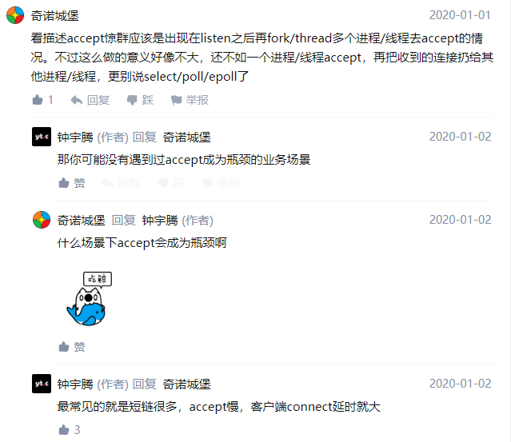

# 定义

- 惊群效应是指多进程（线程）在同时阻塞等待一个事件的时候（休眠状态），如果等待的这个事件发生，那么他就会唤醒等待的所有进程（或线程），但是最终却只能有一个进程（线程）获得这个时间的控制权，对该时间进行处理，而其他进程（线程）获取“控制权”失败，只能重新进入休眠状态，这种现象和性能浪费就是惊群效应
- 来了一个socket，线程池里面的线程一开始都是沉睡的，来了之后就全都苏醒了，都去争夺这个线程，导致一瞬间系统的资源暴涨
- 是当一个fd的事件被触发时，所有等待这个fd的线程或进程都被唤醒
- 一般是socket的accept会导致惊群，很多个进程阻塞在accept，一旦有客户端进来，所有的进程accept都会返回，但是只有一个进程督导数据，这就是惊群
- 惊群的本质：进线程通过等待事件，挂在关注的对象的等待队列上，当对象有资源到来时，就唤醒它的等待队列上的进程/线程。而是否产生惊群，关键在于内核通过 __wake_up_common 是否无差别地遍历唤醒等待队列上的多个进程/线程
  - 显然 （epoll上的一个选项）EPOLLEXCLUSIVE 的逻辑不会无差别地唤醒所有进程/线程，它只唤醒一个正在睡眠的进程/线程处理新来的资源，所以它能防住惊群吗？它能！

# 缺点

- Linux 内核对用户进程（线程）频繁地做无效的调度、上下文切换等使系统性能大打折扣。上下文切换（context switch）过高会导致 CPU 像个搬运工，频繁地在寄存器和运行队列之间奔波，更多的时间花在了进程（线程）切换，而不是在真正工作的进程（线程）上面。直接的消耗包括 CPU 寄存器要保存和加载（例如程序计数器）、系统调度器的代码需要执行。间接的消耗在于多核 cache 之间的共享数据3
- 为了确保只有一个进程（线程）得到资源，需要对资源操作进行加锁保护，加大了系统的开销。目前一些常见的服务器软件有的是通过锁机制解决的，比如 Nginx（它的锁机制是默认开启的，可以关闭）；还有些认为惊群对系统性能影响不大，没有去处理，比如 Lighttpd
- 惊醒所有进程/线程，导致n-1个进程/线程做了无效的调度，上下文切换，cpu瞬时增高
- 多个进程/线程争抢资源，所以涉及到同步问题，需对资源进行加锁保护，加解锁加大系统CPU开销

# 场景

- accept
- epoll
- 线程（进程）池

# 有关accept下的惊群效应

- 以多进程为例，在主进程创建监听描述符listenfd后，fork()多个子进程，多个进程共享listenfd，accept是在每个子进程中，当一个新连接来的时候，会发生惊群

- 有关为什么会出现多个线程（进程）阻塞在accept的情况
- 使用accept的是服务端，那么会有很多的客户端同时发来TCP三次握手的情况，这就会导致accept的已连接队列被堆满
- 所以在此之前就有一种做法，是让多个进程阻塞在accept，然后又fd来了，就让这些进程去抢fd去处理（注意，这里这些阻塞的进线程都是放在一个内核的等待队列上）
- 而此时就会出现很多线程被弄醒，然后去抢活干，导致资源的浪费
- 解决：
  - Linux2.6在内核级别让accept成为原子操作，如果多个进程同时阻塞在accept上，每次仅唤醒等待队列的第一个进程从accept返回并拿到用户连接
- -这里有了解答（即为什么会出现多个线程阻塞在accept，而不是epoll的情况）
  - 因为accept有可能会成为业务的瓶颈，比如说短链比较多，accept慢，客户端connect因此延时变大（不过陈硕也说一个多进程共同监听一个socket不是一个好的设计，只能说适用于个别情况）
  - 

- 问题是，在实际生产环境中，通常是先用select/epoll来监听listen_fd是否有连接过来，再调用accept，也就是说惊群点从accept提前到epoll上了（这个问题在上面有了解答）
- linux2.6以后，对于accept的解决方式是，通过引入标记位WQ_FLAG_EXCLUSIVE解决的（看滴滴云的代码解释吧）

解决

- 对于互斥等待的行为，比如如对一个listen后的socket描述符，多线程阻塞accept时，系统内核只会唤醒所有正在等待此时间的队列 的第一个，队列中的其他人则继续等待下一次事件的发生，这样就避免的多个线程同时监听同一个socket描述符时的惊群问题

# 有关epoll下的惊群效应

epoll_create在fork之前创建

- 当有事件发生时，等待同一个文件描述符的所有进程（线程）都将被唤醒，而且解决思路和 accept 一致
- （为什么linux不解决这个问题）因为内核不知道你是否等待文件描述符来调用accept函数，还是做其他事情，所以只能全部唤醒（而对于accept来说，来的事件只能是接受然后处理，所以linux最早就默认把他们全部唤醒）
- 因为是fork，所以所有的进程都是共享一颗epoll红黑树
- 简述：fork后所有进程的epoll都是同一个epoll，所以当listenfd来的时候，会把所有人都给叫醒（可以用锁来解决，谁抢到锁就把谁叫醒）
  - 如果进程已经epoll_create了的话，那么fork后所有的子进程引用的都是同一个epoll实例

epoll_create在fork之后创建

- 当连接到来时，我们需要选择一个进程来 accept，这个时候，任何一个 accept 都是可以的。当连接建立以后，后续的读写事件，却与进程有了关联。一个请求与 a 进程建立连接后，后续的读写也应该由 a 进程来做
- 当读写事件发生时，应该通知哪个进程呢？Epoll 并不知道，因此，事件有可能错误通知另一个进程，这是不对的。所以一般在每个进程（线程）里面会再次创建一个 epoll 事件循环机制，每个进程的读写事件只注册在自己进程的 epoll 中
- 但是此时对于该进程，就有两个epoll在监听了，就又会有惊群效应了...
- 简述：fork后每个子进程都自建一个epoll，然后每个人都把listenfd给放进去，当有链接来的时候，所有人也都被叫醒，主进程和子进程都因为有同一个fd而被叫醒

- 如果我们使用多线程epoll对同一个fd进行监控的时候，当fd事件到来时，内核会把所有epoll线程唤醒，因此产生惊群问题
- 为何内核不能像解决accept问题那样解决epoll的惊群问题呢？
- 内核可以解决accept调用中的惊群问题，是因为内核清楚的知道accept调用只可能一个线程调用成功，其他线程必然失败。而对于epoll调用而言，内核不清楚到底有几个线程需要对该事件进行处理，所以只能将所有线程全部唤醒

参考nginx的解决方法

- 多个进程将listenfd加入到epoll之前，首先尝试获取一个全局的accept_mutex互斥锁，只有获得该锁的进程才可以把listenfd加入到epoll中，当网络连接事件到来时，只有epoll中含有listenfd的线程才会被唤醒并处理网络连接事件。从而解决了epoll调用中的惊群问题

# 有关线程池下的惊群效应

- 在实际应用程序开发中，为了避免线程的频繁创建销毁，我们一般建立线程池去并发处理，而线程池最经典的模型就是生产者-消费者模型，包含一个任务队列，当队列不为空的时候，线程池中的线程从任务队列中取出任务进行处理。一般使用条件变量进行处理，当我们往任务队列中放入任务时，需要唤醒等待的线程来处理任务，如果我们使用C++标准库中的函数notify_all()来唤醒线程，则会将所有的线程都唤醒，然后最终只有一个线程可以获得任务的处理权，其他线程在此陷入睡眠，因此产生惊群问题

解决

- 对于线程池中的惊群问题，我们需要分情况看待，有时候业务需求就是需要唤醒所有线程，那么这时候使用notify_all()唤醒所有线程就不能称为”惊群问题“，因为CPU并没有无谓消耗。而对于只需要唤醒一个线程的情况，我们需要使用notify_one()函数代替notify_all()只唤醒一个线程，从而避免惊群问题

# 解决

- 使用mutex锁住多个线程是不会惊群的，在某个线程解锁后，只会有一个线程会获得锁，其他的继续等待
- 解决方法：抢锁，谁抢到了就给谁，并且以后这个线程都负责这个socket
- Nginx的解决方案是，设置一把全局accpet锁，每个进程先去竞争这把锁，拿到锁的进程才向epoll中注册listen_fd事件

# 问题

- 还有个问题，有人说用锁可以解决惊群，但是去抢锁的过程难道不是另一种惊群吗？？？？？
  - 给到的一个解释其实是，进线程抢锁是由操作系统在阻塞线程里挑一个唤醒
  - 或者说，锁也是一个等待队列里唤醒一个......

总结

- 避免惊群效应：每次只唤醒等待队列的一个/给每个fd上锁，谁抢到了锁就执行

# 参考

- https://www.zhihu.com/question/22756773
- https://zhuanlan.zhihu.com/p/37861062
- https://blog.csdn.net/second60/article/details/81252106
- https://blog.csdn.net/lyztyycode/article/details/78648798
- https://zhuanlan.zhihu.com/p/51251700
- https://zhuanlan.zhihu.com/p/37861062