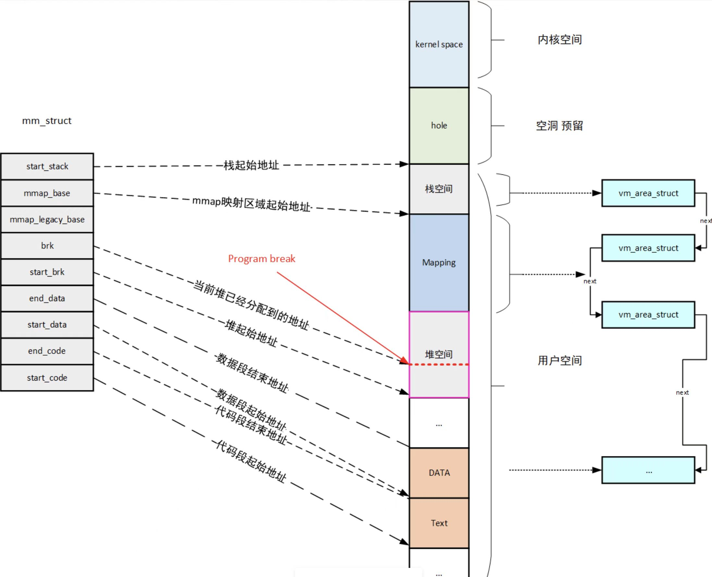
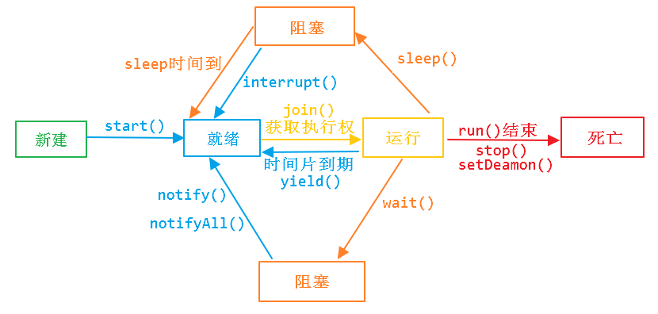

# 进程的创建

- to do：需要参考linux内核设计与实现，注意cow机制，task_struct等等


# 进程的通信

## 管道

- 先进先出，数据是单向传输的，是半双工通信（因此要实现双向通信的话，必须要创建两个管道）
- 无名管道（内存文件）：只能在具有亲缘关系的进程之间使用（进程的亲缘关系通常是指父子进程关系）
- 有名管道（FIFO文件，借助文件系统）：在无名管道的基础上，允许在没有亲缘关系的进程之间使用
- 优点：所有的UNIX系统都支持


## 消息队列

- 是存放在内核中的消息链表，在发送数据的时候，会分成一个独立的数据单元，即就是数据块
- 主要分为Posix消息队列systemV消息队列
- **不适合大数据的传输**
  - 因为在内核中每个消息体都有一个最大长度的限制，同时所有队列所包含的全部消息体的总长度也是有上限
  - 在 Linux 内核中，会有两个宏定义 `MSGMAX` 和 `MSGMNB`，它们以字节为单位，分别定义了一条消息的最大长度和一个队列的最大长度
- **消息队列通信过程中，存在用户态与内核态之间的数据拷贝开销**
  - 因为进程写入数据到内核中的消息队列时，会发生从用户态拷贝数据到内核态的过程
  - 同理另一进程读取内核中的消息数据时，会发生从内核态拷贝数据到用户态的过程
- 和管道的对比：消息队列克服了信号传递信息少、管道只能承载无格式字节流以及缓冲区大小受限等缺点


## 共享内存

- 多个进程不同的虚拟地址空间都映射到同一块物理内存上，这样这个进程写入东西，另外一个进程就可以看到了，大大提高了进程间通信的速度

- 是**速度最快**的通信方式


## 信号量

- 信号量其实是一个整型的计数器，主要用于实现进程间的互斥与同步，而不是用于缓存进程间通信的数据（用来控制多个进程对共享资源的访问）
- 信号量表示资源的数量，控制信号量的方式有两种原子操作：
  - 一个是 **P 操作**，这个操作会把信号量减去 -1，相减后如果信号量 < 0，则表明资源已被占用，进程需阻塞等待；相减后如果信号量 >= 0，则表明还有资源可使用，进程可正常继续执行
  - 另一个是 **V 操作**，这个操作会把信号量加上 1，相加后如果信号量 <= 0，则表明当前有阻塞中的进程，于是会将该进程唤醒运行；相加后如果信号量 > 0，则表明当前没有阻塞中的进程


## 信号

- 用于通知接收进程某个事件已经发生，比如按下ctrl + C就是信号

- 对于异常的情况下的工作模式，需要用信号的方式来进行通知进程
- 信号是进程间通信机制中的**唯一的异步通信机制**，任何时候给某一进程发送信息，一旦信号产生，就会有这几种的方式：
  - 执行默认的操作
  - 捕获信号
  - 忽略信号


## socket

- 适用于同一个机器及不同机器间进程的通信


# 进程的调度

## 先到先调度

- 先到先服务调度算法（First Come First-Served）
- 先请求CPU的进程首先分配到CPU；可以使用FIFO队列实现
- 缺点：平均等待时间往往很长


## 最短作业优先调度

- Shortest-Job-First，有时又被称为最短剩余时间优先

- 当CPU变为空闲时，CPU会被赋给具有最短CPU时间执行的进程
  - 如果两个进程具有同样长度的CPU执行，那么可以用FCFS来处理
- 缺点：很难估计下一次CPU执行的时间；容易造成饥饿


## 优先级调度

- Priority scheduling
- 每个进程都有一个优先级与其关联，而具有最高优先级的进程会分配到CPU；具有同样优先级的进程按FCFS顺序调度
- 缺点：会造成饥饿（让某个低优先级的进程无限等待CPU）


## 轮转调度

- 类似FCFS，但是增加了抢占以切换进程，将一个较小时间单元定义为时间量或**时间片**
- 就绪队列作为循环队列，CPU调度程序循环整个就绪队列，为每个进程分配不超过一个时间片的CPU
  - 如果进程使用的时间少于时间片，进程本身就会释放CPU，调度程序接着处理就绪队列的下一个进程
  - 而如果超过了时间片，那么定时器就会中断，进而中断OS，切换上下文
- 缺点：性能的好坏取决于时间片的大小（太大的话系统会慢，太小的话上下文切换时间高）


## 多级队列调度

- 将就绪队列分为多个单独队列
- 根据进程属性、如内存大小，进程优先级，进程类型等，一个进程永久分到一个队列中，每个队列都有自己的算法


## 多级反馈队列调度

- 允许进程在多个队列间迁移
- 根据不同CPU执行的特点来区分进程，如果进程使用过多的CPU时间，那么它会被移到更低的优先级队列


## 完全公平调度

- Completely Fair Scheduler，完全公平调度器（[参考](https://blog.csdn.net/ctthuangcheng/article/details/8916071)）
- 简述：
  - 假如当前有N个进程，1个CPU，那么每个进程都要分到1/N的CPU使用时间，如果有一个进程执行了多的时间，就需要补偿那些执行实现少的进程
  - 设每个进程的执行时间为vruntime
  - 而每个进程都会有一个nice，nice值越高代表当前进程对其他进程越友好，nice值越低就代表当前进程对其他进程不好
  - 换句话说，nice值越高，就希望其他的进程执行多一点的时间，所以在nice值高的进程中，vruntime会走的快一点
  - 而nice值越低，就对其他进程不友好，就希望自己多执行一点时间，所以vruntime就会走的慢一点
  - vruntime走得快是相对于绝对时钟来说的，即同样是1s，可能nice高的实际只走了0.01s，而nice低的走了0.5s


一些工程上的问题：

- 随着时间的增长，vruntime必然会越界，如何处理：
  - CFS会给cfs_rq设置一个vruntime（值为cfs中的最小vruntime，cfs_rq->min_vruntime），如果有vruntime越界了，就把它设置为这个vruntime
  - 选择进程时，总是以进程的vruntime与cfs_rq->min_vruntime之差来作为判断依据的。而这个差值基本上是不可能溢出的。这个差值被称作normalized vruntime（标准化的虚拟时钟）
- 如何处理睡眠了一段时间的进程（如果不处理，睡眠的进程就会获得一个非常大的时间片，导致系统卡顿）：
  - 如果进程只是短暂的睡眠，其vruntime > cfs_rq->min_vruntime - thresh，则vruntime保持原样
  - 长时间睡眠，其vruntime <= cfs_rq->min_vruntime - thresh，则vruntime修改为cfs_rq->min_vruntime - thresh
  - thresh是指调度延迟
- 如果有非常多的进程需要调度，那么可能出现上下文切换的时间大于时间片，效率会非常的低下，如何处理：
  - 背景2：而如果cfs_rq中有两个旗鼓相当的进程呢？可能导致每个tick都会触发一次switch。（A进程运行一个tick之后，vruntime超过B进程，于是switch到B进程；而B进程运行一个tick之后，vruntime又超过A进程，于是又switch到A进程；如此反复……），调度开销太大
  - 于是cfs为权衡公平性与性能，引入了**调度延迟**的概念：就是提供一个延迟，使得cfs并不是每个tick都去检查是否需要re-schedule，而是要延迟到一定程度再re-schedule
  - 即至少每个进程都会执行一个调度延迟的时间，而不是频繁的调度进程；调度延迟一般是一个固定值，20ms
- 组调度：
  - 引入组调度是为了实现做一件事的一组进程与做另一件事的另一组进程的隔离。每件“事情”各自有自己的权重，而不管它需要使用多少进程来完成
  - 在cfs中，task_group和进程是同等对待的，task_group的优先级也由用户来控制（通过cgroup文件cpu.shares）。

- 因此，需要用一个高效的数据结构来存储vruntime，即rb-tree


关于linux的调度策略的历史

- 在linux 2.4时，可执行状态的进程被挂在一个链表中。每次调度，调度程序需要扫描整个链表，以找出最优的那个进程来运行。复杂度为O(n)
- 在linux 2.6早期，可执行状态的进程被挂在N(N=140)个链表中，每一个链表代表一个优先级，系统中支持多少个优先级就有多少个链表
  - 每次调度，调度程序只需要从第一个不为空的链表中取出位于链表头的进程，复杂度为O(1)
- 在linux 2.6近期的版本中，可执行状态的进程按照优先级顺序被挂在一个红黑树（可以想象成平衡二叉树）中
  - 每次调度，调度程序需要从树中找出优先级最高的进程。复杂度为O(logN)
- 2.6修改的原因：对公平性的理解变了（由之前的动态调整进程的优先级，变为了整体调度的公平性）；链表的长度始终是有限的，并且不好拓展


## 优先级翻转

- 由于互斥，一个进程（设为A）可能因为等待进入临界区而睡眠。直到正在占有相应资源的进程（设为B）退出临界区，进程A才被唤醒
- 可能存在这样的情况：A的优先级非常高，B的优先级非常低。B进入了临界区，但是却被其他优先级较高的进程（设为C）抢占了，而得不到运行，也就无法退出临界区。于是A也就无法被唤醒。
- A有着很高的优先级，但是现在却沦落到跟B一起，被优先级并不太高的C抢占，导致执行被推迟。这种现象就叫做优先级反转。
- 出现这种现象是很不合理的。较好的应对措施是：当A开始等待B退出临界区时，B临时得到A的优先级（还是假设A的优先级高于B），以便顺利完成处理过程，退出临界区。之后B的优先级恢复。这就是优先级继承的方法


# 进程的组成

## 地址空间




linux内核将这4G字节的空间分为两部分

- 内核空间：最高的1G字节（0XC0000000-0CFFFFFFF）
- 用户空间：较低的3G字节（0x00000000-0xBFFFFFFF）


空间布局

- 栈区（Stack）：进程用户空间栈，由编译器自动分配释放，存放函数的参数值、局部变量的值等
- 映射段（Memory Mapping Segment）：任何内存映射文件
- 堆区（Heap）：存储动态内存分配，匿名的内存映射
- BSS段（BSS Segment）：未初始化的全局变量或者静态变量（用零页初始化）
- 数据段（Data Segment）：可执行文件的已初始化全局变量的内存映射
- 程序段（Text Segment）：可执行文件代码的内存映射


## task_struct

- 每个进程在内核中都有一个进程控制块（PCB）来维护进程相关的信息，其中存放了进程的所有数据
- PCB在kernel中的表现形式就是task_struct


进程的状态

- ```cpp
  #define TASK_RUNNING 0         //进程要么正在执行，要么准备执行
  #define TASK_INTERRUPTIBLE 1   //可中断的睡眠，可以通过一个信号唤醒
  #define TASK_UNINTERRUPTIBLE 2 //不可中断睡眠，不可以通过信号进行唤醒
  #define __TASK_STOPPED 4       //进程停止执行
  #define __TASK_TRACED 8        //进程被追踪
  /* in tsk->exit_state */
  #define EXIT_ZOMBIE 16 //僵尸状态的进程，表示进程被终止，但是父进程还没有获取它的终止信息，比如进程有没有执行完等信息。
  #define EXIT_DEAD 32   //进程的最终状态，进程死亡
  /* in tsk->state again */
  #define TASK_DEAD 64      //死亡
  #define TASK_WAKEKILL 128 //唤醒并杀死的进程
  #define TASK_WAKING 256   //唤醒进程
  
  volatile long state; /* -1 unrunnable, 0 runnable, >0 stopped */
  ```


进程的亲属关系

- ```cpp
  struct task_struct *real_parent; /* real parent process */              // 指向其父进程，如果创建它的父进程不再存在，则指向PID为1的init进程
  struct task_struct *parent; /* recipient of SIGCHLD, wait4() reports */ // 指向其父进程，当它终止时，必须向它的父进程发送信号。它的值通常与real_parent相同
  struct list_head children; /* list of my children */                    // 表示链表的头部，链表中的所有元素都是它的子进程（进程的子进程链表）
  struct list_head sibling; /* linkage in my parent's children list */    // 用于把当前进程插入到兄弟链表中（进程的兄弟链表）
  struct task_struct *group_leader; /* threadgroup leader */              // 指向其所在进程组的领头进程
  ```


进程的标识

- ```cpp
  pid_t pid;  //进程的唯一标识
  pid_t tgid; // 线程组的领头线程的pid成员的值
  ```

- 在Linux系统中，一个线程组中的所有线程使用和该线程组的领头线程（该组中的第一个轻量级进程）相同的PID，并被存放在tgid成员中。只有线程组的领头线程的pid成员才会被设置为与tgid相同的值。注意，getpid()系统调用返回的是当前进程的tgid值而不是pid值


进程的文件表

- ```cpp
  /* filesystem information */
  struct fs_struct *fs; //文件系统的信息的指针
  /* Open file information: */
  struct files_struct *files;
  //	是一个指针，指向被打开了的文件表
  ```


进程调度信息

- ```cpp
   int prio, static_prio, normal_prio; // static_prio为静态优先级，可以通过nice系统调用来进行修改，normal_prio 的值取决于静态优先级和调度策略，prio 用于保存动态优先级
   unsigned int rt_priority; // rt_priority 用于保存实时优先级。
   const struct sched_class *sched_class;
   struct sched_entity se;
   struct sched_rt_entity rt;
   unsigned int policy;
  ```


进程的**内核栈**

- ```cpp
  struct task_struct {
      //进程的状态 -1：就绪态 0：运行态 >0:停止态
      volatile long state; /* -1 unrunnable, 0 runnable, >0 stopped */
      void *stack;         //指向内核栈指针----------------------------------
      atomic_t usage;      //有几个进程在使用此结构
  }
  ```

- 在每一个进程的生命周期中，必然会通过到系统调用陷入内核。在执行系统调用陷入内核之后，这些内核代码所使用的栈并不是原先进程用户空间中的栈，而是一个单独内核空间的栈，这个称作进程内核栈

- 内核栈在进程创建的时候，通过 slab 分配器从 thread_info_cache 缓存池中分配出来，其大小为 THREAD_SIZE，一般来说是一个页大小 4K

- 内核栈就是用于内核态的堆栈，它和进程的task_struct结构，更具体的是thread_info结构一起放在两个连续的页框大小的空间内


拓展：中断栈

- 当系统收到中断事件后，进行中断处理的时候，也需要中断栈来支持函数调用。由于系统中断的时候，系统当然是处于内核态的，所以中断栈是可以和内核栈共享的。但是具体是否共享，这和具体处理架构密切相关
- X86 上中断栈就是独立于内核栈的
  - 独立的中断栈所在内存空间的分配发生在 arch/x86/kernel/irq_32.c 的 irq_ctx_init() 函数中 
  - 如果是多处理器系统，那么每个处理器都会有一个独立的中断栈，函数使用 __alloc_pages 在低端内存区分配 2个物理页面，也就是8KB大小的空间

- ARM架构没有独立的中断栈


进程的**thread_info**

- ```cpp
  struct task_struct {
  #ifdef CONFIG_THREAD_INFO_IN_TASK
  	struct thread_info	thread_info;
  #endif
  … 
  	void			*stack;
  }
  
  union thread_union {
  	struct thread_info thread_info;
  	unsigned long stack[THREAD_SIZE/sizeof(long)];
  };
  ```

- 因为不同的体系架构中会存储不同的信息，所以将**体系结构相关的部分**存储在thread_info中


# 进程的状态

**进程的切换一定发生在中断/异常/系统调用处理过程中**

- 时间片**中断**、IO**中断**后 更改优先级进程（导致被中断进程进入**就绪**）
- 阻塞式**系统调用**、**虚拟地址异常**（缺页异常，需要从磁盘读取page）（导致被中断进程进入**阻塞**）
- 终止用**系统调用**、**不能继续执行的异常**（1/0，缺页，读到未有权限的地方）（导致被中断进程进入**死亡**）




## 阻塞

背景

- linux内核维护的工作队列和等待队列：假如现在进程 A 里跑的程序有一个对象执行了某个方法将当前进程阻塞了，内核会立刻将进程A从工作队列中移除，并将该对象移至等待队列


- 正在执行的进程由于发生某事件（如I/O请求、申请缓冲区失败，睡眠等）暂时无法继续执行
  - 此时引起进程调度，把OS分配给另一个就绪进程，而让受阻进程处于暂停状态
  - 是进程**主动**让出CPU，同时挂载到内核的某个等待队列下面，等待某个时间的到来，引发进程调度切换

- 阻塞恢复：需要在等待的资源得到满足（IO完成）后，才会进入就绪状态，等待被调度而执行
  - 当对象收到中断或者某件事情触发之后，操作系统将该对象等待队列上的进程重新放回到工作队列上就绪，等待时间片轮转到该进程


- 进程阻塞是不会消耗CPU资源的，但是会消耗系统资源（例如内存，磁盘IO）
  - 此时CPU会继续处理其他的进程
  - PS：但进/线程是非常大的，如果网络编程中每个连接都创建一个进/线程，就会导致系统资源的浪费（因此才有了epoll以及后续的网络编程范式）


- 阻塞分为被动阻塞（IO）和主动阻塞（即睡眠）


和挂起的对比：

共同点

- 都导致进程暂停执行。
- 进程都释放CPU，即两个过程都会涉及上下文切换

不同点

- 对系统资源占用不同：虽然都释放了CPU，但阻塞的进程仍处于内存中，而挂起的进程通过”对换“技术被换出到磁盘中
- 发生时机不同：阻塞一般在进程等待资源（IO资源、信号量等）时发生；而挂起是由于用户和系统的需要
  - 终端用户需要暂停程序研究其执行情况或对其进行修改、OS为了提高内存利用率需要将暂时不能运行的进程（处于就绪或阻塞队列的进程）调出到磁盘

- 恢复时机不同：阻塞要在等待的资源得到满足（例如获得了锁）后，才会进入就绪状态，等待被调度而执行；被挂起的进程由将其挂起的对象（如用户、系统）在时机符合时（调试结束、被调度进程选中需要重新执行）将其主动激活


## 挂起

- 由于系统和用户的需要引入了挂起的操作，进程被挂起意味着该进程处于静止状态
- 如果进程正在执行，它将暂停执行，若原本处于就绪状态，则该进程此时暂不接受调度

- 是一种用户/程序**主动**的行为，挂起时线程不会释放对象锁
- 挂起的进程会被换出到磁盘中


## 睡眠

- 用户主动暂停执行的进程，将进行睡眠于内存中（sleep(10)）
- 睡眠恢复：是自动完成的，睡眠时间到了则恢复到就绪态，睡眠时线程不会释放对象锁


# 进程和线程的对比

- **进程是资源分配的最小单位，线程是CPU调度的最小单位**
- 一个进程挂了不会影响其他进程，而线程挂了会影响其他线程（一般是指cpp和c，jvm会捕获信号）


## 上下文切换

- 同样的问题：为什么进程切换比线程切换要慢/为什么说进程上下文切换比线程上下文切换代价高


- 进程切换的步骤（以时间片到期为例）：
  - 内核的timer到期后，产生一个中断，发起一个进程调度
  - 进程A —> 陷入到内核态，内核进程A
  - 内核进程A —> 进程调度器 —> 内核进程B
  - 内核进程B —> 进程B

- 进程需要切换的数据：
  - 切换页目录（虚拟内存）同时使用新的地址空间
  - 切换内核栈和硬件上下文（寄存器及PC）
- 分析：
  - 用户态 -> 内核态 -> 用户态
  - 进程切换比线程切换成本大的地方在需要切换地址空间
  - 进程的切换会涉及虚拟地址空间的切换，这就导致内存中的页表也需要进行切换，一个进程对应一个页表是不假，但是 CPU 中的 TLB 只有一个啊，这就尴尬了，页表切换后这个 TLB 就失效了。这样，TLB 在一段时间内肯定是无法被命中的，操作系统就必须去访问内存，那么虚拟地址转换为物理地址就会变慢，表现出来的就是程序运行会变慢；而线程的切换不会修改页表
- 并且**线程的切换是不会切换地址空间及内存的**（线程切换高效的原因）


- 而线程的切换（一般讨论同一个进程下的线程），要修改的无非是CPU寄存器及PC


## 通信方式

- 线程的通信比较方便（同一进程的线程可以共享数据，例如全局变量或者静态变量）


## 地址空间

- 进程有自己的独立地址空间，线程没有


# 八股

## 为什么OS可以同时运行多个进程

- CPU时间片的轮换调度，实现了时分复用
- 虚拟地址提供了进程间的隔离性


## 为什么会有进程

- IO很慢，为了提高CPU的使用率，不能让进入IO的进程一直阻塞在IO阶段，做无用功，所以就需要在别的进程进入IO阻塞的时候，将其切出CPU
- 用户可能在某一时刻运行进程A，下一时刻运行进程B，在下一时刻又运行进程A，那么我们就需要保存进程A的上下文，方便后续使用


## 进程退出后，线程是如何处理的

- 主线程以return的方式退出：那么此时main()执行完return之后，实际上会调用exit()函数，该函数除了执行关闭IO等操作之外，还会执行关掉其他子线程的操作

- 主线程以pthread_exit退出的：在主线程中执行pthread_exit()，实际上是提前结束了main的主线程，也就无法执行后续的exit()函数了。所以，这种方法是可以达到主线程退出子线程继续运行的目的

- ```cpp
  #include <iostream>
  #include <pthread.h>
  #include <unistd.h>
  
  void *func(void *args) {
      while (true) {
          std::cout << "I am func." << std::endl;
          sleep(3);
      }
  }
  
  int main() {
      pthread_t pid = 0;
      pthread_create(&pid, nullptr, func, nullptr);
      pthread_detach(pid);
      pthread_exit(nullptr);
      return 0;
  }	//	g++ test.cpp -o test -pthread
  ```