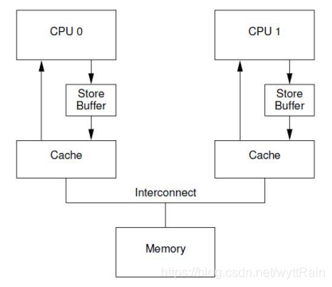

# 背景

早期的处理器为有序处理器（In-order processors），有序处理器处理指令通常有以下几步：

- 指令获取
- 如果指令的输入操作对象（input operands）可用（例如已经在寄存器中了），则将此指令分发到适当的功能单元中。如果一个或者多个操作对象不可用（通常是由于需要从内存中获取），则处理器会等待直到它们可用
- 指令被适当的功能单元执行
- 功能单元将结果写回寄存器堆（Register file，一个 CPU 中的一组寄存器）


相比之下，乱序处理器（Out-of-order processors）处理指令通常有以下几步：（感觉有点像异步操作）

- 指令获取
- 指令被分发到指令队列（Invalidate Queues，后面会讲到）
- 指令在指令队列中等待，直到输入操作对象可用（一旦输入操作对象可用，指令就可以离开队列，即便更早的指令未被执行）
- 指令被分配到适当的功能单元并执行
- 执行结果被放入队列（**放入到store buffer中，而不是直接写到cache中**，后面也会讲到）
- 只有所有更早请求执行的指令的执行结果被写入cache后，指令执行的结果才被写入cache（执行结果重排序，让执行看起来是有序的）


为什么要用乱序？

- 对于数据的读取，如果出现了cache miss，就会导致CPU在从其他CPU获取数据或者直接与主存进行数据交互的时候需要等待不可用的操作对象，这样就会非常慢，非常影响性能
- 而乱序处理就不需要等待不可用的操作对象，直接把cashe miss message放到invalidate queues中，然后继续干其他的事情


# 内存屏障

- 能够让CPU或编译器在内存访问上有序


编译器内存屏障

- Linux 内核提供函数 `barrier()` 用于让编译器保证其之前的内存访问先于其之后的完成。

  ```c
  #define barrier() __asm__ __volatile__("" ::: "memory")
  ```


CPU内存屏障

- 通用barrier，保证读写操作有序， `mb()`和`smp_mb()`
- 写操作barrier，仅保证写操作有序，`wmb()`和`smp_wmb()`
- 读操作barrier，仅保证读操作有序，`rmb()`和`smp_rmb()`


# 硬件上的实现

store buffer

- 
- 加入了这个硬件结构后，但CPU0需要往某个地址中写入一个数据时，它不需要去关心其他的CPU的local cache中有没有这个地址的数据，它只需要把它需要写的值直接存放到store buffer中
- 然后发出invalidate的信号
- 等到成功invalidate其他CPU中该地址的数据后，再把CPU0存放在store buffer中的数据推到CPU0的local cache中
- 每一个CPU core都拥有自己私有的store buffer，一个CPU只能访问自己私有的那个store buffer


缺点：

- 先看看下面的代码，思考一下会不会出现什么问题

  ```c++
  a = 1;
  b = a + 1;
  assert(b = 2);
  ```

  我们假设变量a的数据存放在CPU1的local cache line中，变量b在CPU0的cache line中，如果我们单纯使用CPU来运行上面这段程序，应该是正常运行的，但是如果加入了store buffer这个硬件结构，就会出现assert失败的问题，到底是为什么呢？我们来走一走程序的流程。

  - CPU0执行a=1这条命令，由于CPU0本地没有数据，会发出read invalidate消息从CPU1那获得数据，并发出invalidate命令
  - CPU0把要写入的数据放到store buffer中
  - CPU1接收到了CPU0发来的read invalidate信号，将其local cache line 中的数据发送给CPU0，并把自己本地cache line中的数据设置为无效
  - CPU0执行b=a+1
  - CPU0接收到CPU1返回回来的a的值，等于0，b=0+1=1
  - CPU0将store buffer中的a=1的值推入到cache中，造成了数据不一致性


即使换为store forwarding，也还是会有问题


# 参考

- https://blog.csdn.net/weixin_39094034/article/details/123773446