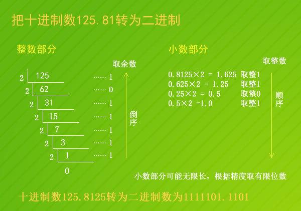

# 原码表示法

- 1  00001
- -1 10001
- 2 00010
- -2 10010
- 无法解决的问题是对于0，会出现正0和负0两种情况

# 反码表示法

- 1 00001
- -1 10000
- 2 00010
- -2 10001
- 无法解决的问题是，加法不好做，对于正负数的加法要写两套

# 补码表示法

- 1 00001
- -1 11111
- 2 00010
- -2 11110
- 上述问题就都能够解决

# 二进制的存储

## 十进制整数转二进制

- 辗转除二，直到最后得到的数为零
- 接着将余数从尾到头记录，便是对应的二进制

## 十进制小数转二进制

- 不断乘二，取整数部分，然后不断迭代
- 直到最后得到1.0
- 但是很多情况都是得不到1.0的，所以才有精度的说法
- 