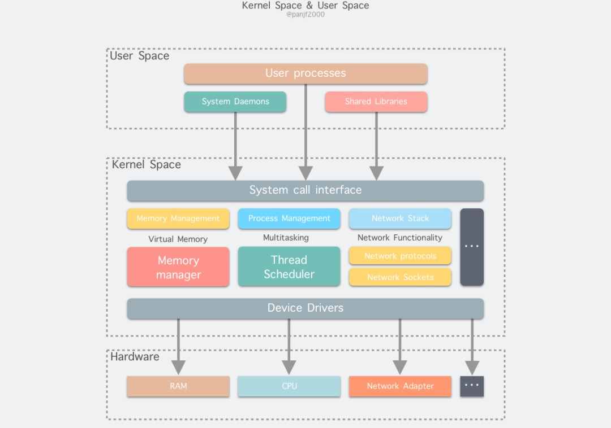

# 背景

## 特权级

- Intel x86架构的CPU一共有0～4四个特权级，0级最高，3级最低，硬件上在执行每条指令时都会对指令所具有的特权级做相应的检查
- 在UNIX/LINUX系统中，一条工作在0级特权级的指令具有了CPU能提供的最高权力，而一条工作在3级特权的指令具有CPU提供的最低或者说最基本权力
- 当程序运行在3级特权级上时，就可以称之为运行在用户态，是普通的用户进程运行的特权级，大部分用户直接面对的程序都是运行在用户态
- 当程序运行在0级特权级上时，就可以称之为运行在内核态

# 用户态

- 用户态运行的程序只能受限地访问内存空间
- 只能直接读取用户程序的数据
- 不允许访问外围设备网卡、硬盘等
- 用户态下所占有的 CPU 会被其他程序抢占，不允许独占

# 内核态

- 内核态运行的程序可以不受限制地访问计算机的任何数据和资源，比如外围设备网卡、硬盘等
- 处于内核态的 CPU 可以从一个程序切换到另外一个程序，并且所占用的 CPU 不会发生抢占情况

# 用户态切换到内核态的三种方式

## 系统调用

- 用户态程序想要使用计算机资源，如某个设备、某种IO等，是不能自己直接去使用的，需要告诉内核，让内核去做。这个主动告诉内核让它去做的方法就是系统调用。（还有被动的异常和外部中断等）

- 用户态进程通过系统调用申请使用操作系统提供的服务程序完成工作
- 系统调用的机制，其核心还是使用了操作系统为用户特别开放的一个中断来实现，例如lx86的int 80h， powerpc的sc，Intel的int 0x80
- 可以认为是用户自己主动发起的切换

## 异常

- 当CPU在执行运行在用户态下的程序时，发生了某些事先不可知的异常
- 这时会触发由当前运行进程切换到处理此异常的内核相关的程序中，也就是转到了内核态
- 比如缺页异常，1/0

## 外围设备的中断

- 当外围设备完成用户请求的操作后，会向CPU发出相应的中断信号，这时CPU会暂停执行下一条即将要执行的指令转而去执行与中断信号对应的处理程序
- 如果先前执行的指令是用户态下的程序，那么这个转换的过程自然也就发生了由用户态到内核态的切换
- 比如硬盘读写操作的完成，系统会切换到硬盘读写的中断处理程序中执行后续操作等

- 

# 八股

## 为什么要划分用户态和内核态

- 如果OS始终是只运行单个任务，不需要对进程进行调度，不需要多进程并发，不需要对内存进行管理，那么是不需要划分用户态和内核态的
- 而后续OS的发展，逐渐对上面的功能有了需求，因此就会有相关的代码产生
- 这些kernel的代码及其运行的空间应该是不允许用户随便更改的，所以就有了内核态和用户态的划分

另一个角度

- 区分用户态和内核态能够避免应用程序直接访问甚至修改寄存器会导致严重的bug
- 通过硬件，限制部分代码，使其不能修改物理硬件，进而kernel代码和其他用户的数据不被无意或者有意地破坏和盗取

引申

- 因此如果需要使用IO等系统资源，就得用系统调用（系统调用不同于普通函数调用，是通过一个体系结构设定的软中断进入）
- 可以认为系统调用是OS提供给用户的一个接口